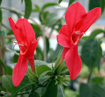
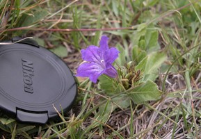
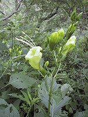
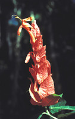
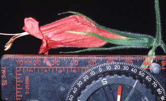

## Phylogeny 

-   « Ancestral Groups  
    -   [Ruellieae](../Ruellieae.md)
    -   [Acanthaceae](../../Acanthaceae.md)
    -   [Lamiales](../../../Lamiales.md)
    -   [Asterids](../../../../Asterids.md)
    -   [Core Eudicots](Core_Eudicots)
    -   [Eudicots](../../../../../../Eudicots.md)
    -   [Flowering_Plant](../../../../../../../Flowering_Plant.md)
    -   [Seed_Plant](../../../../../../../../Seed_Plant.md)
    -   [Land_Plant](../../../../../../../../../Land_Plant.md)
    -   [Green plants](../../../../../../../../../../Plants.md)
    -   [Eukaryotes](Eukaryotes)
    -   [Tree of Life](../../../../../../../../../../../Tree_of_Life.md)

-   ◊ Sibling Groups of  Ruellieae
    -   Ruellia s. l.
    -   [Acanthopale](Acanthopale.md)
    -   [Brillantaisia](Brillantaisia.md)
    -   [Hemigraphis + Strobilanthes +         relatives](Hemigraphis_%2B_Strobilanthes_%2B_relatives)
    -   [Bravaisia](Bravaisia.md)
    -   [Suessenguthia](Suessenguthia.md)
    -   [Sanchezia](Sanchezia.md)
    -   [Louteridium](Louteridium.md)
    -   [Dyschoriste](Dyschoriste.md)
    -   [Phaulopsis](Phaulopsis.md)

-   » Sub-Groups
    -   [Physiruellia clade](Physiruellia_clade)
    -   [Blechum clade](Blechum_clade)
    -   [Ruellia inundata clade](Ruellia_inundata_clade)
    -   [Ebracteolate clade](Ebracteolate_clade)
    -   [Euruellia clade](Euruellia_clade)
    -   [Ruellia inflata clade](Ruellia_inflata_clade)
    -   [Ruellia jaliscana clade](Ruellia_jaliscana_clade)
    -   [Ruellia harveyana clade](Ruellia_harveyana_clade)
    -   [Ruellia humilis clade](Ruellia_humilis_clade)
    -   [African Ruellia](African_Ruellia)

# *Ruellia s. l.* 

[Erin Tripp](http://www.tolweb.org/)

Containing group: [Ruellieae](../Ruellieae.md)

### Introduction

*Ruellia* is a large genus of ca. 300 species. Mexico and Brazil are
centers of diversity, but the genus is common elsewhere throughout the
neotropics, Madagascar, and mainland Africa. A few species also occur in
southeast Asia, Australia, and temperate regions of North America and
South America.

Recent molecular work (E. Tripp, in press) indicates *Ruellia* is
monophyletic, though bootstrap support is weak, and early diverging
lineages are poorly resolved. *Ruellia* s. l. encompasses a small number
of related genera: *Blechum, Eusiphon*, and *Polylychnis*. Old World
species form a basal grade, and New World taxa are monophyletic and
nested within this grade. The New World clade is composed of several
lineages, three of them quite large in size (*Euruellia*,
*Physiruellia*, and *Ebracteolate*), and six somewhat smaller in size
(the *Ruellia inundata*, *R. inflata*, *R. jaliscana*, *R. humilis*, *R.
harveyana* and *Blechum* clades). Floral morphology is diverse within
*Ruellia*. Putatitve pollination syndromes (e. g. bee, hummingbird, bat,
hawkmoth) have evolved multiple times suggesting that pollinators have
played an important role in the overall diversification of the genus.
Pollen morphology (3-porate, spheroidal, coarsely reticulate) represents
perhaps the best-known synapomorphy for the genus. Also, a haploid
chromosome count of x = 17 has been found for nearly all *Ruellia*
species (over 50 spp.; Daniel & Chuang 1998).

Left: SEM of *Ruellia petiolaris* pollen. Right: SEM of *Ruellia
norvegigratiosa* leaf glands. Images © Erin Tripp.

Species of *Ruellia* can be found in a wide variety of habitats
including understory rainforest, desert, swamp, tropical montane, and
temperate grassland environments. Most are herbaceous but some are
shrubs, small trees, or lianas. A majority of species of *Ruellia*
produce cleistogamous flowers in addition to open (chasmogamous)
flowers. The seeds of *Ruellia*, like other Ruellieae, are covered by
hygroscopic trichomes that become mucilaginous when wet. These traits
aid in successful reproduction and dispersal, and may help explain the
widespread distribution of the genus. Several species of *Ruellia* are
ornamentals, and others have been noted for their local, medicinal uses
(e. g., for the treatment of headaches, dizziness, used to make teas,
eye drops, and leaves smoked to induce hallucinations; see Daniel 2004
and Wasshausen 2005).

Many (if not most) species of *Ruellia* possess sessile, inconspicuous
leaf glands. These are generally only visible with a dissecting scope.
Despite their commonality, these glands have never been systematically
studied. It is also not known whether similar structures occur in other,
closely related genera. Published images of these glands can be seen in
Ezcurra (1993), Daniel (1990), and McDade & Tripp (in press), as well as
in the above photo. Research is needed to determine the taxonomic
breadth, morphological diversity, and perhaps functional significance of
these glands.\

### References

Daniel, T. F. & T. I. Chuang. 1993. Chromosome numbers of New World
Acanthaceae. Syst. Bot. 18: 283-289.

Daniel, T. F. and T. I. Chuang. 1998. Chromosome number of cultivated
Acanthaceae and systematic implications. Pp. 309-330 In: Mathew P.,
Sivadasan M. (eds.) Diversity and taxonomy of tropical flowering plants.
Mentor Books. Calicut, India.

Daniel, T. F. 2004. Acanthaceae of Sonora: Taxonomy and Phytogeography.
Proc. Cal. Acad. Sci. 55(4): 690-805.

Ezcurra, C. 1993. Systematics of Ruellia (Acanthaceae) in southern South
America. Ann. Mo. Bot. Gard. 80: 787-845.

Grant, W. F. 1955. A cytogenetic study of Acanthaceae of Thailand.
Brittonia. 8: 121-149.

McDade, L. A. and E. A. Tripp. Synopsis of Costa Rican Ruellia L.
(Acanthaceae): New species, taxonomic concepts, a country record, range
extensions, and identification aids to the 22 species known from the
country. Brittonia, in press.

Tripp, E. A. Evolutionary relationships within the species-rich genus
Ruellia (Acanthaceae). Systematic Botany, in press.

Wasshausen, D. C. 2005. Chapter 5.6 Acanthus: Family Acanthaceae. Pp.
112-114. In: G. A. Krupnick and W. J. Kress (eds.). Plant conservation:
A natural history approach. University of Chicago Press, Chicago.

##### Title Illustrations



  ------------------------------------------------------------------------
  Scientific Name ::     Ruellia affinis Lindau
  Location ::           Duke Greenhouses
  Reference            Duke Greenhouses
  Specimen Condition   Live Specimen
  Copyright ::            © 2006 [Erin Tripp](mailto:erin.tripp@duke.edu) 
  ------------------------------------------------------------------------


  -----------------------------------------------------------------------
  Scientific Name ::     Ruellia cf. lactea Cav.
  Location ::           Estado de Mexico
  Specimen Condition   Live Specimen
  Identified By        Erin A. Tripp & Tom Daniel
  Collector            Tripp, Acosta, & Blanco
  Copyright ::            © [Erin Tripp](mailto:erin.tripp@duke.edu) 
  -----------------------------------------------------------------------


  ------------------------
  Scientific Name ::     Ruellia bourgaei Hemsl.
  Location ::           Ixtlahuacán del Río, Jalisco, Mexico
  Specimen Condition   Live Specimen
  Identified By        E. Tripp
  Life Cycle Stage ::     Flowering
  Body Part            Flower and Habit
  Collection           Ruellia bourgaei Hemsl.
  Collector            P.C. Reyes
  Copyright ::            © 2001 [Pablo Carrillo Reyes](mailto:crassulaceae@gmail.com)
  ------------------------


  ---------------------------------------------------------------------------
  Scientific Name ::     Ruellia chartacea (T. Anders.) Wassh.
  Location ::           Vicinity of Jatun Sacha, Napo, Ecuador
  Specimen Condition   Live Specimen
  Identified By        L. A. McDade
  Copyright ::            © 2006 [Lucinda A. McDade](mailto:lucinda.mcdade@cgu.edu) 
  ---------------------------------------------------------------------------
