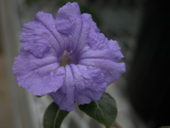
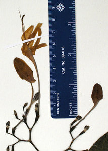

## Phylogeny 

-   « Ancestral Groups  
    -   [Ruellia s. l.](Ruellia_s._l.)
    -   [Ruellieae](../../Ruellieae.md)
    -   [Acanthaceae](../../../Acanthaceae.md)
    -   [Lamiales](../../../../Lamiales.md)
    -   [Asterids](../../../../../Asterids.md)
    -   [Core Eudicots](Core_Eudicots)
    -   [Eudicots](../../../../../../../Eudicots.md)
    -   [Flowering_Plant](../../../../../../../../Flowering_Plant.md)
    -   [Seed_Plant](../../../../../../../../../Seed_Plant.md)
    -   [Land_Plant](../../../../../../../../../../Land_Plant.md)
    -   [Green plants](../../../../../../../../../../../Plants.md)
    -   [Eukaryotes](Eukaryotes)
    -   [Tree of Life](../../../../../../../../../../../../Tree_of_Life.md)

-   ◊ Sibling Groups of  Ruellia s. l.
    -   [Physiruellia clade](Physiruellia_clade)
    -   [Blechum clade](Blechum_clade)
    -   [Ruellia inundata clade](Ruellia_inundata_clade)
    -   [Ebracteolate clade](Ebracteolate_clade)
    -   [Euruellia clade](Euruellia_clade)
    -   [Ruellia inflata clade](Ruellia_inflata_clade)
    -   [Ruellia jaliscana clade](Ruellia_jaliscana_clade)
    -   [Ruellia harveyana clade](Ruellia_harveyana_clade)
    -   [Ruellia humilis clade](Ruellia_humilis_clade)
    -   African Ruellia

-   » Sub-Groups 

# African Ruellia 

[Erin Tripp](http://www.tolweb.org/)

-   *Ruellia anaticollis*[ Benoist]
-   *Ruellia ansericollis*[ Benoist]
-   *Ruellia cordata*[ Thunb.]
-   *Ruellia detonsa*[ Benoist]
-   *Ruellia discifolia*[ Oliver]
-   *Ruellia geayi*[ (Benoist) E. Tripp] [(= Eusiphon
    geayi Benoist)]
-   *Ruellia insignis*[ Balf.f.]
-   *Ruellia latisepala*[ Benoist]
-   *Ruellia lineari-bracteolata*[ Lindau]
-   *Ruellia malacophylla*[ C. B. Clarke]
-   *Ruellia megachlamys*[ S. Moore]
-   *Ruellia patula*[ Jacq.]

Note: this taxon list is still under construction. It does not yet
contain all known African Ruellia subgroups.

Only species that were sampled in Tripp\'s study (in press) are listed.

Containing group: *[Ruellia s. l.](../Ruellia.md)*

### Introduction

African *Ruellia* form a grade that is ancestral with respect to New
World *Ruellia* (Tripp, in press). Species that have been sampled and
are in this grade are listed above. Members of this group are
distributed in Madagascar and across mainland Africa including Botswana,
Democratic Repulic of Congo, Ethiopia, Ghana, Kenya, Namibia, Somalia,
South Africa, Tanzania, Uganda, Zimbabwe, and other countries. At least
one species occurs on an island in the Indian Ocean, i. e., *Ruellia
insignis* Balf.f. on Socotra (Yemen). In Floral of Tropical Africa,
Clarke (1900) treated 15 species of *Ruellia* in Africa. Benoist (1939,
1967) treated another 30 species of *Ruellia* from Madagascar, most of
these non-overlapping with those in Clarke\'s list. One species native
to Ethiopia, *Ruellia megachlamys* S. Moore, has corolla tubes longer
than any known *Ruellia*, and possibly longer than any acanth (see photo
above). The narrow, unexpanded portion of the tube is 13+ cm! Flowers
open in the evening and produce a faint, sweet odor (pers. obs), which
is very notable within the family as most acanths are odorless.

Included in this African grade is the Malagasy endemic *Eusiphon geayi*,
which was recently transferred to *Ruellia*. Plants of *Ruellia geayi*
(Benoist) E. Tripp are shrubs with long-tubed white flowers. The calyx
lobes are fused for the majority of their length (see photo below).
Pollen of *Eusiphon* matches that of *Ruellia*, supporting molecular
data that indicate the two are closely related.\

Herbarium specimens of *Ruellia geayi*. Images © 2006 Erin Tripp.

Species of *Ruellia* also occur in other non-African (incl. Malagasy and
Soctran species) regions of the Old World. They are distributed on the
mainland of southeast Asia, through the Malay Archipelago, and into
Australia. These were not included in Tripp\'s study (in press) due to a
lack of herbarium or living material. Little is known about these
species, and thus they are deserving of further study.

### References

Benoist, R. 1939. Nouvelles Acanthacées Malgaches. P. 144 In: Notulae
Systematicae, vol. 8, ed. H. Humbert. Contribution a l\'etude de la
flore de Madagascar et des Comores. Fasc. 3. Paris.

Benoist, R. 1967. Famille 182 -- Acanthacées. In: Flore de Madagascar et
des Comores, ed. H. Humbert. Tome I. Mus. Nat. Hist. Nat., Paris.

Clarke, C. B. 1900. Acanthaceae, Vol 5. In: Flora of Tropical Africa
(ed. W. T. Thiselton-Dyer). Lovell Reeve & Co., London.

Tripp, E. A. Evolutionary relationships within the species-rich genus
Ruellia (Acanthaceae). Systematic Botany, in press.

##### Title Illustrations



  -----------------------------------------------------------------------
  Scientific Name ::     Ruellia insignis Balf.f.
  Specimen Condition   Live Specimen
  Identified By        Erin A. Tripp
  Collection           Wild collected in Socotra (Yemen)
  Copyright ::            © [Erin Tripp](mailto:erin.tripp@duke.edu) 
  -----------------------------------------------------------------------


  -----------------------------------------------------------------------
  Scientific Name ::     Ruellia megachlamys S. Moore
  Location ::           cultivated, DUKE greenhouses
  Specimen Condition   Live Specimen
  Identified By        Erin A. Tripp
  Collection           native to Ethiopia
  Copyright ::            © [Erin Tripp](mailto:erin.tripp@duke.edu) 
  -----------------------------------------------------------------------
