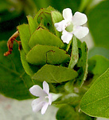
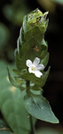
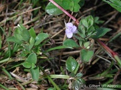
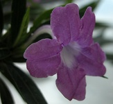
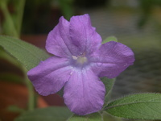

## Phylogeny 

-   « Ancestral Groups  
    -   [Ruellia s. l.](Ruellia_s._l.)
    -   [Ruellieae](../../Ruellieae.md)
    -   [Acanthaceae](../../../Acanthaceae.md)
    -   [Lamiales](../../../../Lamiales.md)
    -   [Asterids](../../../../../Asterids.md)
    -   [Core Eudicots](Core_Eudicots)
    -   [Eudicots](../../../../../../../Eudicots.md)
    -   [Flowering_Plant](../../../../../../../../Flowering_Plant.md)
    -   [Seed_Plant](../../../../../../../../../Seed_Plant.md)
    -   [Land_Plant](../../../../../../../../../../Land_Plant.md)
    -   [Green plants](../../../../../../../../../../../Plants.md)
    -   [Eukaryotes](Eukaryotes)
    -   [Tree of Life](../../../../../../../../../../../../Tree_of_Life.md)

-   ◊ Sibling Groups of  Ruellia s. l.
    -   [Physiruellia clade](Physiruellia_clade)
    -   Blechum clade
    -   [Ruellia inundata clade](Ruellia_inundata_clade)
    -   [Ebracteolate clade](Ebracteolate_clade)
    -   [Euruellia clade](Euruellia_clade)
    -   [Ruellia inflata clade](Ruellia_inflata_clade)
    -   [Ruellia jaliscana clade](Ruellia_jaliscana_clade)
    -   [Ruellia harveyana clade](Ruellia_harveyana_clade)
    -   [Ruellia humilis clade](Ruellia_humilis_clade)
    -   [African Ruellia](African_Ruellia)

-   » Sub-Groups 

# Blechum clade 

[Erin Tripp](http://www.tolweb.org/)

-   *Ruellia blechum*[ L. ] [(= Blechum pyramidatum (Lam.)
    Urb.)]
-   *Ruellia longepetiolata*[ (Oerst.) Hemsl.]
-   *Ruellia maya*[ T. F. Daniel]
-   *Ruellia menthifolia*[ Leonard]
-   *Ruellia tuxtlensis*[ T. P. Ramamoorthy & Y. Hornelas
    ]

## #has_/text_of_/abstract 

> Ruellia is a genus of flowering plants commonly known as ruellias or wild petunias. 
> They are not closely related to petunias (Petunia) 
> although both genera belong to the same euasterid clade. 
> 
> The genus was named in honor of Jean Ruelle (1474–1537), 
> herbalist and physician to Francis I of France and translator of several works of Dioscorides.
>
> Numerous formerly independent genera are nowadays considered synonymous with Ruellia, 
> including **Blechum**, Eusiphon,  and Ulleria. Acanthopale and Polylychnis are considered a distinct genera.
>
> Ruellias are popular ornamental plants. 
> Some are used as medicinal plants, but many are known or suspected to be poisonous. 
> Their leaves are food for the caterpillars of several Lepidoptera (butterflies and moths), 
> typically Nymphalinae and in particular members of their tribe Junoniini, such as the larvae of the banded peacock (Anartia fatima). Nymphalinae using Ruellia as host plants include the common buckeye (Junonia coenia), recorded on R. nodiflora, the lemon pansy (Junonia lemonias), recorded on R. tuberosa, and the malachite butterfly (Siproeta stelenes) and Australian lurcher (Yoma sabina), which are recorded on several species.
>
> [Wikipedia](https://en.wikipedia.org/wiki/Ruellia) 

## Introduction

The *Blechum* clade contains species of *Blechum* that are distributed
widely across the neotropics, as well as species of *Ruellia* that are
endemic to Mexico (see species list below). Tripp\'s study (in press)
showed that *Blechum* is nested within *Ruellia*, with strong support.\
\
The close relationship of *Blechum* to *Ruellia* has long been noted,
but the former has been recognized as distinct primarily on the basis of
pollen characters and fruit morphology. While pollen does seem a useful
character (in part), fruit as well as other macromorphological
characters fail to distinguish *Blechum* from *Ruellia*. McDade and
Tripp (in press) transferred the two Costa Rican species of *Blechum* to
*Ruellia*. A forthcoming manuscript (Tripp, Daniel, Lendemer & McDade in
prep.) further discusses this topic and places the entire genus
*Blechum* into synonymy with *Ruellia*.

### References

McDade, L. A. and E. A. Tripp. Synopsis of Costa Rican Ruellia L.
(Acanthaceae): New species, taxonomic concepts, a country record, range
extensions, and identification aids to the 22 species known from the
country. Brittonia, in press.

Tripp, E. A. Evolutionary relationships within the species-rich genus
Ruellia (Acanthaceae). Systematic Botany, in press.

## Title Illustrations

  -----------------------------------------------------------------------
  Scientific Name ::     Blechum pyramidatum (Lam.) Urb.
  Location ::           Tabasco, Mexico
  Specimen Condition   Live Specimen
  Collector            E. Tripp
  Copyright ::            © [Erin Tripp](mailto:erin.tripp@duke.edu) 
  -----------------------------------------------------------------------

  ---------------------------------------------------------------------------
  Scientific Name ::     Blechum pyramidatum (Lam.) Urb.
  Location ::           Rio Pirre, Darien, Panama
  Specimen Condition   Live Specimen
  Identified By        L. A. McDade
  Copyright ::            © 2006 [Lucinda A. McDade](mailto:lucinda.mcdade@cgu.edu) 
  ---------------------------------------------------------------------------

  ---------------------------------
  Scientific Name ::     Blechum costaricense Oerst.
  Specimen Condition   Live Specimen
  Copyright ::            © [L. Gilbert, UT Austin](http://www.utexas.edu/courses/zoo384l/sirena/species/plants/a/)
  ---------------------------------

  ----------------------------------------------------------------------
  Scientific Name ::  Ruellia maya T.F. Daniel
  Copyright ::         © [Erin Tripp](mailto:erin.tripp@duke.edu) 
  ----------------------------------------------------------------------

  -----------------------------------------------------------------------
  Scientific Name ::     Ruellia longepetiolata (Oerst.) Hemsl.
  Specimen Condition   Live Specimen
  Identified By        Erin A. Tripp
  Collection           donated as living material to DUKE greenhouses
  Copyright ::            © [Erin Tripp](mailto:erin.tripp@duke.edu) 
  -----------------------------------------------------------------------

## Confidential Links & Embeds: 

### [Blechum](/_Standards/bio/bio~Domain/Eukaryotes/Plants/Land_Plant/Seed_Plant/Flowering_Plant/Eudicots/Core_Eudicots/Asterids/Lamiales/Acanthaceae/Ruellieae/Ruellia/Blechum.md) 

### [Blechum.public](/_public/bio/bio~Domain/Eukaryotes/Plants/Land_Plant/Seed_Plant/Flowering_Plant/Eudicots/Core_Eudicots/Asterids/Lamiales/Acanthaceae/Ruellieae/Ruellia/Blechum.public.md) 

### [Blechum.internal](/_internal/bio/bio~Domain/Eukaryotes/Plants/Land_Plant/Seed_Plant/Flowering_Plant/Eudicots/Core_Eudicots/Asterids/Lamiales/Acanthaceae/Ruellieae/Ruellia/Blechum.internal.md) 

### [Blechum.protect](/_protect/bio/bio~Domain/Eukaryotes/Plants/Land_Plant/Seed_Plant/Flowering_Plant/Eudicots/Core_Eudicots/Asterids/Lamiales/Acanthaceae/Ruellieae/Ruellia/Blechum.protect.md) 

### [Blechum.private](/_private/bio/bio~Domain/Eukaryotes/Plants/Land_Plant/Seed_Plant/Flowering_Plant/Eudicots/Core_Eudicots/Asterids/Lamiales/Acanthaceae/Ruellieae/Ruellia/Blechum.private.md) 

### [Blechum.personal](/_personal/bio/bio~Domain/Eukaryotes/Plants/Land_Plant/Seed_Plant/Flowering_Plant/Eudicots/Core_Eudicots/Asterids/Lamiales/Acanthaceae/Ruellieae/Ruellia/Blechum.personal.md) 

### [Blechum.secret](/_secret/bio/bio~Domain/Eukaryotes/Plants/Land_Plant/Seed_Plant/Flowering_Plant/Eudicots/Core_Eudicots/Asterids/Lamiales/Acanthaceae/Ruellieae/Ruellia/Blechum.secret.md)

