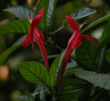
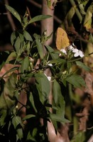

# [[Ebracteolate]]  

## #has_/text_of_/abstract 

> In botany, a bract is a modified or specialized leaf, 
> associated with a reproductive structure such as a flower, inflorescence axis or cone scale. 
>
> Bracts are usually different from foliage leaves in size, color, shape or texture. 
> They also look different from the parts of the flower, such as the petals or sepals. 
>
> A plant having bracts is referred to as bracteate or bracteolate, 
> while one that lacks them is referred to as ebracteate or **Ebracteolate**.
>
> [Wikipedia](https://en.wikipedia.org/wiki/Bract) 

## Phylogeny 

-   « Ancestral Groups  
    -   [Ruellia s. l.](Ruellia_s._l.)
    -   [Ruellieae](../../Ruellieae.md)
    -   [Acanthaceae](../../../Acanthaceae.md)
    -   [Lamiales](../../../../Lamiales.md)
    -   [Asterids](../../../../../Asterids.md)
    -   [Core Eudicots](Core_Eudicots)
    -   [Eudicots](../../../../../../../Eudicots.md)
    -   [Flowering_Plant](../../../../../../../../Flowering_Plant.md)
    -   [Seed_Plant](../../../../../../../../../Seed_Plant.md)
    -   [Land_Plant](../../../../../../../../../../Land_Plant.md)
    -   [Green plants](../../../../../../../../../../../Plants.md)
    -   [Eukaryotes](Eukaryotes)
    -   [Tree of Life](../../../../../../../../../../../../Tree_of_Life.md)

-   ◊ Sibling Groups of  Ruellia s. l.
    -   [Physiruellia clade](Physiruellia_clade)
    -   [Blechum clade](Blechum_clade)
    -   [Ruellia inundata clade](Ruellia_inundata_clade)
    -   Ebracteolate clade
    -   [Euruellia clade](Euruellia_clade)
    -   [Ruellia inflata clade](Ruellia_inflata_clade)
    -   [Ruellia jaliscana clade](Ruellia_jaliscana_clade)
    -   [Ruellia harveyana clade](Ruellia_harveyana_clade)
    -   [Ruellia humilis clade](Ruellia_humilis_clade)
    -   [African Ruellia](African_Ruellia)

-   » Sub-Groups 

	-   *Ruellia adenocalyx*[ Leonard]
	-   *Ruellia alboviolacea*[ Lindau]
	-   *Ruellia amoena*[ Sesse & Moc.]
	-   *Ruellia beyrichiana*[ (Nees) S. Moore]
	-   *Ruellia bulbifera*[ Lindau]
	-   *Ruellia densa*[ (Nees) Hiern]
	-   *Ruellia donnell-smithii*[ Leonard]
	-   *Ruellia eriocalyx*[ Glaz.]
	-   *Ruellia erythropus*[ (Nees) Lindau]
	-   *Ruellia foetida*[ Willd.]
	-   *Ruellia geminiflora*[ H. B. K.]
	-   *Ruellia hapalotricha*[ Lindau]
	-   *Ruellia hookeriana*[ (Nees) Hemsl.]
	-   *Ruellia humboldtiana*[ (Nees) Lindau]
	-   *Ruellia incompta*[ (Nees) Lindau]
	-   *Ruellia leucantha*[ Brandegee]
	-   *Ruellia longifilamentosa*[ Lindau]
	-   *Ruellia magnifora*[ C. Ezcurra]
	-   *Ruellia matagalpae*[ Lindau]
	-   *Ruellia mcvaughii*[ T. F. Daniel]
	-   *Ruellia novogaliciana*[ T. F. Daniel]
	-   *Ruellia petiolaris*[ (Nees) T. F. Daniel]
	-   *Ruellia salviaefolius*[ (Nees) Lindau]
	-   *Ruellia spissa*[ Leonard]
	-   *Ruellia tarapotana*[ Lindau]
	-   *Ruellia tomentosa*[ (Nees) Lindau]
	-   *Ruellia tubiflora*[ H. B. K.]
	-   *Ruellia verbasciformis*[ (Nees) C. Ezcurra & Zappi]
	-   *Ruellia villosa*[ Lindau]
	-   *Ruellia yurimaguensis*[ Lindau]

## Introduction

[Erin Tripp]() 

Members of the Ebracteolate clade are characterized by having reduced
structures associated with the inflorescence (Ezcurra 1993). For
example, most species have sessile and often solitary flowers in leaf
axils (vs. dichasial, long-pedunculate flowers in other groups such as
*Euruellia* and *Physiruellia*). Further, most lack floral bracteoles.
Fruits generally contain between 2 and 8 ovules.\
\
Species in Ebracteolate are distributed across the neotropics, though
some geographic structure can be found within subclades. In other cases,
some subclades are characterized by species having similar growth forms
and habitat preferences, such as the group containing the widespread
*Ruellia geminiflora*. Though species in this group are distributed
across various parts of the neotropics (no geographic structure),  they
all occupy open areas such as savannas, cerrados, and grasslands. Some
of these species, e.g., *Ruellia bulbifera*, have thick, tuberous
xylopodia (see above photo) and are apparently adapted to withstand
frequent fires.\

\

*Ruellia bulbifera* has thick, tuberous xylopodia which is likely an
adaptation to fire. © Erin Tripp.

The Ebracteolate clade is very large and morphologically diverse. One
species, *Ruellia verbasciformis*, has gibbous corollas that open at
night and have a strong, \"fermented\" floral odor. These features
suggest pollination by bats, though this claim remains to be
field-validated. Vegetative portions of *R. verbasciformis* have proven
highly irritating to human skin (Ezcurra & Zappi 1996).\

### References

Ezcurra, C. 1993. Systematics of Ruellia (Acanthaceae) in southern South
America. Annals of the Missouri Botanical Garden 80:787-845.

Ezcurra, C. and D. Zappi. 1996. Ruellia verbasciformis, a new
combination in the genus Ruellia (Acanthaceae). Kew Bulletin 51(4):
819-829.

Tripp, E. A. Evolutionary relationships within the species-rich genus
Ruellia (Acanthaceae). Systematic Botany, in press.

## Title Illustrations

  -----------------------------------------------------------------------
  Scientific Name ::     Ruellia mcvaughii T. F. Daniel
  Location ::           Jalisco, Mexico
  Specimen Condition   Live Specimen
  Identified By        Erin A. Tripp
  Collector            Tripp & Deregibus
  Copyright ::            © [Erin Tripp](mailto:erin.tripp@duke.edu) 
  -----------------------------------------------------------------------

  -----------------------------------------------------------------------
  Scientific Name ::     Ruellia tubiflora H. B. K.
  Location ::           La Selva Biological Station, Costa Rica
  Specimen Condition   Live Specimen
  Identified By        Erin A. Tripp
  Collector            Tripp & McDade
  Copyright ::            © [Erin Tripp](mailto:erin.tripp@duke.edu) 
  -----------------------------------------------------------------------

  -----------------------------------------------------------------------
  Scientific Name ::     Ruellia foetida Willd.
  Location ::           Oaxaca, Mexico
  Specimen Condition   Live Specimen
  Identified By        Erin A. Tripp
  Collector            E. Tripp
  Copyright ::            © [Erin Tripp](mailto:erin.tripp@duke.edu) 
  -----------------------------------------------------------------------
