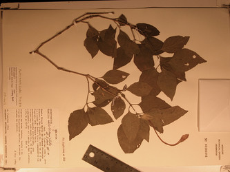

## Phylogeny 

-   « Ancestral Groups  
    -   [Ruellia s. l.](Ruellia_s._l.)
    -   [Ruellieae](../../Ruellieae.md)
    -   [Acanthaceae](../../../Acanthaceae.md)
    -   [Lamiales](../../../../Lamiales.md)
    -   [Asterids](../../../../../Asterids.md)
    -   [Core Eudicots](Core_Eudicots)
    -   [Eudicots](../../../../../../../Eudicots.md)
    -   [Flowering_Plant](../../../../../../../../Flowering_Plant.md)
    -   [Seed_Plant](../../../../../../../../../Seed_Plant.md)
    -   [Land_Plant](../../../../../../../../../../Land_Plant.md)
    -   [Green plants](../../../../../../../../../../../Plants.md)
    -   [Eukaryotes](Eukaryotes)
    -   [Tree of Life](../../../../../../../../../../../../Tree_of_Life.md)

-   ◊ Sibling Groups of  Ruellia s. l.
    -   [Physiruellia clade](Physiruellia_clade)
    -   [Blechum clade](Blechum_clade)
    -   [Ruellia inundata clade](Ruellia_inundata_clade)
    -   [Ebracteolate clade](Ebracteolate_clade)
    -   [Euruellia clade](Euruellia_clade)
    -   [Ruellia inflata clade](Ruellia_inflata_clade)
    -   [Ruellia jaliscana clade](Ruellia_jaliscana_clade)
    -   Ruellia harveyana clade
    -   [Ruellia humilis clade](Ruellia_humilis_clade)
    -   [African Ruellia](African_Ruellia)

-   » Sub-Groups 

# Ruellia harveyana clade 

[Erin Tripp](http://www.tolweb.org/)

-   *Ruellia harveyana*[ Stapf]
-   *Ruellia multifolia*[ (Nees) Lindau]
-   *Ruellia nobilis*[ Lindau]
-   *Ruellia pilosa*[ (Nees) Pav. ex Nees]

Note: this taxon list is still under construction. It does not yet
contain all known Ruellia harveyana clade subgroups.

Containing group: *[Ruellia s. l.](../Ruellia.md)*

### Introduction

Phylogenetic analyses from Tripp (in press) revealed a small, moderately
supported lineage, the Ruellia harveyana clade, that contains four
species. There are surely other species that belong to this group, but
these were not included in taxon sampling for the study. There are no
known synapormorphies to unite these species. *Ruellia nobilis*, a rare
and endemic species of the Chaco in S. South America, has very long,
white corolla tubes--the narrow, unexpanded portion of the tube is
approximately 10 cm long. Other species in this group have purple
flowers and occur in S. South America, Central America, and Mexico.

### References

Ezcurra, C. 1993. Systematics of Ruellia (Acanthaceae) in southern South
America. Annals of the Missouri Botanical Garden 80:787-845.

Tripp, E. A. Evolutionary relationships within the species-rich genus
Ruellia (Acanthaceae). Systematic Botany, in press.

Wasshausen, D. C. and J. R. I. Wood. 2004. Acanthaceae of Bolivia.
Contr. U.S. Nat. Herb. 49: 1-152.

##### Title Illustrations



  -----------------------------------------------------------------------
  Scientific Name ::     Ruellia nobilis (S. Moore) Lindau
  Specimen Condition   Dead Specimen
  Identified By        Erin A. Tripp
  Copyright ::            © [Erin Tripp](mailto:erin.tripp@duke.edu) 
  -----------------------------------------------------------------------
