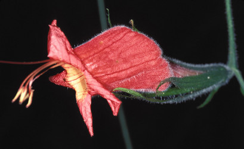

## Phylogeny 

-   « Ancestral Groups  
    -   [Ruellia s. l.](Ruellia_s._l.)
    -   [Ruellieae](../../Ruellieae.md)
    -   [Acanthaceae](../../../Acanthaceae.md)
    -   [Lamiales](../../../../Lamiales.md)
    -   [Asterids](../../../../../Asterids.md)
    -   [Core Eudicots](Core_Eudicots)
    -   [Eudicots](../../../../../../../Eudicots.md)
    -   [Flowering_Plant](../../../../../../../../Flowering_Plant.md)
    -   [Seed_Plant](../../../../../../../../../Seed_Plant.md)
    -   [Land_Plant](../../../../../../../../../../Land_Plant.md)
    -   [Green plants](../../../../../../../../../../../Plants.md)
    -   [Eukaryotes](Eukaryotes)
    -   [Tree of Life](../../../../../../../../../../../../Tree_of_Life.md)

-   ◊ Sibling Groups of  Ruellia s. l.
    -   [Physiruellia clade](Physiruellia_clade)
    -   [Blechum clade](Blechum_clade)
    -   [Ruellia inundata clade](Ruellia_inundata_clade)
    -   [Ebracteolate clade](Ebracteolate_clade)
    -   [Euruellia clade](Euruellia_clade)
    -   Ruellia inflata clade
    -   [Ruellia jaliscana clade](Ruellia_jaliscana_clade)
    -   [Ruellia harveyana clade](Ruellia_harveyana_clade)
    -   [Ruellia humilis clade](Ruellia_humilis_clade)
    -   [African Ruellia](African_Ruellia)

-   » Sub-Groups 

# Ruellia inflata clade 

[Erin Tripp](http://www.tolweb.org/)

-   *Ruellia acutangula*[ (Nees) Lindau]
-   *Ruellia elegans*[ Poir.]
-   *Ruellia eurycodon*[ Lindau]
-   *Ruellia exserta*[ Wassh.]
-   *Ruellia inflata*[ Rich.]
-   *Ruellia steyermarkii*[ Wassh.]
-   *Ruellia subsessilis*[ (Mart.) Lindau]

Note: this taxon list is still under construction. It does not yet
contain all known Ruellia inflata clade subgroups.

Containing group: *[Ruellia s. l.](../Ruellia.md)*

### Introduction

The *Ruellia inflata* clade contains species having red or
greenish-yellow flowers. Those with the latter have floral morphologies
suggestive of bat-pollination, though next to nothing is known about
their pollination biology.\
\
Members of this group occur in South America, especially in Brazil and
Venezuela. Three species in this clade are also scrambling vines or
lianas which is an unusual habit in *Ruellia*.\

### References

Tripp, E. A. Evolutionary relationships within the species-rich genus
Ruellia (Acanthaceae). Systematic Botany, in press.

##### Title Illustrations



  ---------------------------------------------------------------------
  Scientific Name ::     Ruellia elegans
  Specimen Condition   Live Specimen
  Copyright ::            © [Kurt Stüber](http://www.biolib.de/) 
  ---------------------------------------------------------------------


  -----------
  Scientific Name ::     Ruellia inflata
  Location ::           Bolivia
  Specimen Condition   Live Specimen
  Collector            John L. Clark
  Copyright ::            © 2002 John L. Clark
  -----------
