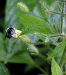
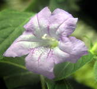
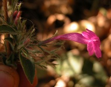
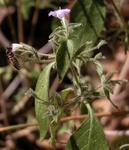

---
title: "Ruellia inundata clade"
---

# Ruellia inundata  

       

## Introduction

[Erin Tripp]()

Species in the *Ruellia inundata* clade exhibit a disjunct distribution:
some occur in Mexico and Central America, while others occur in Brazil
and Ecuador.  All inhabit forests or habitats that experience
seasonality, i. e., a dry season. Some species in this clade are
characterized by having clavate fruits with external, maroon splotches.
Many have a very pungent, vegetative odor. This clade is well supported
by molecular data (Tripp, in press), and provides an excellent example
of the floral diversity that is seen even between very closely related
species in *Ruellia*.

## Phylogeny 

-   « Ancestral Groups  
    -   [Ruellia s. l.](Ruellia_s._l.)
    -   [Ruellieae](../../Ruellieae.md)
    -   [Acanthaceae](../../../Acanthaceae.md)
    -   [Lamiales](../../../../Lamiales.md)
    -   [Asterids](../../../../../Asterids.md)
    -   [Core Eudicots](Core_Eudicots)
    -   [Eudicots](../../../../../../../Eudicots.md)
    -   [Flowering_Plant](../../../../../../../../Flowering_Plant.md)
    -   [Seed_Plant](../../../../../../../../../Seed_Plant.md)
    -   [Land_Plant](../../../../../../../../../../Land_Plant.md)
    -   [Green plants](../../../../../../../../../../../Plants.md)
    -   [Eukaryotes](Eukaryotes)
    -   [Tree of Life](../../../../../../../../../../../../Tree_of_Life.md)

-   ◊ Sibling Groups of  Ruellia s. l.
    -   [Physiruellia clade](Physiruellia_clade)
    -   [Blechum clade](Blechum_clade)
    -   Ruellia inundata clade
    -   [Ebracteolate clade](Ebracteolate_clade)
    -   [Euruellia clade](Euruellia_clade)
    -   [Ruellia inflata clade](Ruellia_inflata_clade)
    -   [Ruellia jaliscana clade](Ruellia_jaliscana_clade)
    -   [Ruellia harveyana clade](Ruellia_harveyana_clade)
    -   [Ruellia humilis clade](Ruellia_humilis_clade)
    -   [African Ruellia](African_Ruellia)

-   » Sub-Groups 

	-   *Ruellia asperula*[ Lindau]
	-   *Ruellia floribunda*[ Hook.]
	-   *Ruellia galeottii*[ Leonard]
	-   *Ruellia inundata*[ H. B. K.]
	-   *Ruellia paniculata*[ L.]
	-   *Ruellia standleyi*[ Leonard]

## Title Illustrations

------------------------------------------------------------------------
 
Scientific Name ::     Ruellia standleyi Leonard
Location ::           Cartago, Costa Rica
Specimen Condition   Live Specimen
Copyright ::            © 2006 [Erin Tripp](mailto:erin.tripp@duke.edu) 

-----------------------------------------------------------------------

Scientific Name ::     Ruellia paniculata L.
Location ::           Palo Verde Biological Station, Costa Rica
Specimen Condition   Live Specimen
Collector            Tripp & E. Deinert
Copyright ::            © [Erin Tripp](mailto:erin.tripp@duke.edu) 

-----------------------------------------------------------------------

Scientific Name ::     Ruellia inundata H. B. K.
Location ::           Palo Verde Biological Station, Costa Rica
Specimen Condition   Live Specimen
Identified By        Erin A. Tripp
Collector            Tripp & Deinert
Copyright ::            © [Erin Tripp](mailto:erin.tripp@duke.edu) 

----------------------------------------------------------------------

Scientific Name ::  Ruellia galeottii Leonard
Location ::        Oaxaca, Mexico
Identified By     Erin A. Tripp
Collector         E. Tripp
Copyright ::         © [Erin Tripp](mailto:erin.tripp@duke.edu) 

## Confidential Links & Embeds: 

### #is_/same_as :: [inundata](/_Standards/bio/bio~Domain/Eukaryotes/Plants/Land_Plant/Seed_Plant/Flowering_Plant/Eudicots/Core_Eudicots/Asterids/Lamiales/Acanthaceae/Ruellieae/Ruellia/inundata.md) 

### #is_/same_as :: [inundata.public](/_public/bio/bio~Domain/Eukaryotes/Plants/Land_Plant/Seed_Plant/Flowering_Plant/Eudicots/Core_Eudicots/Asterids/Lamiales/Acanthaceae/Ruellieae/Ruellia/inundata.public.md) 

### #is_/same_as :: [inundata.internal](/_internal/bio/bio~Domain/Eukaryotes/Plants/Land_Plant/Seed_Plant/Flowering_Plant/Eudicots/Core_Eudicots/Asterids/Lamiales/Acanthaceae/Ruellieae/Ruellia/inundata.internal.md) 

### #is_/same_as :: [inundata.protect](/_protect/bio/bio~Domain/Eukaryotes/Plants/Land_Plant/Seed_Plant/Flowering_Plant/Eudicots/Core_Eudicots/Asterids/Lamiales/Acanthaceae/Ruellieae/Ruellia/inundata.protect.md) 

### #is_/same_as :: [inundata.private](/_private/bio/bio~Domain/Eukaryotes/Plants/Land_Plant/Seed_Plant/Flowering_Plant/Eudicots/Core_Eudicots/Asterids/Lamiales/Acanthaceae/Ruellieae/Ruellia/inundata.private.md) 

### #is_/same_as :: [inundata.personal](/_personal/bio/bio~Domain/Eukaryotes/Plants/Land_Plant/Seed_Plant/Flowering_Plant/Eudicots/Core_Eudicots/Asterids/Lamiales/Acanthaceae/Ruellieae/Ruellia/inundata.personal.md) 

### #is_/same_as :: [inundata.secret](/_secret/bio/bio~Domain/Eukaryotes/Plants/Land_Plant/Seed_Plant/Flowering_Plant/Eudicots/Core_Eudicots/Asterids/Lamiales/Acanthaceae/Ruellieae/Ruellia/inundata.secret.md)

