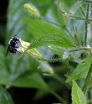
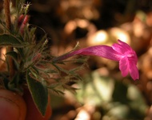
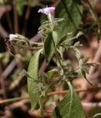

## Phylogeny 

-   « Ancestral Groups  
    -   [Ruellia s. l.](Ruellia_s._l.)
    -   [Ruellieae](../../Ruellieae.md)
    -   [Acanthaceae](../../../Acanthaceae.md)
    -   [Lamiales](../../../../Lamiales.md)
    -   [Asterids](../../../../../Asterids.md)
    -   [Core Eudicots](Core_Eudicots)
    -   [Eudicots](../../../../../../../Eudicots.md)
    -   [Flowering_Plant](../../../../../../../../Flowering_Plant.md)
    -   [Seed_Plant](../../../../../../../../../Seed_Plant.md)
    -   [Land_Plant](../../../../../../../../../../Land_Plant.md)
    -   [Green plants](../../../../../../../../../../../Plants.md)
    -   [Eukaryotes](Eukaryotes)
    -   [Tree of Life](../../../../../../../../../../../../Tree_of_Life.md)

-   ◊ Sibling Groups of  Ruellia s. l.
    -   [Physiruellia clade](Physiruellia_clade)
    -   [Blechum clade](Blechum_clade)
    -   Ruellia inundata clade
    -   [Ebracteolate clade](Ebracteolate_clade)
    -   [Euruellia clade](Euruellia_clade)
    -   [Ruellia inflata clade](Ruellia_inflata_clade)
    -   [Ruellia jaliscana clade](Ruellia_jaliscana_clade)
    -   [Ruellia harveyana clade](Ruellia_harveyana_clade)
    -   [Ruellia humilis clade](Ruellia_humilis_clade)
    -   [African Ruellia](African_Ruellia)

-   » Sub-Groups 

# Ruellia inundata clade 

[Erin Tripp](http://www.tolweb.org/)

-   *Ruellia asperula*[ Lindau]
-   *Ruellia floribunda*[ Hook.]
-   *Ruellia galeottii*[ Leonard]
-   *Ruellia inundata*[ H. B. K.]
-   *Ruellia paniculata*[ L.]
-   *Ruellia standleyi*[ Leonard]

Note: this taxon list is still under construction. It does not yet
contain all known Ruellia inundata clade subgroups.

Containing group: *[Ruellia s. l.](../Ruellia.md)*

### Introduction

Species in the *Ruellia inundata* clade exhibit a disjunct distribution:
some occur in Mexico and Central America, while others occur in Brazil
and Ecuador.  All inhabit forests or habitats that experience
seasonality, i. e., a dry season. Some species in this clade are
characterized by having clavate fruits with external, maroon splotches.
Many have a very pungent, vegetative odor. This clade is well supported
by molecular data (Tripp, in press), and provides an excellent example
of the floral diversity that is seen even between very closely related
species in *Ruellia*.

### References

Tripp, E. A. Evolutionary relationships within the species-rich genus
Ruellia (Acanthaceae). Systematic Botany, in press.

##### Title Illustrations



  ------------------------------------------------------------------------
  Scientific Name ::     Ruellia standleyi Leonard
  Location ::           Cartago, Costa Rica
  Specimen Condition   Live Specimen
  Copyright ::            © 2006 [Erin Tripp](mailto:erin.tripp@duke.edu) 
  ------------------------------------------------------------------------


  -----------------------------------------------------------------------
  Scientific Name ::     Ruellia paniculata L.
  Location ::           Palo Verde Biological Station, Costa Rica
  Specimen Condition   Live Specimen
  Collector            Tripp & E. Deinert
  Copyright ::            © [Erin Tripp](mailto:erin.tripp@duke.edu) 
  -----------------------------------------------------------------------


  -----------------------------------------------------------------------
  Scientific Name ::     Ruellia inundata H. B. K.
  Location ::           Palo Verde Biological Station, Costa Rica
  Specimen Condition   Live Specimen
  Identified By        Erin A. Tripp
  Collector            Tripp & Deinert
  Copyright ::            © [Erin Tripp](mailto:erin.tripp@duke.edu) 
  -----------------------------------------------------------------------


  ----------------------------------------------------------------------
  Scientific Name ::  Ruellia galeottii Leonard
  Location ::        Oaxaca, Mexico
  Identified By     Erin A. Tripp
  Collector         E. Tripp
  Copyright ::         © [Erin Tripp](mailto:erin.tripp@duke.edu) 
  ----------------------------------------------------------------------
