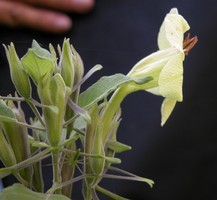
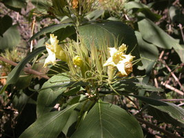
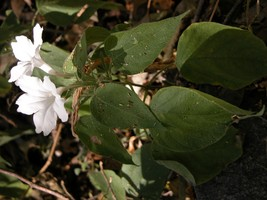

## Phylogeny 

-   « Ancestral Groups  
    -   [Ruellia s. l.](Ruellia_s._l.)
    -   [Ruellieae](../../Ruellieae.md)
    -   [Acanthaceae](../../../Acanthaceae.md)
    -   [Lamiales](../../../../Lamiales.md)
    -   [Asterids](../../../../../Asterids.md)
    -   [Core Eudicots](Core_Eudicots)
    -   [Eudicots](../../../../../../../Eudicots.md)
    -   [Flowering_Plant](../../../../../../../../Flowering_Plant.md)
    -   [Seed_Plant](../../../../../../../../../Seed_Plant.md)
    -   [Land_Plant](../../../../../../../../../../Land_Plant.md)
    -   [Green plants](../../../../../../../../../../../Plants.md)
    -   [Eukaryotes](Eukaryotes)
    -   [Tree of Life](../../../../../../../../../../../../Tree_of_Life.md)

-   ◊ Sibling Groups of  Ruellia s. l.
    -   [Physiruellia clade](Physiruellia_clade)
    -   [Blechum clade](Blechum_clade)
    -   [Ruellia inundata clade](Ruellia_inundata_clade)
    -   [Ebracteolate clade](Ebracteolate_clade)
    -   [Euruellia clade](Euruellia_clade)
    -   [Ruellia inflata clade](Ruellia_inflata_clade)
    -   Ruellia jaliscana clade
    -   [Ruellia harveyana clade](Ruellia_harveyana_clade)
    -   [Ruellia humilis clade](Ruellia_humilis_clade)
    -   [African Ruellia](African_Ruellia)

-   » Sub-Groups 

# Ruellia jaliscana clade 

[Erin Tripp](http://www.tolweb.org/)

-   *Ruellia bourgaei*[ Hemsl.]
-   *Ruellia conzattii*[ Standl.]
-   *Ruellia fruticosa*[ Sesse & Moc.]
-   *Ruellia jaliscana*[ Standl.]
-   *Ruellia pringlei*[ Fernald]
-   *Ruellia speciosa*[ (Nees) Lindau]

Note: this taxon list is still under construction. It does not yet
contain all known Ruellia jaliscana clade subgroups.

Containing group: *[Ruellia s. l.](../Ruellia.md)*

### Introduction

All species in the *Ruellia jaliscana* clade sampled by Tripp (in press)
are endemic to Mexico. Generally, floral color cannot be used to
diagnose clades within *Ruellia*, but this may be an exception in that
all species lack floral anthocyanins, i. e., they possess yellow or
white flowers. Nearly all species encountered \"in the cellulose\" have
a pungent vegetative odor. This odor can be so strong that, upon
entering a forest with large populations of one of these species, one
can immediately sense the presence of these plants. Beyond this
vegetative odor, at least one species in this clade produces a spicy,
vanilla-like floral odor. Floral odors are very rare among all of
Acanthaceae.\

Species in the *Ruellia jaliscana* clade have yellow or white flowers.
Left: *Ruellia conzattii*. Center: *Ruellia fruticosa*. Right: *Ruellia
pringlei*. Photographs © Erin Tripp.

Most species in this clade are, to varying degrees, rare in the wild
(see Daniel 2003). Some are also endemic to a single state. There are a
handful of other described species of *Ruellia* likely part of this
clade, but they were not included in analyses due to a lack of material.
Many of these are known only from the type collection and may be extinct
in the wild.

Several species in this group have terminal inflorescences, which is
notable in *Ruellia*. Based on the large, gibbous flowers of some
members of this clade, Ramamoorthy (1991) established a new section
(Chiropterophila) to accomodate some of them. Despite the sectional
name, field work by Tripp & friends indicates that some species in this
group are hummingbird-pollinated. Molecular data (Tripp in press, Tripp
unpublished) suggest that the content of sect. Chiropterophila needs
revisiting, thus a forthcoming revision of this section will be produced
in subsequent months.

### References

Daniel, T.F. 2003. New and reconsidered Mexican Acanthaceae X. Flora del
Bajío region. Novon 13:37---48.

Ramamoorthy, T. P. 1991. Ruellia section Chiropterophila (Acanthaceae):
A novelty from Mexico. Botanical Journal of the Linnaean Society
107:79-88.

Tripp, E. A. Evolutionary relationships within the species-rich genus
Ruellia (Acanthaceae). Systematic Botany, in press.

##### Title Illustrations



  -----------------------------------------------------------------------
  Scientific Name ::     Ruellia speciosa Lindau
  Location ::           Oaxaca, Mexico
  Specimen Condition   Live Specimen
  Identified By        Erin A. Tripp
  Collector            Tripp & Acosta
  Copyright ::            © [Erin Tripp](mailto:erin.tripp@duke.edu) 
  -----------------------------------------------------------------------


  -----------------------------------------------------------------------
  Scientific Name ::     Ruellia bourgaei Hemsl.
  Location ::           Jalisco, Mexico
  Specimen Condition   Live Specimen
  Identified By        Erin A. Tripp
  Collector            Tripp & L. Tripp
  Copyright ::            © [Erin Tripp](mailto:erin.tripp@duke.edu) 
  -----------------------------------------------------------------------


  -----------------------------------------------------------------------
  Scientific Name ::     Ruellia jaliscana Standl.
  Location ::           Jalisco, Mexico
  Specimen Condition   Live Specimen
  Identified By        Erin A. Tripp
  Collector            Tripp & Deregibus
  Copyright ::            © [Erin Tripp](mailto:erin.tripp@duke.edu) 
  -----------------------------------------------------------------------
