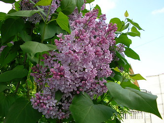

## Phylogeny 

-   « Ancestral Groups  
    -   [Lamiales](../Lamiales.md)
    -   [Asterids](../../Asterids.md)
    -   [Core Eudicots](Core_Eudicots)
    -   [Eudicots](../../../../Eudicots.md)
    -   [Flowering_Plant](../../../../../Flowering_Plant.md)
    -   [Seed_Plant](../../../../../../Seed_Plant.md)
    -   [Land_Plant](../../../../../../../Land_Plant.md)
    -   [Green plants](../../../../../../../../Plants.md)
    -   [Eukaryotes](Eukaryotes)
    -   [Tree of Life](../../../../../../../../../Tree_of_Life.md)

-   ◊ Sibling Groups of  Lamiales
    -   Oleaceae
    -   [Acanthaceae](Acanthaceae.md)
    -   [Gesneriaceae](Gesneriaceae.md)

-   » Sub-Groups 

# Oleaceae 

Relationships after Wallander & Albert 2000.

Containing group: [Lamiales](../Lamiales.md)

### Information on the Internet

[Eva Wallander\'s Home Page](http://www.systbot.gu.se/staff/evawal/welcome.html).

### References

Baas, P., P. M. Esser, M. E. T. van der Westen, and M. Zandee. 1988.
Wood anatomy of the Oleaceae. IAWA Bulletin 9:103--182.

Bigazzi, M. 1989. Ultrastructure of nuclear inclusions and the
separation of Verbenaceae and Oleaceae (including Nyctanthes). Plant
Systematics and Evolution 163:1--12.

George, K., S. Geethamma, and C. A. Ninan. 1989. Chromosome evolution in
Oleaceae. Journal of Cytology and Genetics 24:71--77.

Jensen, S. R., H. Franzyk, and E. Wallander. 2002. Chemotaxonomy of the
Oleaceae: iridoids as taxonomic markers. Phytochemistry 60:213-231.

Johnson, L. A. S. 1957. A review of the family Oleaceae. Contributions
from the New South Wales National Herbarium 2:395--418.

Kuriachen, P. M. and Y. S. Dave. 1989. Structural studies in the fruits
of Oleaceae with discussion on the systematic position of Nyctanthes L.
Phytomorphology 39:51--60.

Rohwer, J. G. 1993. A preliminary survey of the fruits and seeds of the
Oleaceae. Botanische Jahrbücher für Systematik, Pflanzengeschichte und
Pflanzengeographie 115:271--291.

Wallander, E. and V. A. Albert. 2000. Phylogeny and classification of
Oleaceae based on rps16 and trnL-F sequence data. American Journal of
Botany 87:1827-1841.

##### Title Illustrations



  ---------------------------------------------------------------------------
  Scientific Name ::   Syringa vulgaris
  Location ::         Romania
  Identified By      Ilisoi Gabriel
  Life Cycle Stage ::   Adult
  Body Part          Aerial, Leaves and flowers
  Copyright ::          © [Gabriel Ilisoi](mailto:ilisoi_gabriel@yahoo.co.uk) 
  ---------------------------------------------------------------------------


  ------------------------------------------------------------------------
  Scientific Name ::   Olea europaea
  Location ::         Samos, Greece
  Acknowledgements   courtesy [Botanical Image Database](http://www.unibas.ch/botimage/)
  Copyright ::          © 2001 University of Basel, Basel, Switzerland 
  ------------------------------------------------------------------------
