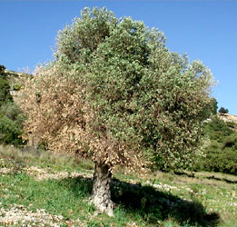

# [[Oleaceae]] 

   

## #has_/text_of_/abstract 

> **Oleaceae**, also known as the olive family or sometimes the lilac family, 
> is a taxonomic family of flowering shrubs, trees, and a few lianas in the order Lamiales. 
> It presently comprises 28 genera, one of which is recently extinct. 
> 
> The extant genera include Cartrema, which was resurrected in 2012. 
> The number of species in the Oleaceae is variously estimated in a wide range around 700. 
> The flowers are often numerous and highly odoriferous. 
> 
> The family has a subcosmopolitan distribution, 
> ranging from the subarctic to the southernmost parts of Africa, Australia, and South America. 
> 
> Notable members include olive, ash, jasmine, and several popular ornamental plants 
> including privet, forsythia, fringetrees, and lilac.
>
> [Wikipedia](https://en.wikipedia.org/wiki/Oleaceae) 

## Phylogeny 

-   « Ancestral Groups  
    -   [Lamiales](../Lamiales.md)
    -   [Asterids](../../Asterids.md)
    -   [Core Eudicots](Core_Eudicots)
    -   [Eudicots](../../../../Eudicots.md)
    -   [Flowering_Plant](../../../../../Flowering_Plant.md)
    -   [Seed_Plant](../../../../../../Seed_Plant.md)
    -   [Land_Plant](../../../../../../../Land_Plant.md)
    -   [Green plants](../../../../../../../../Plants.md)
    -   [Eukaryotes](Eukaryotes)
    -   [Tree of Life](../../../../../../../../../Tree_of_Life.md)

-   ◊ Sibling Groups of  Lamiales
    -   Oleaceae
    -   [Acanthaceae](Acanthaceae.md)
    -   [Gesneriaceae](Gesneriaceae.md)

-   » Sub-Groups 

## Title Illustrations

---------------------------------------------------------------------------
 
Scientific Name ::   Syringa vulgaris
Location ::         Romania
Identified By      Ilisoi Gabriel
Life Cycle Stage ::   Adult
Body Part          Aerial, Leaves and flowers
Copyright ::          © [Gabriel Ilisoi](mailto:ilisoi_gabriel@yahoo.co.uk) 

------------------------------------------------------------------------
 
Scientific Name ::   Olea europaea
Location ::         Samos, Greece
Acknowledgements   courtesy [Botanical Image Database](http://www.unibas.ch/botimage/)
Copyright ::          © 2001 University of Basel, Basel, Switzerland 

## Confidential Links & Embeds: 

### [Oleaceae](/_Standards/bio/bio~Domain/Eukaryotes/Plants/Land_Plant/Seed_Plant/Flowering_Plant/Eudicots/Core_Eudicots/Asterids/Lamiales/Oleaceae.md) 

### [Oleaceae.public](/_public/bio/bio~Domain/Eukaryotes/Plants/Land_Plant/Seed_Plant/Flowering_Plant/Eudicots/Core_Eudicots/Asterids/Lamiales/Oleaceae.public.md) 

### [Oleaceae.internal](/_internal/bio/bio~Domain/Eukaryotes/Plants/Land_Plant/Seed_Plant/Flowering_Plant/Eudicots/Core_Eudicots/Asterids/Lamiales/Oleaceae.internal.md) 

### [Oleaceae.protect](/_protect/bio/bio~Domain/Eukaryotes/Plants/Land_Plant/Seed_Plant/Flowering_Plant/Eudicots/Core_Eudicots/Asterids/Lamiales/Oleaceae.protect.md) 

### [Oleaceae.private](/_private/bio/bio~Domain/Eukaryotes/Plants/Land_Plant/Seed_Plant/Flowering_Plant/Eudicots/Core_Eudicots/Asterids/Lamiales/Oleaceae.private.md) 

### [Oleaceae.personal](/_personal/bio/bio~Domain/Eukaryotes/Plants/Land_Plant/Seed_Plant/Flowering_Plant/Eudicots/Core_Eudicots/Asterids/Lamiales/Oleaceae.personal.md) 

### [Oleaceae.secret](/_secret/bio/bio~Domain/Eukaryotes/Plants/Land_Plant/Seed_Plant/Flowering_Plant/Eudicots/Core_Eudicots/Asterids/Lamiales/Oleaceae.secret.md)

