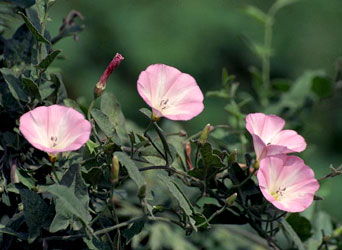
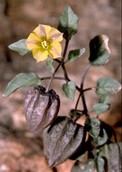

# [[Solanales]] 

 
  

## #has_/text_of_/abstract 

> The **Solanales** are an order of flowering plants, included in the asterid group of the eudicots. 
> Well-known members of Solanales include potatoes, eggplants, tomatoes, chili peppers, 
> tobacco, petunias, nightshades, morning glory, and sweet potato. 
> 
> Some older sources used the name Polemoniales for this order.
>
> [Wikipedia](https://en.wikipedia.org/wiki/Solanales)

## Phylogeny 

-   « Ancestral Groups  
    -   [Asterids](../Asterids.md)
    -   [Core Eudicots](Core_Eudicots)
    -   [Eudicots](../../../Eudicots.md)
    -   [Flowering_Plant](../../../../Flowering_Plant.md)
    -   [Seed_Plant](../../../../../Seed_Plant.md)
    -   [Land_Plant](../../../../../../Land_Plant.md)
    -   [Green plants](../../../../../../../Plants.md)
    -   [Eukaryotes](Eukaryotes)
    -   [Tree of Life](../../../../../../../../Tree_of_Life.md)

-   ◊ Sibling Groups of  Asterids
    -   [Cornales](Cornales.md)
    -   [Ericales](Cornales/Ericales.md)
    -   Solanales
    -   [Lamiales](Lamiales.md)
    -   [Gentianales](Gentianales.md)
    -   [Garryales](Garryales.md)
    -   [Asterales](Asterales.md)
    -   [Apiales](Apiales.md)
    -   [Dipsacales](Dipsacales.md)
    -   [Aquifoliales](Aquifoliales.md)

-   » Sub-Groups 

## Title Illustrations

-------------------------------------------------------------------------

Scientific Name ::     Calystegia dahurica
Location ::           Vladivostok city, Primorsky Territory (Russian Federation).
Comments             Convolvulaceae
Specimen Condition   Live Specimen
Source Collection    [CalPhotos](http://calphotos.berkeley.edu/)
Copyright ::            © 1999 [Nick Kurzenko](mailto:kurzenko@ibss.dvo.ru) 

------------------------------------------------------------------------------

Scientific Name ::     Physalis crassifolia
Location ::           Anza Borrego Desert State Park (San Diego County, California, USA).
Comments             Yellow nightshade groundcherry (Solanaceae).
Creator              Photograph by Gerald and Buff Corsi
Specimen Condition   Live Specimen
Source Collection    [CalPhotos](http://calphotos.berkeley.edu/)
Copyright ::            © 1999 [California Academy of Sciences](http://www.calacademy.org/) 

