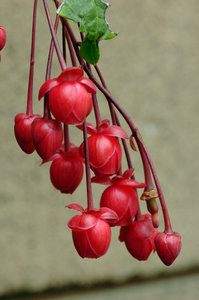

# [[Berberidopsidales]] 

 

## #has_/text_of_/abstract 

> **Berberidopsidales** is an order of Southern Hemisphere woody flowering plants. 
> The name is newly accepted in the APG III system of plant taxonomy. 
> APG II system, of 2003, mentions the possibility of recognizing the order, 
> as comprising the families Berberidopsidaceae and Aextoxicaceae. 
> However, APG II left the families unplaced as to order, assigning them to the clade core eudicots. 
> The APG III system of 2009 formally recognized the order.
>
> The family Aextoxicaceae is a monotypic family native to Chile; 
> Berberidopsidaceae is a family of 2 genera and 3 species native to Chile and eastern Australia.
>
> [Wikipedia](https://en.wikipedia.org/wiki/Berberidopsidales) 

## Phylogeny 

-   « Ancestral Groups  
    -   [Core Eudicots](Core_Eudicots)
    -   [Core_Eudicots](../Core_Eudicots.md)
    -   [Flowering_Plant](../../../Flowering_Plant.md)
    -   [Seed_Plant](../../../../Seed_Plant.md)
    -   [Land_Plant](../../../../../Land_Plant.md)
    -   [Green plants](../../../../../../Plants.md)
    -   [Eukaryotes](Eukaryotes)
    -   [Tree of Life](../../../../../../../Tree_of_Life.md)

-   ◊ Sibling Groups of  Core Eudicots
    -   [Santalales](Santalales.md)
    -   [Saxifragales](Saxifragales.md)
    -   Berberidopsidales
    -   [Rosids](Rosids.md)
    -   [Caryophyllales](Caryophyllales.md)
    -   [Asterids](Asterids.md)

-   » Sub-Groups 
	-   *Aextoxicaceae*
	    -   *Aextoxicon punctatum* [(olivillo)]
	-   *Berberidopsidaceae*
	    -   *Berberidopsis corallina*
	    -   *Streptothamnus moorei*
	    -   *Berberidopsis beckleri*

## Title Illustrations

----------------------------------------------------------------
Scientific Name ::     Berberidopsis corallina
Location ::           cultivated at Strybing Arboretum, San Francisco, native to Chile
Specimen Condition   Live Specimen
Body Part            flowers
Source               [Berberidopsis corallina](http://www.flickr.com/photos/ericinsf/92947553/)
Source Collection    [Flickr](http://flickr.com/)
ToL Image Use        [Attribution-NonCommercial-NoDerivs 2.0 Creative Commons License](http://creativecommons.org/licenses/by-nc-nd/2.0/).
Copyright ::            © 2005 [Eric in SF](http://flickr.com/people/39312862@N00)

