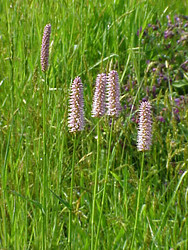
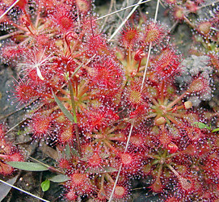
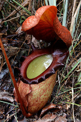

## Phylogeny 

-   « Ancestral Groups  
    -   [Caryophyllales](../Caryophyllales.md)
    -   [Core Eudicots](Core_Eudicots)
    -   [Eudicots](../../../Eudicots.md)
    -   [Flowering_Plant](../../../../Flowering_Plant.md)
    -   [Seed_Plant](../../../../../Seed_Plant.md)
    -   [Land_Plant](../../../../../../Land_Plant.md)
    -   [Green plants](../../../../../../../Plants.md)
    -   [Eukaryotes](Eukaryotes)
    -   [Tree of Life](../../../../../../../../Tree_of_Life.md)

-   ◊ Sibling Groups of  Caryophyllales
    -   non-core Caryophyllales
    -   [core Caryophyllales](core_Caryophyllales)

-   » Sub-Groups 

# non-core Caryophyllales

## Polygonales 

[Pam Soltis, Doug Soltis, and Monica Arakaki](http://www.tolweb.org/)

Containing group: [Caryophyllales](../Caryophyllales.md)

### Information on the Internet

-   [International Carnivorous Plant     Society](http://www.carnivorousplants.org/).
-   [Carnivorous Plant     Database](http://www.omnisterra.com/bot/cp_home.cgi).

### Introduction

The non-core Caryophyllales clade (*sensu* Cuénoud *et al.* 2002), which
corresponds to the Polygonales of Judd *et al*. (2002), has only
recently been identified through molecular phylogenetic analysis. It
includes several families that were previously classified in Cronquist's
(1981) Rosidae or Dilleniidae.

### Characteristics

Possible synapomorphies for the non-core Caryophyllales (= Polygonales
*sensu* Judd *et al*. 2002) are scattered secretory cells containing
plumbagin, naphthaquinone (which has been lost in several clades), an
indumentum of stalked, gland-headed hairs, basal placentation (with
shifts to parietal in some Droseraceae and axile in Nepenthaceae), and
starchy endosperm (Judd *et al*. 2002). Polygonaceae and Plumbaginaceae
are united by ovaries with a single ovule and generally indehiscent
fruits such as achenes or nuts. The clade of Droseraceae, Nepenthaceae,
and relatives is probably supported by carnivory, circinate leaves, and
pollen grains in tetrads (Judd *et al.* 2002).

### Discussion of Phylogenetic Relationships

There are three major clades within non-core Caryophyllales:

1.  Polygonaceae (43 genera, 1,100 species; cosmopolitan) and
    Plumbaginaceae (22 genera, 800 species; cosmopolitan, but centered
    in the Mediterranean region) form a strongly supported clade, as
    they have in many previous analyses (e.g., Giannasi *et al*. 1992;
    Rettig *et al*. 1992).
2.  Tamaricaceae (5 genera, 90 species; Eurasia and Africa) and
    Frankeniaceae (monogeneric with 90 species; cosmopolitan)
3.  Carnivorous plants classified in Droseraceae (3 genera; 115 species;
    cosmopolitan), Drosophyllaceae (monospecific; Spain and Morocco),
    Dioncophyllaceae (3 monospecific genera; western Africa), and
    Nepenthaceae (monogeneric with 90 species; Madagascar to New
    Caledonia), together with Ancistrocladaceae (monogeneric with 12
    species; tropical Africa to Borneo and Taiwan).

The relationship between Droseraceae and Nepenthaceae, and their
relationship to Caryophyllidae *sensu* Cronquist (1981), was first
recognized on the basis of *rbcL* sequences (Albert *et al.* 1992; Chase
et al. 1993; Williams *et al.* 1994). Analyses of *matK* sequences alone
for several species of *Nepenthes, Drosera,* and *Ancistrocladus,* plus
*Drosophyllum* and all three genera of Dioncophyllaceae, resulted in a
well-supported tree with Droseraceae sister to a clade of Nepenthaceae ,
(*Drosophyllum* , (Dioncophyllaceae , Ancistrocladaceae)) (Meimberg *et
al*. 2000).

### References

Albert, V. A., S. E. Williams, and M. W. Chase. 1992. Carnivorous
plants: phylogeny and structural evolution. Science 257:1491-1495.

Chase, M., Soltis, D. and R. E. A. Olmstead. 1993. Phylogenetics of seed
plants: an anlysis of nucleotide sequences from the plastid gene rbcL.
Ann. Miss. Bot. Gard. 80: 526-580.

Cronquist. 1981. An integrated system of classification of flowering
plants. Columbia University Press, New York.

Cuènoud, P., Savolainen, V. Chatrou, L. W., Grayer, P. M., R. J., and M.
Chase. 2002. Molecular

Giannasi, D. E., Zurawski, G., Learn, G. and M. T. Clegg. 1992.
Evolutionary relationships of the Caryophyllidae based on comparative
rbcL sequences. Systematic Botany 17: 1-15.

Judd, W. S., Campbell, C. S., Kellogg, E. A. and P. F. Stevens. 2002.
Plant systematics: a phylogenetic approach. Sinauer Associates, Inc.,
Sunderland, Massachusetts.

Meimberg, H., P. Dittrich, G. Bringmann, J. Schlauer, and G. Heubl.
2000. Molecular phylogeny of Caryophyllidae s. l. based on matK
sequences with special emphasis on carnivorous taxa. Plant Biology
2:218-228.

Rettig, J. H., Wilson, H. D. and J. M. Manhart. 1992. Phylogeny of the
Caryophyllales\--Gene sequence data. Taxon 41: 201-209.

Williams, S., Albert, V., and M. Chase. 1994. Relationships of
Droseraceae: a cladistic analysis of rbcL sequence and morphological
data. American Journal of Botany 81: 1027-1037.

##### Title Illustrations



  ----------------------------------------------------------------------
  Scientific Name ::  Polygonum bistorta
  Copyright ::         © 2004 [Kurt Stüber](http://www.biolib.de/) 
  ----------------------------------------------------------------------


  ------------------------------
  Scientific Name ::     Drosera intermedia
  Location ::           coastal Mississippi, USA
  Acknowledgements     Photograph courtesy [InsectImages.org](http://www.insectimages.org/) (#1241028)
  Specimen Condition   Live Specimen
  Source Collection    [InsectImages.org](http://www.insectimages.org/)
  Copyright ::            © James Henderson, Gulf South Research Corporation
  ------------------------------


  -------------------------------------------------------------------------
  Scientific Name ::     Nepenthes rajah
  Location ::           Sabah, Malaysia
  Specimen Condition   Live Specimen
  Identified By        Ch\'ien Lee
  Life Cycle Stage ::     Mature plant
  Body Part            Lower pitcher
  Size                 c\. 20 cm long
  Copyright ::            © 2006 [Chien Lee](http://www.wildborneo.com.my/) 
  -------------------------------------------------------------------------
