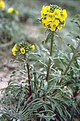
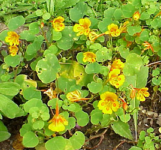
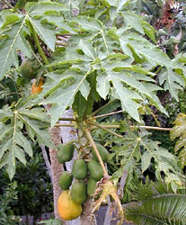

# [[Brassicales]] 

     

## #has_/text_of_/abstract 

> The **Brassicales** (or Cruciales) are an order of flowering plants, 
> belonging to the malvid group of eudicotyledons under the APG IV system. 
> 
> Well-known members of Brassicales include 
> cabbage, cauliflower, Brussels sprout, broccoli, kale, mustard, turnip, bok choy, rapeseed, radish, 
> horseradish, caper, papaya, moringa or drumstick tree, mignonette, nasturtium, and arabidopsis.
>
> One character common to many members of the order 
> is the production of isothiocyanate (mustard oil) compounds. 
> Most systems of classification have included this order, 
> although sometimes under the name Capparales 
> (the name chosen depending on which is thought to have priority).
>
> The order typically contains the following families:
> - Akaniaceae – two species of turnipwood trees, native to Asia and eastern Australia
> - Bataceae – salt-tolerant shrubs from America and Australasia
> - Brassicaceae – mustard and cabbage family; may include the Cleomaceae
> - Capparaceae – caper family, sometimes included in Brassicaceae
> - Caricaceae – papaya family
> - Cleomaceae
> - Emblingiaceae
> - Gyrostemonaceae – several genera of small shrubs and trees endemic to temperate parts of Australia
> - Koeberliniaceae – one species of thorn bush native to Mexico and the US Southwest
> - Limnanthaceae – meadowfoam family
> - Moringaceae – thirteen species of trees from Africa and India including the drumstick
> - Pentadiplandraceae – African species whose berries have two highly sweet tasting proteins
> - Resedaceae – mignonette family
> - Salvadoraceae – three genera found from Africa to Java
> - Setchellanthaceae
> - Tiganophytaceae
> - Tovariaceae
> - Tropaeolaceae – nasturtium family
>
> [Wikipedia](https://en.wikipedia.org/wiki/Brassicales) 

## Phylogeny 

-   « Ancestral Groups  
    -   [Rosids](../Rosids.md)
    -   [Core Eudicots](Core_Eudicots)
    -   [Eudicots](../../../Eudicots.md)
    -   [Flowering_Plant](../../../../Flowering_Plant.md)
    -   [Seed_Plant](../../../../../Seed_Plant.md)
    -   [Land_Plant](../../../../../../Land_Plant.md)
    -   [Green plants](../../../../../../../Plants.md)
    -   [Eukaryotes](Eukaryotes)
    -   [Tree of Life](../../../../../../../../Tree_of_Life.md)

-   ◊ Sibling Groups of  Rosids
    -   [Gerrardina](Gerrardina)
    -   [Fagales](Fagales.md)
    -   [Cucurbitales](Cucurbitales.md)
    -   [Rosales](Rosales.md)
    -   [Fabales](Fabales.md)
    -   [Zygophyllales](Zygophyllales.md)
    -   [Oxalidales](Oxalidales.md)
    -   [Malpighiales](Malpighiales.md)
    -   [Celastrales](Celastrales.md)
    -   [Geraniales](Geraniales.md)
    -   [Crossosomatales](Crossosomatales.md)
    -   [Myrtales](Myrtales.md)
    -   Brassicales
    -   [Malvales](Malvales.md)
    -   [Sapindales](Sapindales.md)

-   » Sub-Groups 

## Title Illustrations

  -------------------------------
  Scientific Name ::     Erysimum ammophilum
  Location ::           Marina State Beach (Monterey County, California, USA)
  Comments             Coast wallflower (Brassicaceae)
  Specimen Condition   Live Specimen
  Source Collection    [CalPhotos](http://calphotos.berkeley.edu/)
  Copyright ::            © 1995 [Dean Wm. Taylor, Jepson Herbarium, UC Berkeley](mailto:dwtaylor@cruzers.com)
  -------------------------------

  ---------------------------------------------------------------------
  Scientific Name ::  Tropaeolum minus
  Comments          Indian cress (Tropaeolaceae)
  Copyright ::         © [Kurt Stüber](http://www.biolib.de/) 
  ---------------------------------------------------------------------

  ------------------------------------------------------------------------
  Scientific Name ::   Carica papaya
  Location ::         Cultivated plant, Puerto de la Cruz, Teneriffa, Canary Islands.
  Comments           Papaya tree (Caricaceae).
  Acknowledgements   courtesy [Botanical Image Database](http://www.unibas.ch/botimage/)
  Copyright ::          © 2001 University of Basel, Basel, Switzerland 
  ------------------------------------------------------------------------
