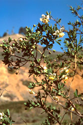
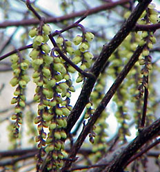
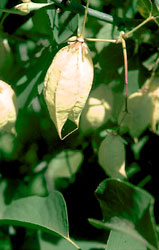

## Phylogeny 

-   « Ancestral Groups  
    -   [Rosids](../Rosids.md)
    -   [Core Eudicots](Core_Eudicots)
    -   [Eudicots](../../../Eudicots.md)
    -   [Flowering_Plant](../../../../Flowering_Plant.md)
    -   [Seed_Plant](../../../../../Seed_Plant.md)
    -   [Land_Plant](../../../../../../Land_Plant.md)
    -   [Green plants](../../../../../../../Plants.md)
    -   [Eukaryotes](Eukaryotes)
    -   [Tree of Life](../../../../../../../../Tree_of_Life.md)

-   ◊ Sibling Groups of  Rosids
    -   [Gerrardina](Gerrardina)
    -   [Fagales](Fagales.md)
    -   [Cucurbitales](Cucurbitales.md)
    -   [Rosales](Rosales.md)
    -   [Fabales](Fabales.md)
    -   [Zygophyllales](Zygophyllales.md)
    -   [Oxalidales](Oxalidales.md)
    -   [Malpighiales](Malpighiales.md)
    -   [Celastrales](Celastrales.md)
    -   [Geraniales](Geraniales.md)
    -   Crossosomatales
    -   [Myrtales](Myrtales.md)
    -   [Brassicales](Brassicales.md)
    -   [Malvales](Malvales.md)
    -   [Sapindales](Sapindales.md)

-   » Sub-Groups 

# [[Crossosomatales]] 

     

## #has_/text_of_/abstract 

> The **Crossosomatales** are an order, first recognized as such by APG II. 
> They are flowering plants included within the Rosid eudicots.
>
> [Wikipedia](https://en.wikipedia.org/wiki/Crossosomatales) 

## Title Illustrations

------------------------------------------------------------------------------

Scientific Name ::     Crossosoma californicum
Location ::           Forrestal Quarry, Rancho Palos Verdes, \~560\' elev. (Los Angeles County, California, USA)
Comments             California rockflower (Crossosomataceae)
Creator              Photograph by Angelika Brinkman-Busi
Specimen Condition   Live Specimen
Source Collection    [CalPhotos](http://calphotos.berkeley.edu/)
Copyright ::            © 1990 [California Native Plant Society](mailto:dtibor@CNPS.org) 

---------------------------------------------------------------------

Scientific Name ::  Stachyurus chinensis
Comments          Stachyuraceae
Copyright ::         © [Kurt Stüber](http://www.biolib.de/) 

---------------------------------------------------------------------------------

Scientific Name ::     Staphylea bolanderi
Location ::           California, USA
Comments             Bladdernut (Staphyleaceae)
Creator              Photograph by Brother Alfred Brousseau
Specimen Condition   Live Specimen
Source Collection    [CalPhotos](http://calphotos.berkeley.edu/)
Copyright ::            © 1995 [Saint Mary\'s College of California](mailto:rpolowin@stmarys-ca.edu) 

## Confidential Links & Embeds: 

### [Crossosomatales](/_Standards/bio/bio~Domain/Eukaryotes/Plants/Land_Plant/Seed_Plant/Flowering_Plant/Eudicots/Core_Eudicots/Rosids/Crossosomatales.md) 

### [Crossosomatales.public](/_public/bio/bio~Domain/Eukaryotes/Plants/Land_Plant/Seed_Plant/Flowering_Plant/Eudicots/Core_Eudicots/Rosids/Crossosomatales.public.md) 

### [Crossosomatales.internal](/_internal/bio/bio~Domain/Eukaryotes/Plants/Land_Plant/Seed_Plant/Flowering_Plant/Eudicots/Core_Eudicots/Rosids/Crossosomatales.internal.md) 

### [Crossosomatales.protect](/_protect/bio/bio~Domain/Eukaryotes/Plants/Land_Plant/Seed_Plant/Flowering_Plant/Eudicots/Core_Eudicots/Rosids/Crossosomatales.protect.md) 

### [Crossosomatales.private](/_private/bio/bio~Domain/Eukaryotes/Plants/Land_Plant/Seed_Plant/Flowering_Plant/Eudicots/Core_Eudicots/Rosids/Crossosomatales.private.md) 

### [Crossosomatales.personal](/_personal/bio/bio~Domain/Eukaryotes/Plants/Land_Plant/Seed_Plant/Flowering_Plant/Eudicots/Core_Eudicots/Rosids/Crossosomatales.personal.md) 

### [Crossosomatales.secret](/_secret/bio/bio~Domain/Eukaryotes/Plants/Land_Plant/Seed_Plant/Flowering_Plant/Eudicots/Core_Eudicots/Rosids/Crossosomatales.secret.md)

