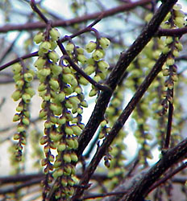
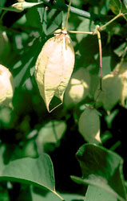

## Phylogeny 

-   « Ancestral Groups  
    -   [Rosids](../Rosids.md)
    -   [Core Eudicots](Core_Eudicots)
    -   [Eudicots](../../../Eudicots.md)
    -   [Flowering_Plant](../../../../Flowering_Plant.md)
    -   [Seed_Plant](../../../../../Seed_Plant.md)
    -   [Land_Plant](../../../../../../Land_Plant.md)
    -   [Green plants](../../../../../../../Plants.md)
    -   [Eukaryotes](Eukaryotes)
    -   [Tree of Life](../../../../../../../../Tree_of_Life.md)

-   ◊ Sibling Groups of  Rosids
    -   [Gerrardina](Gerrardina)
    -   [Fagales](Fagales.md)
    -   [Cucurbitales](Cucurbitales.md)
    -   [Rosales](Rosales.md)
    -   [Fabales](Fabales.md)
    -   [Zygophyllales](Zygophyllales.md)
    -   [Oxalidales](Oxalidales.md)
    -   [Malpighiales](Malpighiales.md)
    -   [Celastrales](Celastrales.md)
    -   [Geraniales](Geraniales.md)
    -   Crossosomatales
    -   [Myrtales](Myrtales.md)
    -   [Brassicales](Brassicales.md)
    -   [Malvales](Malvales.md)
    -   [Sapindales](Sapindales.md)

-   » Sub-Groups 

# Crossosomatales 

Relationships after Matthews & Endress 2005 and Cameron 2003.

Containing group: [Rosids](../Rosids.md)

### References

Cameron, K. M. 2003. On the phylogenetic position of the New Caledonian
endemic families Paracryphiaceae, Oncothecaceae, and Strasburgeriaceae:
a comparison of molecules and morphology. Botanical Review 68:428-443.

Matthews, M. L. and P. K. Endress. 2005. Comparative floral structure
and systematics in Crossosomatales (Crossosomataceae, Stachyuraceae,
Staphyleaceae, Aphloiaceae, Geissolomataceae, Ixerbaceae,
Strasburgeriaceae). Botanical Journal of the Linnean Society
147(1):1-46.

Savolainen, V., M. F. Fay, D. C. Albach, A. Backlund, M. van der Bank,
K. M. Cameron, S. A. Johnson, M. D. Lledó, J.-C. Pintaud, M. Powell, M.
C. Sheahan, D. E. Soltis, P. S. Soltis, P. Weston, W. M. Whitten, K. J.
Wurdack, and M. W. Chase. 2000. Phylogeny of the eudicots: a nearly
complete familial analysis based on rbcl gene sequences. Kew Bulletin
55:257-309.

Soltis, D. E., P. S. Soltis, M. W. Chase, M. E. Mort, D. C. Albach, M.
Zanis, V. Savolainen, W. H. Hahn, S. B. Hoot, M. F. Fay, M. Axtell, S.
M. Swensen, L. M. Prince, W. J. Kress, K. C. Nixon, and J. S. Farris.
2000. Angiosperm phylogeny inferred from 18S rDNA, rbcL, and atpB
sequences. Botanical Journal of the Linnean Society 133:381-461.

##### Title Illustrations



  ------------------------------------------------------------------------------
  Scientific Name ::     Crossosoma californicum
  Location ::           Forrestal Quarry, Rancho Palos Verdes, \~560\' elev. (Los Angeles County, California, USA)
  Comments             California rockflower (Crossosomataceae)
  Creator              Photograph by Angelika Brinkman-Busi
  Specimen Condition   Live Specimen
  Source Collection    [CalPhotos](http://calphotos.berkeley.edu/)
  Copyright ::            © 1990 [California Native Plant Society](mailto:dtibor@CNPS.org) 
  ------------------------------------------------------------------------------


  ---------------------------------------------------------------------
  Scientific Name ::  Stachyurus chinensis
  Comments          Stachyuraceae
  Copyright ::         © [Kurt Stüber](http://www.biolib.de/) 
  ---------------------------------------------------------------------


  ---------------------------------------------------------------------------------
  Scientific Name ::     Staphylea bolanderi
  Location ::           California, USA
  Comments             Bladdernut (Staphyleaceae)
  Creator              Photograph by Brother Alfred Brousseau
  Specimen Condition   Live Specimen
  Source Collection    [CalPhotos](http://calphotos.berkeley.edu/)
  Copyright ::            © 1995 [Saint Mary\'s College of California](mailto:rpolowin@stmarys-ca.edu) 
  ---------------------------------------------------------------------------------
