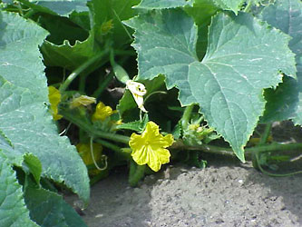
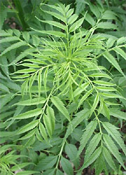

# [[Cucurbitales]] 

     

## #has_/text_of_/abstract 

> The **Cucurbitales** are an order of flowering plants, included in the rosid group of dicotyledons. 
> This order mostly belongs to tropical areas, 
> with limited presence in subtropical and temperate regions. 
> 
> The order includes shrubs and trees, together with many herbs and climbers. 
> One major characteristic of the Cucurbitales is the presence of unisexual flowers, 
> mostly pentacyclic, with thick pointed petals (whenever present). 
> The pollination is usually performed by insects, 
> but wind pollination is also present (in Coriariaceae and Datiscaceae).
>
> The order consists of roughly 2600 species in eight families. 
> The largest families are Begoniaceae (begonia family) with around 1500 species 
> and Cucurbitaceae (gourd family) with around 900 species. 
> These two families include the only economically important plants. 
> 
> Specifically, the Cucurbitaceae (gourd family) include some food species, 
> such as squash, pumpkin (both from Cucurbita), watermelon (Citrullus vulgaris), 
> and cucumber and melons  (Cucumis). 
> 
> The Begoniaceae are known for their horticultural species, 
> of which there are over 130 with many more varieties.
>
> [Wikipedia](https://en.wikipedia.org/wiki/Cucurbitales) 

## Phylogeny 

-   « Ancestral Groups  
    -   [Rosids](../Rosids.md)
    -   [Core Eudicots](Core_Eudicots)
    -   [Eudicots](../../../Eudicots.md)
    -   [Flowering_Plant](../../../../Flowering_Plant.md)
    -   [Seed_Plant](../../../../../Seed_Plant.md)
    -   [Land_Plant](../../../../../../Land_Plant.md)
    -   [Green plants](../../../../../../../Plants.md)
    -   [Eukaryotes](Eukaryotes)
    -   [Tree of Life](../../../../../../../../Tree_of_Life.md)

-   ◊ Sibling Groups of  Rosids
    -   [Gerrardina](Gerrardina)
    -   [Fagales](Fagales.md)
    -   Cucurbitales
    -   [Rosales](Rosales.md)
    -   [Fabales](Fabales.md)
    -   [Zygophyllales](Zygophyllales.md)
    -   [Oxalidales](Oxalidales.md)
    -   [Malpighiales](Malpighiales.md)
    -   [Celastrales](Celastrales.md)
    -   [Geraniales](Geraniales.md)
    -   [Crossosomatales](Crossosomatales.md)
    -   [Myrtales](Myrtales.md)
    -   [Brassicales](Brassicales.md)
    -   [Malvales](Malvales.md)
    -   [Sapindales](Sapindales.md)

-   » Sub-Groups 

## Title Illustrations

------------------------------------------------------------------------

Scientific Name ::   Begonia froebelii
Comments           Begoniaceae. Male flower of a plant cultivated at the Botanical Garden Basel, Switzerland.
Acknowledgements   courtesy [Botanical Image Database](http://www.unibas.ch/botimage/)
Sex ::              Male
Copyright ::          © 2001 University of Basel, Basel, Switzerland 

---------------------------------------------------------------------

Scientific Name ::  Cucumis sativus
Comments          Cucumber plant (Cucurbitaceae)
Copyright ::         © [Kurt Stüber](http://www.biolib.de/) 

------------------------------------------------------------------------

Scientific Name ::   Datisca cannabina
Comments           Datiscaceae. Young plant cultivated at the Botanical Garden Basel, Switzerland
Acknowledgements   courtesy [Botanical Image Database](http://www.unibas.ch/botimage/)
Copyright ::          © 2001 University of Basel, Basel, Switzerland 

## Confidential Links & Embeds: 

### [Cucurbitales](/_Standards/bio/bio~Domain/Eukaryotes/Plants/Land_Plant/Seed_Plant/Flowering_Plant/Eudicots/Core_Eudicots/Rosids/Cucurbitales.md) 

### [Cucurbitales.public](/_public/bio/bio~Domain/Eukaryotes/Plants/Land_Plant/Seed_Plant/Flowering_Plant/Eudicots/Core_Eudicots/Rosids/Cucurbitales.public.md) 

### [Cucurbitales.internal](/_internal/bio/bio~Domain/Eukaryotes/Plants/Land_Plant/Seed_Plant/Flowering_Plant/Eudicots/Core_Eudicots/Rosids/Cucurbitales.internal.md) 

### [Cucurbitales.protect](/_protect/bio/bio~Domain/Eukaryotes/Plants/Land_Plant/Seed_Plant/Flowering_Plant/Eudicots/Core_Eudicots/Rosids/Cucurbitales.protect.md) 

### [Cucurbitales.private](/_private/bio/bio~Domain/Eukaryotes/Plants/Land_Plant/Seed_Plant/Flowering_Plant/Eudicots/Core_Eudicots/Rosids/Cucurbitales.private.md) 

### [Cucurbitales.personal](/_personal/bio/bio~Domain/Eukaryotes/Plants/Land_Plant/Seed_Plant/Flowering_Plant/Eudicots/Core_Eudicots/Rosids/Cucurbitales.personal.md) 

### [Cucurbitales.secret](/_secret/bio/bio~Domain/Eukaryotes/Plants/Land_Plant/Seed_Plant/Flowering_Plant/Eudicots/Core_Eudicots/Rosids/Cucurbitales.secret.md)

