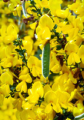
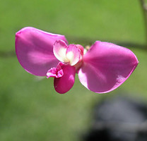
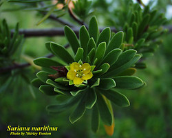

## Phylogeny 

-   « Ancestral Groups  
    -   [Rosids](../Rosids.md)
    -   [Core Eudicots](Core_Eudicots)
    -   [Eudicots](../../../Eudicots.md)
    -   [Flowering_Plant](../../../../Flowering_Plant.md)
    -   [Seed_Plant](../../../../../Seed_Plant.md)
    -   [Land_Plant](../../../../../../Land_Plant.md)
    -   [Green plants](../../../../../../../Plants.md)
    -   [Eukaryotes](Eukaryotes)
    -   [Tree of Life](../../../../../../../../Tree_of_Life.md)

-   ◊ Sibling Groups of  Rosids
    -   [Gerrardina](Gerrardina)
    -   [Fagales](Fagales.md)
    -   [Cucurbitales](Cucurbitales.md)
    -   [Rosales](Rosales.md)
    -   Fabales
    -   [Zygophyllales](Zygophyllales.md)
    -   [Oxalidales](Oxalidales.md)
    -   [Malpighiales](Malpighiales.md)
    -   [Celastrales](Celastrales.md)
    -   [Geraniales](Geraniales.md)
    -   [Crossosomatales](Crossosomatales.md)
    -   [Myrtales](Myrtales.md)
    -   [Brassicales](Brassicales.md)
    -   [Malvales](Malvales.md)
    -   [Sapindales](Sapindales.md)

-   » Sub-Groups
    -   [Fabaceae](Fabales/Fabaceae.md)
    -   [Surianaceae](Fabales/Surianaceae.md)
    -   [Polygalaceae](Fabales/Polygalaceae.md)
    -   [Quillaja](Quillaja)

# Fabales 

[Martin F. Wojciechowski, Johanna Mahn, and Bruce Jones](http://www.tolweb.org/)

Containing group: [Rosids](../Rosids.md)

### Information on the Internet

-   [Angiosperm Phylogeny     Website](http://www.mobot.org/MOBOT/Research/APweb/welcome.html);
    search on \"Fabales\"
-   [International Legume Database & Information     Service](http://www.ildis.org/)

### Introduction

The traditional orders Fabales, Rosales, Cucurbitales, and Fagales
comprise one of the major clades within Eurosids I. This clade is
characterized by the ability of many of its members to fix atmospheric
nitrogen (N~2~) to a form usable by plants (Soltis et al. 2000). Within
this 'nitrogen-fixing' clade the monophyly of each of its subclades
receives strong support from analyses of molecular data. The monophyly
of Fabales (sensu Angiosperm Phylogeny Group, 2003) and a sister group
relationship of legumes (family Fabaceae) to the families Quillajaceae,
Polygalaceae, and Surianaceae, are all strongly supported (Doyle et al.
2000), but the relationship among these lineages is not clearly resolved
at the present time.

### Discussion of Phylogenetic Relationships

Within angiosperms, Fabaceae has traditionally been considered 'rosid'
in its taxonomic relationships, with Connaraceae, Chrysobalanaceae,
Crossosomataceae, Krameriaceae, and even Sapindaceae suggested as
closely related families (potential sister groups) by different authors
at one time or another (reviewed by Dickison, 1981; Thorne, 1992). The
first challenge to these hypotheses came from the now landmark study of
Chase et al. (1993) based on cladistic analysis of the chloroplast
*rbcL* gene, which suggested Polygalaceae and Surianaceae as potential
sister groups to Fabaceae and resolved the other families as more
distantly related. A close relationship of Fabaceae to Polygalaceae (and
Surianaceae) within a more inclusive Fabales clade has been
substantiated by most subsequent angiosperm-wide analyses of molecular
data (Savolainen et al., 2000; Soltis et al., 2000). In addition,
studies focused on relationships within rosids (Soltis et al., 1995;
Steele et al., 2000; Persson, 2001) have shown the rosacean genus
*Quillaja* Molina strongly supported as a member of Fabales, although
relationships within Fabales are still only weakly resolved.

### References

Angiosperm Phylogeny Group \[APG\]. 2003. An update of the Angiosperm
Phylogeny Group classification for the orders and families of flowering
plants: APG II. Botanical Journal of the Linnean Society 141: 399-436.

Crayn, D. M., E. S. Fernando, P.A. Gadek, and C.J. Quinn. 1995. A
reassessment of the familial affinity of the Mexican genus *Recchia*
Moçiño & Sessé ex DC. Brittonia 47: 397-402.

Doyle, J. J., J. A. Chappill, C.D. Bailey, and T. Kajita. 2000. Towards
a comprehensive phylogeny of legumes: evidence from *rbcL* sequences and
non-molecular data. Pages 1-20 in Advances in legume systematics, part 9
(P.S. Herendeen and A. Bruneau, eds.). Royal Botanic Gardens, Kew, UK.

Fernando, E.S., P. A. Gadek, D. M. Crayn, and C. J. Quinn. 1993. Rosid
affinities of Surianacae: molecular evidence. Molecular Phylogenetics
and Evolution 2: 344 -- 350.

Lotova, L. I. and A. C. Timonin. 1999. Anatomy of cortex and secondary
phloem in Rosaceae. 3. Quillajoideae. Bot. Zhurn. 84 (2): 34-41.

Persson, C. 2001. Phylogenetic relationships in Polygalaceae based on
plastid DNA sequences from the *trnL-F* region. Taxon 50: 763-779.

Robertson, K. R. 1974. The genera of the Rosaceae in the southeastern
United States. J. Arnold Arboretum 55: 303-401, 611-662.

Savolainen, V., M.W. Chase, S.B. Hoot, C.M. Morton, D.E. Soltis, C.
Bayer, M.F. Fay, A.Y. De Bruijn, S. Sullivan, and Y.L. Qiu. 2000a.
Phylogenetics of flowering plants based on combined analysis of plastid
atpB and rbcL gene sequences. Systematic Biology 49:306-362.

Savolainen, V., M. F. Fay, D. C. Albach, A. Backlund, M. van der Bank,
K. M. Cameron, S. A. Johnson, M. D. Lledó, J.-C. Pintaud, M. Powell, M.
C. Sheahan, D. E. Soltis, P. S. Soltis, P. Weston, W. M. Whitten, K. J.
Wurdack, and M. W. Chase. 2000b. Phylogeny of the eudicots: a nearly
complete familial analysis based on *rbcL* gene sequences. Kew Bulletin
55:257-309.

Soltis, D. E., P. S. Soltis, M. W. Chase, M. E. Mort, D. C. Albach, M.
Zanis, V. Savolainen, W. H. Hahn, S. B. Hoot, M. F. Fay, M. Axtell, S.
M. Swensen, L. M. Prince, W. J. Kress, K. C. Nixon, and J. S. Farris.
2000. Angiosperm phylogeny inferred from 18S rDNA, *rbcL*, and *atpB*
sequences. Botanical Journal of the Linnean Society 133:381-461.

Takhtajan, Armen. 1997. Diversity and classification of flowering
plants. Columbia University Press, New York.

Zhang, S.-Y. 1992. Systematic wood anatomy of the Rosaceae. Blumea 37:
81-158.

##### Title Illustrations



  ------------------------------
  Scientific Name ::     Cytisus scoparius
  Acknowledgements     Photograph courtesy [InsectImages.org](http://www.insectimages.org/) (#0022099)
  Specimen Condition   Live Specimen
  Source Collection    [InsectImages.org](http://www.insectimages.org/)
  Copyright ::            © Eric Coombs, Oregon Department of Agriculture
  ------------------------------


  ------------------------
  Scientific Name ::     Securidaca diversifolia S.F. Blake
  Location ::           Fairchild Tropical Garden, Coral Gables, FL
  Specimen Condition   Live Specimen
  Copyright ::            © 2006 [Dennis Stevenson](http://www.plantsystematics.org/)
  ------------------------


  -------------------------
  Scientific Name ::     Quillaja saponaria Poir.
  Specimen Condition   Live Specimen
  Copyright ::            © 2003-2006 [David L. Magney](http://www.magney.org)
  -------------------------


  ----------
  Scientific Name ::     Suriana maritima L.
  Specimen Condition   Live Specimen
  Copyright ::            © Shirley Denton
  ----------
