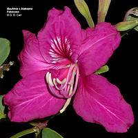
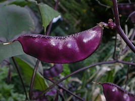

## Phylogeny 

-   « Ancestral Groups  
    -   [Fabales](../Fabales.md)
    -   [Rosids](../../Rosids.md)
    -   [Core Eudicots](Core_Eudicots)
    -   [Eudicots](../../../../Eudicots.md)
    -   [Flowering_Plant](../../../../../Flowering_Plant.md)
    -   [Seed_Plant](../../../../../../Seed_Plant.md)
    -   [Land_Plant](../../../../../../../Land_Plant.md)
    -   [Green plants](../../../../../../../../Plants.md)
    -   [Eukaryotes](Eukaryotes)
    -   [Tree of Life](../../../../../../../../../Tree_of_Life.md)

-   ◊ Sibling Groups of  Fabales
    -   Fabaceae
    -   [Surianaceae](Surianaceae.md)
    -   [Polygalaceae](Polygalaceae.md)
    -   [Quillaja](Quillaja)

-   » Sub-Groups
    -   [Cercideae](Fabaceae/Cercideae.md)
    -   [Detarieae sensu lato](Fabaceae/Detarieae.md)
    -   [Cassieae sensu lato (pro         parte)](Cassieae_%28pro_parte%29)
    -   [Caesalpinieae s.l. & s.s., Cassieae sensu stricto,         Mimosoideae](Caesalpinieae_s.l._%26_s.s.%2C_Cassieae_sensu_stricto%2C_Mimosoideae)
    -   [Papilionoideae](Fabaceae/Papilionoideae.md)

# Fabaceae

## legumes 

[Martin F. Wojciechowski, Johanna Mahn, and Bruce Jones](http://www.tolweb.org/)

The phylogenetic relationships of Fabaceae, presented on this and
subsequent pages, are based on a \"supertree\" of the family compiled
from several recent analyses, including Doyle et al. (2000), Crisp et
al. (2000), Kajita et al. (2001), Lavin et al. (2001), Pennington et al.
(2001), Herendeen et al. (2003), Luckow et al. (2003), Wojciechowski
(2003), and Wojciechowski et al. (2000, 2004), for the treatise Legumes
of the World, by Lewis, Schrire, Mackinder, & Lock (2005).

Containing group: [Fabales](../Fabales.md)

### Information on the Internet

-   [Angiosperm Phylogeny     Website](http://www.mobot.org/MOBOT/research/APweb/). For more
    information on the family, search for Fabaceae.
-   [Bean Bag](http://www.rbgkew.org.uk/herbarium/legumes/beanbag.html).
    A newsletter to promote communication among research scientists
    concerned with the systematics of the Leguminosae/Fabaceae.
-   [Fabaceae on Wikipedia](http://en.wikipedia.org/wiki/Fabaceae)
-   [International Legume Database & Information     Service](http://www.ildis.org/). The International Legume Database &
    Information Service (ILDIS) is an international project which aims
    to document and catalog the world\'s legume species diversity in a
    readily accessible form, including publications, electronic
    resources, and enquiry services.
-   [Medicago.org](http://medicago.org/). Medicago truncatula, A model
    for legume genomic research website.
-   [Legume Information Service at     NCGR](http://www.comparative-legumes.org/). The Legume Information
    System (LIS) is a publicly accessible legume resource that
    integrates genetic and molecular data from multiple legume species.
-   [Pierre Guertin\'s Philatelic Herbarium](http://aildoux.tripod.com/)
    shows examples of stamps that species of plants have appeared on,
    many of which belong to Leguminosae. Click on Liste Taxonomique and
    scroll down about halfway to get to the stamps with pictures of
    legumes on them.
-   [USDA Germplasm Resources Information     Network](http://www.ars-grin.gov/cgi-bin/npgs/html/family.pl?440)
    website, information on Fabaceae

### Introduction

The **Fabaceae** (also called Leguminosae) or bean and pea family, is
the third largest family of angiosperms after Orchidaceae (orchids) and
Asteraceae (daisies, sunflowers), and second only to Poaceae (grasses)
in terms of agricultural and economic importance. Legumes includes a
large number of domesticated species harvested as crops for human and
animal consumption as well as for oils, fiber, fuel, fertilizers,
timber, medicinals, chemicals, and horticultural varieties (Lewis et
al., 2005). In addition, the family includes several species studied as
genetic and genomic model systems (e.g., pea, *Pisum sativum*, barrel
medic, *Medicago truncatula*, and trefoil, *Lotus corniculatus*).

Legumes vary in habit from annual and perennial herbs to shrubs, trees,
vines/lianas, and even a few aquatics. Ranging in size from some of the
smallest plants of deserts and arctic/alpine regions to the tallest of
rain forest trees, legumes are a conspicuous, and often dominant,
component of most of the vegetation types distributed throughout
temperate and tropical regions of the world (Rundel, 1989). Legumes are
particularly diverse in tropical forests and temperate shrublands with a
seasonally dry or arid climate. This preference for semi-arid to arid
habitats is related to a nitrogen demanding metabolism. While many
species have the ability to colonize barren and marginal lands because
of their capacity to \"fix\" atmospheric nitrogen via a symbiotic
association with root-nodulating bacteria, this is just one of several
ways in which legumes obtain high levels of nitrogen to meet the demands
of their metabolism (McKey, 1994; Sprent, 2001)

Over the past 30 years, the study of legume classification and biology
has benefitted from major advances in our understanding of the
morphology, evolution and systematics, and ecology of the family
(Polhill, 1994; Lewis et al., 2005). Much of this knowledge is recorded
in the venerable **Advances in Legume Systematics** series, first
published in 1981 by the Royal Botanic Gardens at Kew, United Kingdom
(see complete list below). Coming 25 years after publication of the
first volumes of Advances in Legume Systematics (Polhill and Raven,
1981; parts 1,2), the most recent authoritative (and only illustrated)
guide to the family, **Legumes of the World**, by Lewis, Schrire,
Mackinder, and Lock (2005, Royal Botanic Garden, Kew) continues that
tradition.

### Characteristics

Morphologically, Fabaceae is characterized by leaves simple to compound
(pinnate, rarely palmate, or bipinnate), unifoliate, trifoliate
(*Medicago, Trifolium*), sometimes phyllodic (many species of *Acacia*),
or reduced to a tendril (as in *Lathyrus*), spirally arranged, with
stipules present that are sometimes large and leaf-like (*Pisum*) or
developed into spines (*Prosopis, Robinia*).

Flowers are usually regular or irregular (i.e., actinomorphic to
zygomorphic in symmetry, respectively), bisexual, with a single superior
carpel (hypogynous to perigynous), pentamerous, arranged singly or in
racemes, spikes, or heads. The principal unifying feature of the family
is the fruit, the legume (Polhill, 1994). With a few exceptions, legumes
are typically one-chambered pods (one locule), with parietal
placentation along the adaxial suture, ovules 2 to many, in two
alternating rows on a single placenta, typically dry and dehiscent along
one or both sutures (legume), occasionally constricted into 1-seeded
sections (loments) or indehiscent (samara, drupe, achene). For a
sampling of legume fruit diversity in Fabaceae, see [Fabaceae Fruits](http://www.tolweb.org/notes/?note_id=4132).

Ranging in habit from large trees to annual herbs, the family is
cosmopolitan in distribution and well represented throughout temperate
and tropical regions of the world (Rundel, 1989). Legumes are
particularly diverse in tropical forests with a seasonally dry aspect
and temperate shrublands tailored by xeric climates, but noticeably
absent to poorly represented in mesic temperate habitats, including many
arctic and alpine regions and the understory of cool temperate forests.
The preference of legumes for semi-arid to arid habitats is related to a
nitrogen-demanding metabolism, which is thought to be an adaptation to
climatically variable or unpredictable habitats whereby leaves can be
produced economically and opportunistically (McKey, 1994). A hallmark of
legume biology, the fixation of atmospheric nitrogen via root-nodulating
rhizobial bacteria, is just one of several ways (in addition to
arbuscular mycorrhizas, ectomycorrhizas, and uptake of inorganic
nitrogen compounds) in which legumes obtain high levels of nitrogen to
meet the demands of their metabolism (Sprent, 2001). Legumes play an
important role in the terrestrial nitrogen cycle regardless of whether
they form root nodules (Sprent, 2001).

### Taxonomy

Taxonomically, Fabaceae has been traditionally divided into three
subfamilies, the Caesalpinioideae, Mimosoideae, and Papilionoideae
(although sometimes these have been ranked as separate families, as in
Caesalpiniaceae, Mimosaceae, and Papilionaceae), and considered most
closely related to the Connaraceae and Sapindaceae on the basis of
anatomy, morphology, and biogeographic distributions (reviewed in
Polhill and Raven, 1981). The recognition of three subfamilies is based
on characteristics particularly of the flower, including size, symmetry,
[aestivation of petals](http://www.tolweb.org/notes/?note_id=4195),
sepals (united or free), stamen number and heteromorphy, pollen (single
or polyads), but also presence of a pleurogram, embryo radicle shape,
leaf complexity, and presence of root nodules (reviewed in Lewis et al.,
2005). Differences in these characteristics led to the view that the
Mimosoideae and Papilionoideae are unique and distinct lineages in the
family which arose independently within a paraphyletic \"basal\"
caesalpinioid assemblage. The *Dimorphandra* group of tribe
Caesalpinieae and papilionoid tribe Swartzieae were considered likely
transitional groups between them, respectively (e.g., Polhill, 1994).

The last formal classification by Polhill (1994), published prior to the
advent of family-wide molecular phylogenetic studies, recognized 39
tribes and some 670 genera. The recent update of the tribal and generic
classification of the family, having the benefit from more than 10 years
of intensive molecular phylogenetic studies, recognizes 36 tribes, 727
genera and 19,327 species (Lewis et al., 2005). The family contains at
least four genera of 500 or more species (*Acacia, Astragalus,
Crotalaria*, and *Indigofera*) and at least 40 genera with 100 spp. or
more. At the other extreme, nearly 500 genera are small, either being
monospecific or containing up to 10 species (Lewis et al., 2005).

As Lewis et al. (2005) point out, while there has been some disagreement
as to whether Fabaceae should be treated as one family (composed of
three subfamilies) or three, there is a growing body of evidence from
morphology and molecules to support the legumes being one monophyletic
family. This view has been reinforced not only by the degree of
interrelatedness of taxonomic groups within the legumes compared to that
between legumes and its relatives, but also by recent molecular
phylogenetic studies (Doyle et al., 2000; Kajita et al., 2001;
Wojciechowski, 2003; Wojciechowski et al., 2004) showing strong support
for a monophyletic family that is more closely related to Polygalaceae,
Surianaceae, and Quillajaceae, which together form the order Fabales
(sensu Angiosperm Phylogeny Group, 2003).

### Discussion of Phylogenetic Relationships

On this and subsequent pages, the composite or supertree of the Fabaceae
constructed by Lewis et al. (2005), derived from a number of recent
analyses that are cited here, is presented to provide a \"snapshot\" of
the largely robust (that is, supported by conventional measures of clade
support, such as bootstrap and jackknife analyses, Bayesian inference)
pattern of phylogenetic relationships in the family, with terminal taxa
representing putatively monophyletic groups of genera. Note that many of
the tribes, several informally named generic groups, and subfamily
Caesalpinioideae, as traditionally circumscribed, are not natural groups
and will be so indicated where appropriate. However, it is too premature
to recognize many of these newly identified groups as on-going studies
seek to further clarify their membership and resolve relationships
within them. Thus, for clarity and consistency, nomenclature of both
traditionally named and informally named groups will follow that of
Lewis et al. (2005). For more information, the Lewis et al. (2005)
volume is an excellent source of references to traditional taxonomy and
classification as well as contemporary phylogenetic studies of specific
groups and should be consulted.

Analyses of the plastid *rbcL* gene played an early role in our evolving
understanding of legume phylogeny. Results from studies by two groups
(e.g., Käss and Wink, 1996, 1997; Doyle et al., 1997) were largely
concordant with earlier work, confirming for example the monophyly of
smaller groups suggested by other molecular evidence (e.g., Lavin et
al., 1990; Sanderson and Wojciechowski, 1996) or morphology (Chappill,
1995), and the monophyly of the traditional subfamilies Mimosoideae
("mimosoids") and Papilionoideae ("papilionoids"), nested within a
paraphyletic Caesalpinioideae ("caesalpinioids"). Many of these groups
have received additional support and have been more clearly resolved by
subsequent, more extensive studies using the plastid *trnL* intron,
alone or in combination with morphology (e.g., Bruneau et al., 2001;
Pennington et al., 2001; Herendeen et al., 2003), the plastid *matK*
gene and flanking *trnK* intron (e.g., Hu et al., 2000; Luckow et al.,
2003; Wojciechowski et al., 2004), the nuclear ribosomal DNA ITS region
(e.g., Sanderson and Wojciechowski, 1996; Allan and Porter, 2000), or a
combination of these and other molecular loci (Lavin et al., 2001,
2003).

The studies are consistent and show strong support for the relationships
between the major subclades in the family, as shown above. The earliest
branching clade in the legume phylogeny is tribe Cercideae, followed by
two clades composed entirely of caesalpinioid taxa, the Detarieae sens.
lat. and Cassieae sens. lat. clades. The subfamily Mimosoideae and the
caesalpinioid tribes Caesalpinieae sens. lat. and pro parte, and
Cassieae sens. strict. comprise a strongly supported clade that is the
sister group to a strongly supported and monophyletic subfamily
Papilionoideae.

### Fossil Record

The Fabaceae contains over 19,000 extant species widely distributed
throughout the world in many ecological settings, from deserts of high
latitudes to seasonally dry and wet tropical forests of equatorial
regions (Lewis et al., 2005). Legumes appear to have diversified during
the Early Tertiary (Herendeen et al., 1992) to become a ubiquitous
feature of modern terrestrial biotas, similar to the timing of
diversification of several other modern families of angiosperms (e.g.,
Fagaceae; Manos and Standford, 2001). Suggestions of a 'moist equatorial
megathermal' origin of legumes during the mid to late Cretaceous (e.g.,
Morley, 2000) have supported the long-held West Gondwanan hypothesis for
the origin of the family (Raven and Axelrod, 1974; Raven and Polhill,
1981). Although legumes are now highly diverse in tropical to
subtropical Africa and South America, the fossil data alone argue
against a moist, warm tropical origin or a Mesozoic Age of
diversification.

The fossil record of the Fabaceae is abundant and diverse, particularly
in the Tertiary, with fossil flowers, fruits, leaflets, wood, and pollen
known from numerous localities; some examples are shown in the figures
below (Crepet and Taylor, 1985, 1986; Crepet and Herendeen, 1992;
Herendeen, 1992; Herendeen et al., 1992). Although there are several
reports of earlier fossils, *Sindora*-like pollen (subf.
Caesalpinioideae) from the Maastrichtian of Canada, Columbia, and
Siberia (Raven and Polhill, 1981) and woods similar to *Cassia* s. l.
and Mimosoideae from the same time period (e.g., Müller-Stoll and Mädel,
1967), they cannot be assigned unequivocally to legumes. The first
definitive legumes appear during the Late Paleocene (ca. 56 Mya;
Herendeen, 2001; Herendeen and Wing, 2001; Wing et al. 2004).
Representatives of all three traditionally recognized subfamilies, the
caesalpinioids, mimosoids, and papilionoids (Polhill et al., 1981), as
well as other taxonomically large clades within these subfamilies (e.g.,
"genistoids"), are recorded from the fossil record soon afterward,
beginning around 50 to 55 Mya (e.g., Herendeen et al., 1992). Indeed,
the occurrence of diverse assemblages of taxa representing all three
subfamilies at multiple localities dating from the middle to upper
Eocene, especially the Mississippi Embayment of southeastern North
America, suggests that most major lineages of woody legumes (except for
the tribe Cercideae) were present and extensive diversification had
taken place by this time (Herendeen et al., 1992).

*Caesalpinia claibornensis* (subg. *Mezoneuron*, Caesalpinioideae)
fossil legume (fruit) described from the Middle Eocene (40-50 Mya)
Claiborne Formation in western Tennessee.\
Left: Holotype (IU 15826-5853) showing outlines of seed chambers. Right:
Single-seeded fruit (IU 15826-5848). From Herendeen & Dilcher (1991).

*Acacia eocaribbeanensis* (Mimosoideae). Specimen showing numerous
stamens with long filaments (USNM 458372, holotype). From Dilcher,
Herendeen, & Hueber (1992).

Left: *Cladrastis* subgenus *Platycarpa* (Papilionoideae) fossil fruit.
See Herendeen (1992) for information on similar fossils of same time
period. Right: *Diplotropis claibornensis* fossil fruit (IU 15826-7235)
from the Middle Eocene Claiborne Formation of the southeastern North
America. From Herendeen and Dilcher (1990).

Attempts to estimate the age of legumes and diversification in the
family, based on molecular sequence data, have been published in recent
years. Wikström et al. (2001) used a non-molecular clock based analysis
of the three gene data set (plastid *atpB* & *rbcL*, and nuclear 18S
rDNA genes; Soltis et al., 2000) with a minimum age of 84 Ma for the
split between Fagales and Cucurbitales as an internal calibration point,
and estimated an age for Fabaceae of 74-79 Ma. A comprehensive analysis
of rates of molecular evolution and estimated ages for crown groups
within the legume family has been presented by Lavin et al. (2005). In
this study, Tertiary macrofossils that showed distinctive combinations
of apomorphic characters or features were used to constrain the minimum
age of 12 specific internal nodes to estimate ages of a number of the
clades identified in recent family-wide phylogenetic analyses of plastid
*matK* (Wojciechowski et al., 2004) and *rbcL* (Kajita et al., 2001)
gene sequence data. Their findings indicate the age of the legume crown
clade differs by only 1.0 to 2.5 Ma from the age of the stem clade and
the oldest caesalpinioid, mimosoid, and papilionoid crown clades show
approximately the same age range of 40 to 59 Ma, findings consistent
with a rapid diversification of the family soon after its origin during
the Late Paleocene. Remarkably, three large clades that include
papilionoids traditionally considered derived (Polhill et al., 1981;
Polhill, 1994), the "dalbergioids" (Lavin et al., 2001), "Hologalegina"
(Wojciechowski et al., 2000), and "mirbelioids" (Crisp et al., 2000),
all have ages estimates in the 50-Ma time frame or older. One of these,
Hologalegina, contains many of the well-known temperate, herbaceous
species of legumes grown as food and forage crops (e.g., alfalfa,
clovers, peas, and lentils).

### Agricultural & Economic Importance of Legumes

Legumes have demonstrated agricultural importance for thousands of
years, beginning with the domestication of lentils (*Lens esculenta*) in
Iran dating to 9,500 to 8,000 years ago, their use as a food source
during the prehistory of North and South America (beans, more than 3,000
years ago), and their use by the Roman Empire as a food source and for
soil improvement (Graham and Vance, 2003). Today legumes are an
increasingly invaluable food source not just for humans, accounting for
27% of the world\'s primary crop production, but also for farm animals
(Graham and Vance, 2003). Legumes were grown on more than 13% of the
total arable land under cultivation in the world in 2004 (Gepts et al.,
2005). Grain legumes alone contribute 33% of the dietary protein
nitrogen needs of humans, while soybeans (*Glycine max*) and peanut
(*Arachis hypogeae*) provide more than 35% of the world\'s processed
vegetable oil and a rich source of dietary protein for the poultry and
pork industries (Graham and Vance, 2003).

While they produce nitrogen-containing protein in abundance, legumes are
deficient in sulfur containing amino acids and other nutrients needed by
people and animals. For this reason, legumes and cereal crops are often
raised together to account for the amino acids and other elements they
are each deficient in (Gepts et al., 2005). The primary dietary legumes
grown, such as bean (*Phaseolus vulgaris*), pea (*Pisum sativum*),
chickpea (*Cicer arietinum*), broad bean (*Vicia faba*), pigeon pea
(*Cajanus cajan*), cowpea (*Vigna unguiculata*), and lentils (Graham and
Vance, 2003), include representatives of each of the four clades within
papilionoids, the genistoids, dalbergioids, Hologalegina, and
phaseoloid/millettioids. [See list of agriculturally and economically important legumes](http://www.tolweb.org/notes/?note_id=3968).

Many legumes form [root nodules to fix atmospheric nitrogen](http://www.tolweb.org/notes/?note_id=3920) in a symbiotic
relationship with the soil bacteria \'rhizobia\'. Legumes are extremely
diverse in their abilities to nodulate, not all species can and there is
a [wide variety of nodules](http://www.tolweb.org/notes/?note_id=3948)
that form, depending on the species in symbiosis. In addition to their
uses as food, legumes are still used as tools in agriculture and
forestry as the Romans did. The plants themselves or plant products like
leaves and pods can be tilled into the soil as a nitrogen source or
legume crops can be rotated with others for soil improvement. These
techniques save farmers billions of dollars in the cost of nitrogen
fertilizers (Graham and Vance, 2003).

Industrially, legumes have many uses in making biodegradable plastics,
oils, dyes, and biodiesel fuel. Legumes are used traditionally in folk
medicines, but also demonstrate importance in modern medicine.
Isoflavones commonly found in legumes are thought to reduce the risk of
cancer and lower cholesterol and soybean phytoestrogens are being
studied for use in postmenopausal hormone replacement therapy (Graham
and Vance, 2003). Legumes also produce a hypoglycemic effect when eaten,
making them a recommended food for diabetics (Gepts et al., 2005).

### References

Allan, G. J., and J. M. Porter. 2000. Tribal delimitation and
phylogenetic relationships of Loteae and Coronilleae (Faboideae:
Fabaceae) with special reference to *Lotus*: evidence from nuclear
ribosomal ITS sequences. American J. Botany 87: 1871-1881.

Angiosperm Phylogeny Group \[APG\]. 2003. An update of the Angiosperm
Phylogeny Group classification for the orders and families of flowering
plants: APG II. Botanical J. Linnean Society 141: 399-436.

Bruneau, A., F. Forest, P. S. Herendeen, B. B. Klitgaard, and G. P.
Lewis. 2001. Phylogenetic relationships in the Caesalpinioideae
(Leguminosae) as inferred from chloroplast *trnL* intron sequences.
Systematic Botany 26: 487-514.

Chappill, J. A. 1995. Cladistic analysis of the Leguminosae: the
development of an explicit hypothesis. Pages 1-10 in Advances in Legume
Systematics, part 7, phylogeny (M. D. Crisp and J. J. Doyle, eds.).
Royal Botanic Gardens, Kew, UK.

Chase, M. W., D. E. Soltis, R. G. Olmstead, D. Morgan, D. H. Les, B. D.
Mishler, M. R. Duvall, R. A. Price, H. G. Hills, Y.-L. Qiu, K. A. Kron,
J. H. Rettig, E. Conti, J. D. Palmer, J. R. Manhart, K. J. Sytsma, H. J.
Michaels, W. J. Kress, K. G. Karol, W. D. Clark, M. Hedrén, B. S. Gaut,
R. K. Jansen, K.-J. Kim, C. F. Wimpee, J. F. Smith, G. R. Furnier, S. H.
Strauss, Q.-Y. Xiang, G. M. Plunkett, P. S. Soltis, S. M. Swensen, S. E.
Williams, P. A. Gadek, C. J. Quinn, L. E. Eguiarte, E. Golenberg, G. H.
Learn Jr., S. W. Graham, S. C. H. Barrett, S. Dayanandan, and V. A.
Albert. 1993. Phylogenetics of seed plants: An analysis of nucleotide
sequences from the plastid gene *rbcL*. Annals of the Missouri Botanic
Garden 80: 528-580.

Crepet, W. L., and D. W. Taylor. 1985. The diversification of the
Leguminosae: first fossil evidence of the Mimosoideae and
Papilionoideae. Science 288: 1087-1089.

Crepet, W. L., and D. W. Taylor. 1986. Primitive mimosoid flowers from
the Paleocene-Eocene and their systematic and evolutionary implications.
American J. Botany 73: 548-563.

Crepet, W. L., and P. S. Herendeen. 1992. Papilionoid flowers from the
early Eocene of southeastern North America. Pages 43--55 in Advances in
Legume Systematics, part 4, the fossil record (P. S. Herendeen and D. L.
Dilcher, eds.). Royal Botanic Gardens, Kew, UK.

Crisp, M. D., S. Gilmore, and B-E. Van Wyk. 2000. Molecular phylogeny of
the genistoid tribes of papilionoid legumes. Pages 249-276 in Advances
in Legume Systematics, part 9 (P. S. Herendeen and A. Bruneau, eds.).
Royal Botanic Garden, Kew, UK.

Dickison, W. C. 1981. The evolutionary relationships of the Leguminosae.
Pages 35-54 in Advances in Legumes Systematics, part 1 (R. M. Polhill
and P. H. Raven, eds.) Royal Botanic Gardens, Kew, UK.

Dilcher, D. L., P. S. Herendeen, and F. Hueber. 1992. Pages 33-42 in
Advances in Legume Systematics, part 4, the fossil record (P. S.
Herendeen and D. L. Dilcher, eds.). Royal Botanic Gardens, Kew, UK.

Doyle, J.J., J.L. Doyle, J.A. Ballenger, E.E. Dickson, T. Kajita, and H.
Ohashi. 1997. A phylogeny of the chloroplast gene *rbcL* in the
Leguminosae: taxonomic correlations and insights into the evolution of
nodulation. American J. Botany 84: 541-554.

Doyle, J. J., J. A. Chappill, C. D. Bailey, and T. Kajita. 2000. Towards
a comprehensive phylogeny of legumes: evidence from *rbcL* sequences and
non-molecular data. Pages 1 -20 in Advances in legume systematics, part
9, (P. S. Herendeen and A. Bruneau, eds.). Royal Botanic Gardens, Kew,
UK.

Gepts, P., W. D. Beavis, E. C. Brummer, R. C. Shoemaker, H. T. Stalker,
N. F. Weeden, and N. D. Young. 2005. Legumes as a model plant family.
Genomics for food and feed report of the cross-legume advances through
genomics conference. Plant Physiology 137: 1228--1235.

Graham, P. H., and C. P. Vance. 2003. Legumes: importance and
constraints to greater use. Plant Physiol. 131: 872 -- 877.

Herendeen, P. S. 1992. The fossil history of Leguminosae from the Eocene
of southeastern North America. Pages 85-160 in Advances in Legume
Systematics, part 4, the fossil record (Herendeen, P. S., and D. L.
Dilcher, eds.). Royal Botanic Gardens, Kew, UK.

Herendeen, P. S. 2001. The fossil record of the Leguminosae: recent
advances. In Legumes Down Under: the Fourth International Legume
conference, Abstracts, 34--35. Australian National University, Canberra,
Australia.

Herendeen, P. S., W. L. Crepet, and D. L. Dilcher. 1992. The fossil
history of the Leguminosae: phylogenetic and biogeographic implications.
Pages 303 -- 316 in Advances in Legume Systematics, part 4, the fossil
record (P. S. Herendeen and D .L. Dilcher, eds). Royal Botanic Gardens,
Kew, UK.

Herendeen, P. S., and D. L. Dilcher. 1990. *Diplotropis* (Leguminosae,
Papilionoideae) from the Middle Eocene of southeastern North America.
Systematic Botany 15: 526-533.

Herendeen, P. S., and D. L. Dilcher. 1991. *Caesalpinia* subgenus
*Mezoneuron* (Leguminosae, Caesalpinioideae) from the Tertiary of North
America. American J. Botany 78: 1-12.

Herendeen, P. S., and S. Wing. 2001. Papilionoid legume fruits and
leaves from the Paleocene of northwestern Wyoming. Botany 2001
Abstracts, published by Botanical Society of America
(http://www.botany2001.org/).

Herendeen, P. S., A. Bruneau, and G. P. Lewis. 2003. Phylogenetic
relationships in caesalpinioid legumes: a preliminary analysis based on
morphological and molecular data. Pages 37-62 in Advances in Legume
Systematics, part 10, higher level systematics (B.B. Klitgaard and A.
Bruneau, eds.). Royal Botanic Gardens, Kew, UK.

Hu, J.-M., M. Lavin, M. F. Wojciechowski, and M.J. Sanderson. 2000.
Phylogenetic systematics of the tribe Millettieae (Leguminosae) based on
*matK* sequences, and implications for evolutionary patterns in
Papilionoideae. American J. Botany 87: 418-430.

Kajita, T., H. Ohashi, Y. Tateishi, C. D. Bailey, and J. J. Doyle. 2001.
*rbcL* and legume phylogeny, with particular reference to Phaseoleae,
Millettieae, and allies. Systematic Botany 26: 515-536.

Käss, E., and M. Wink. 1996. Molecular evolution of the Leguminosae:
phylogeny of the three subfamilies based on *rbcL* sequences.
Biochemical Systematics and Evolution 24: 365-378.

Käss, E., and M. Wink. 1997. Phylogenetic relationships in the
Papilionoideae (Family Leguminosae) based on nucleotide sequences of
cpDNA (*rbcL*) and ncDNA (ITS1 and 2). Molecular Phylogenetics and
Evolution 8:65-88.

Lavin, M., J. J. Doyle, and J. D. Palmer. 1990. Evolutionary
significance of the loss of the chloroplast\--DNA inverted repeat in the
Leguminosae subfamily Papilionoideae. Evolution 44: 390-402.

Lavin. M., R. T. Pennington, B. B. Klitgaard, J. I. Sprent, H. C. de
Lima, and P. E. Grasson. 2001. The Dalbergioid legumes (Fabaceae):
delimitation of a pantropical monophyletic clade. American J. Botany 88:
503-533.

Lavin, M., M. F. Wojciechowski, P. Gasson, C. E. Hughes, and E. Wheeler.
2003. Phylogeny of robinioid legumes (Fabaceae) revisited: *Coursetia*
and *Gliricidia* recircumscribed, and a biogeographical appraisal of the
Caribbean endemics. Systematic Botany 28: 387--409.

Lavin, M., P. S. Herendeen, and M. F. Wojciechowski. 2005. Evolutionary
rates analysis of Leguminosae implicates a rapid diversification of
lineages during the Tertiary. Systematic Biology 54: 530-549.

Lewis, G., B. Schrire, B. MacKinder, and M. Lock (eds). 2005. Legumes of
the world. Royal Botanical Gardens, Kew, UK.

Luckow, M., J. T. Miller, D. J. Murphy, and T. Livshultz. 2003. A
phylogenetic analysis of the Mimosoideae (Leguminosae) based on
chloroplast DNA sequence data. Pages 197-220 in Advances in Legumes
Systematics, part 10, higher level systematics (B. B. Klitgaard and A.
Bruneau, eds.). Royal Botanic Gardens, Kew, UK.

McKey, D. 1994. Legumes and nitrogen: the evolutionary ecology of a
nitrogen-demanding lifestyle. Pages 211--228 in Advances in Legume
Systematics, part 5, the nitrogen factor (J. I. Sprent and D. McKey,
eds.). Royal Botanic Gardens, Kew, UK.

Manos, P. S., and A. M. Standford. 2001. The biogeography of Fagaceae:
tracking the Tertiary history of temperate and subtropical forests of
the Northern Hemisphere. International J. of Plant Sciences 162:
S77-S93.

Morley, R. J. 2000. *Origin and Evolution of Tropical Rain Forests*.
John Wiley & Sons. Pp. 378.

Müller-Stoll W. R. and E. Mädel. 1967. Die fossilen Leguminosen-Hölzer.
Eine revision der mit Leguminosen verglichenen fossilen Hölzer und
Beschreibungen älterer und neuer Arten. Palaeontographica, Abt. B, 119:
95-174.

Pennington, R. T., M. Lavin, H. Ireland, B. B. Klitgaard, and J.
Preston. 2001. Phylogenetic relationships of basal papilionoid legumes
based upon sequences of the chloroplast *trnL* intron. Systematic Botany
26: 537-566.

Persson, C. 2001. Phylogenetic relationships in Polygalaceae based on
plastid DNA sequences from the *trnL-F* region. Taxon 50: 763-779.

Polhill, R. M. 1994. Classification of the Leguminosae. Pages
xxxv--xlviii in Phytochemical Dictionary of the Leguminosae (F. A.
Bisby, J. Buckingham, and J. B. Harborne, eds.). Chapman and Hall, New
York, NY.

Polhill, R. M., and P. H. Raven (eds.). 1981. Advances in legume
systematics, parts 1 and 2. Royal Botanic Gardens, Kew, UK.

Polhill, R. M., P. H. Raven, and C. H. Stirton. 1981. Evolution and
systematics of the Leguminosae. Pages 1-26 in Advances in Legume
Systematics, part 1 (R. M. Polhill and P. H. Raven, eds.). Royal Botanic
Gardens, Kew, UK.

Raven, P. H. and D. I. Axelrod. 1974. Angiosperm biogeography and past
continental movements. Annals of the Missouri Botanic Garden 61:
539-657.

Rundel, P. W. 1989. Ecological success in relation to plant form and
function in the woody legumes. In C.H. Stirton and J.L. Zarucchi (eds.).
Advances in legume biology, Monographs in Systematic Botany from the
Missouri Botanical Gardens 29: 377-398.

Sanderson, M. J., and M. F. Wojciechowski. 1996. Diversification rates
in a temperate legume clade: are there \"so many species\" of
*Astragalus* (Fabaceae)? American J. Botany 83: 1488-1502.

Savolainen, V., M. W. Chase, S. B. Hoot, C. M. Morton, D. E. Soltis, C.
Bayer, M. F. Fay, A. Y. de Bruijn, S. Sulllivan, and Y.-L. Qiu. 2000.
Phylogenetics of flowering plants based on combined analysis of plastid
*atpB* and *rbcL* sequences. Systematic Biology 49: 306-362.

Soltis, D.E., P.S. Soltis, D.R. Morgan, S.M. Swensen, B.C. Mullin, J.M.
Dowd, and P.G. Martin. 1995. Chloroplast gene sequence data suggest a
single origin of the predisposition for symbiotic nitrogen fixation in
angiosperms. Proceedings of the National Academy of Sciences USA 92:
2647-2651.

Soltis, D. E., P. S. Soltis, M. W. Chase, M. E. Mort, D. C. Albach, M.
Zanis, V. Savolainen, W. H. Hahn, S. B. Hoot, M. F. Fay, M. Axtell, S.
M. Swenson, L. M. Prince, W. J. Kress, K. C. Nixon, and J. S. Farris.
2000. Angiosperm phylogeny inferred from 18S rDNA, *rbcL*, and *atpB*
sequences. Botanical J. Linnean Society 133: 381-461.

Sprent, J. I. 2001. Nodulation in legumes. Royal Botanic Gardens, Kew,
UK.

Steele, K. P., E. Tizon, R. C. Evan, C. S. Campbell, and M. F.
Wojciechowski. 2000. Sister group relationships of Fabaceae and
Rosaceae: phylogenetic relationships of Eurosids I. American J. Botnay
87: S160 (abstract).

Thorne, R. F. 1992. Classification and geography of the flowering
plants. Botanical Review 58: 225-348.

Wikström, N., V. Savolainen, and M. W. Chase. 2001. Evolution of the
angiosperms: calibrating the family tree. Proceedings of the Royal
Society of London, Series B 268: 2211-2220.

Wing, S. L., F. Herrera, and C. Jaramillo. 2004. A Paleocene flora from
the Cerrajón Formation, Guajíra Peninsula, northeastern Colombia. Pages
146-147 in VII International Organization of Paleobotany Conference
Abstracts (21-26 March). Museo Egidio Feruglio, Trelew, Argentina.

Wojciechowski, M. F. 2003. Reconstructing the phylogeny of legumes
(Leguminosae): an early 21st century perspective. Pages 5-35 in Advances
in Legume Systematics, part 10, higher level systematics (B. B.
Klitgaard and A. Bruneau, eds.). Royal Botanic Gardens, Kew, UK.

Wojciechowski, M. F., M. Lavin, and M. J. Sanderson. 2004. A phylogeny
of legumes (Leguminosae) based on analysis of the plastid *matK* gene
resolves many well-supported subclades within the family. American J.
Botany 91: 1846-1862.

Wojciechowski, M. F., M. J. Sanderson, K. P. Steele, and A. Liston.
2000. Molecular phylogeny of the "temperate herbaceous tribes" of
papilionoid legumes: a supertree approach. Pages 277-298 in Advances in
Legume Systematics, part 9 (P. S. Herendeen and A. Bruneau, eds.). Royal
Botanic Gardens, Kew, UK.

**The Advances in Legume Systematics series, published by the Royal
Botanic Gardens, Kew, London, UK**

Polhill, R. M., and P. H. Raven (eds.). 1981. Advances in legume
systematics, parts 1 and 2. Royal Botanic Gardens, Kew.

Stirton, C. H. (ed.). 1987. Advances in legume systematics, part 3.
Royal Botanic Gardens, Kew.

Herendeen, P. S., and D. L. Dilcher (eds.). 1992. Advances in legume
systematics, part 4, The fossil record. Royal Botanic Gardens, Kew.

Sprent, J. I., and D. McKey (eds.). 1994. Advances in legume
systematics, part 5, The nitrogen factor. Royal Botanic Gardens, Kew.

Ferguson, K. I., and S. C. Tucker (eds.). 1994. Advances in legume
systematics, part 6, Structural biology. Royal Botanic Gardens, Kew.

Crisp, M. D., and J. J. Doyle (eds.). 1995. Advances in legume
systematics, part 7, Phylogeny. Royal Botanic Gardens, Kew.

Pickersgill, B., and J. M. Lock (eds.). Advances in legume systematics,
part 8, Legumes of economic importance. Royal Botanic Gardens, Kew.

Herendeen, P. S., and A. Bruneau (eds.). 2000. Advances in legume
systematics, part 9. Royal Botanic Gardens, Kew.

Klitgaard, B. B., and A. Bruneau (eds.). 2003. Advances in legume
systematics, part 10, Higher level systematics. Royal Botanic Gardens,
Kew.

##### Title Illustrations



  ----------------------
  Scientific Name ::  Bauhinia x blakeana Dunn
  Body Part         flower
  Copyright ::         © [G. D. Carr](http://www.botany.hawaii.edu/faculty/carr/)
  ----------------------


  ------------------------
  Scientific Name ::     Lablab purpureus Sweet
  Location ::           Bronx Co. Home Gardening Center, New York Botanical, New York
  Comments             Subf. Papilionoideae
  Specimen Condition   Live Specimen
  Copyright ::            © 2005 [Dennis Stevenson](http://www.plantsystematics.org/)
  ------------------------


  --------------------------
  Scientific Name ::  Prosopis pallida (Humb. & Bonpl. ex Willd.) Kunth
  Copyright ::         © [G. D. Carr](http://www.botany.hawaii.edu/faculty/carr)
  --------------------------
