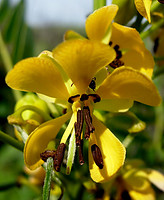
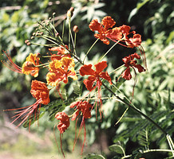
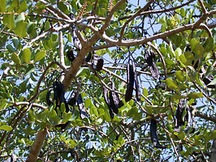

## Phylogeny 

-   « Ancestral Groups  
    -   [Fabaceae](../Fabaceae.md)
    -   [Fabales](../../Fabales.md)
    -   [Rosids](../../../Rosids.md)
    -   [Core Eudicots](Core_Eudicots)
    -   [Eudicots](../../../../../Eudicots.md)
    -   [Flowering_Plant](../../../../../../Flowering_Plant.md)
    -   [Seed_Plant](../../../../../../../Seed_Plant.md)
    -   [Land_Plant](../../../../../../../../Land_Plant.md)
    -   [Green plants](../../../../../../../../../Plants.md)
    -   [Eukaryotes](Eukaryotes)
    -   [Tree of Life](../../../../../../../../../../Tree_of_Life.md)

-   ◊ Sibling Groups of  Fabaceae
    -   [Cercideae](Cercideae.md)
    -   [Detarieae sensu lato](Detarieae.md)
    -   [Cassieae sensu lato (pro         parte)](Cassieae_%28pro_parte%29)
    -   Caesalpinieae s.l. & s.s., Cassieae sensu stricto, Mimosoideae
    -   [Papilionoideae](Papilionoideae.md)

-   » Sub-Groups
    -   [Mimosoideae](Caesalpinieae/Mimosoideae.md)

# Caesalpinieae s.l. & s.s., Cassieae sensu stricto, Mimosoideae 

[Martin F. Wojciechowski](http://www.tolweb.org/)

Containing group: [Fabaceae](../Fabaceae.md)

### Introduction

The clade shown here, referred to as the \"Caesalpinioid crown\" clade
(Wojciechowski et al., 2004), containing Cassieae subtribes Cassiinae
and Ceratoniinae (sensu Irwin and Barneby, 1981) as well as tribe
Caesalpinieae and the entire subfamily Mimosoideae, has been resolved in
all molecular phylogenetic analyses (see below). The members of tribe
Caesalpinieae have been divided into eight to nine informal generic
groups (e.g., Polhill, 1994). These include the Umtiza, Pterogyne,
Caesalpinia, Batesia, Moldenhawera, Tachigali, core-Peltophorum, and
Dimorphandra groups, which as currently presented by Lewis (2005b),
contain 56 genera and 430-440 species.

### Discussion of Phylogenetic Relationships

Results from phylogenetic studies have led to the restructuring of some
of the eight informal groups within Caesalpinieae. For example, recent
analyses of molecular sequence data have supported some of these
informal groups as monophyletic (e.g., Bruneau et al., 2001; Kajita et
al., 2001; Wojciechowski et al. 2004) but the tribe as a whole is
clearly paraphyletic, and the Mimosoideae and Cassieae sens. strict. are
nested within its lineages. As a result of phylogenetic analysis,
Bruneau et al. (2001) removed *Ceratonia* from Cassieae sensu lato
(Lewis, 2005a), showing it was sister to *Acrocarpus* among the
Caesalpinieae in the Umtiza clade, which now includes *Gymnocladus,
Gleditsia, Umtiza, Tetrapterocarpon, Arcoa, Acrocarpus,* and *Ceratonia*
(Herendeen et al. 2003).

The Caesalpinia group is a broad, apparently monophyletic group
containing 20 or more genera (Lewis, 2005b) considered closely related
to the type genus *Caesalpinia*. Numerous studies (e.g., Lewis and
Schrire, 1995; Simpson and Lewis, 2003; Simpson et al., 2003) have
clearly demonstrated that *Caesalpinia*, as traditionally circumscribed
with c. 140 spp., is paraphyletic; *Caesalpinia* in the strict sense is
now reduced to a genus of c. 25 spp. (Lewis, 2005b).

A recent molecular phylogenetic study by Marazzi et al. (2006) greatly
clarified relationships within *Senna*. The Pterogyne and Moldenhawera
groups contain only their name sakes, the genera *Pterogyne* and
*Moldenhawera*, respectively. Haston et al. (2003) found that the
Peltophorum group of Polhill (1994) was non-monophyletic and removed
genera from the group limiting it to what is now referred to as the
\'core-Peltophorum\' group, with *Schizolobium, Bussea, Peltophorum,
Parkinsonia, Conzattia, Delonix, Covillea,* and *Lemuropisum*.
Relationships within this core-Peltophorum group have been further
resolved by Haston et al. (2005).

With the exception of *Dinizia* (currently treated in Mimoseae), which
appears more closely related to members of Caesalpinieae than to
mimosoids on the basis of both molecular and morphological evidence
(Luckow et al., 2003), the subfamily Mimosoideae is resolved as
monophyletic with strong support (Luckow et al., 2003; Wojciechowski et
al., 2004). Phylogenetic studies so far indicate that members of the
Dimorphandra group of Caesalpinieae (e.g., *Dimorphandra, Erythrophleum,
Mora*) comprise the sister group to the Mimosoideae, although
relationships of lineages near the \'base\' of the mimosoids clade are
still poorly resolved.

### References

Bruneau, A., F. Forest, P. S. Herendeen, B. B. Klitgaard, and G. P.
Lewis. 2001. Phylogenetic relationships in the Caesalpinioideae
(Leguminosae) as inferred from chloroplast *trnL* intron sequences.
Systematic Botany 26: 487-514.

Haston, E. M., G. P. Lewis, and J. A. Hawkins. 2003. A phylogenetic
investigation of the Peltophorum group (Caesalpinieae: Leguminosae).
Pages 149-159 in Advances in Legume Systematics, part 10, higher level
systematics (B. B. Klitgaard and A. Bruneau, eds.). Royal Botanic
Gardens, Kew, UK.

Haston, E. M., G. P. Lewis, and J. A. Hawkins. 2005. A phylogenetic
reappraisal of the Peltophorum group (Caesalpinieae: Leguminosae) based
on the chloroplast *trnL-F*, *rbcL*, and *rps16* sequence data. American
J. Botany 92: 1359-1371.

Herendeen, P. S., A. Bruneau, G. P. Lewis. 2003. Phylogenetic
relationships in caesalpinioid legumes: a preliminary analysis based on
morphological and molecular data. Pages 37-62 in Advances in Legume
Systematics, part 10, higher level systematics (B. B. Klitgaard and A.
Bruneau, eds.). Royal Botanic Gardens, Kew, UK.

Herendeen, P. S., A. Bruneau, G. P. Lewis. 2003. Floral morphology in
caesalpinioid legumes: testing the monophyly of the \"Umtiza clade\".
International J. Plant Sciences 164 (5 Suppl.) S393-S407.

Irwin, H. S. and R. C. Barneby. 1981. Cassieae Bronn. Pages 97-106 in
Advances in legume systematics, part 1 (R. M. Polhill and P. H. Raven,
eds.). Royal Botanic Gardens, Kew, UK.

Kajita, T., H. Ohashi, Y. Tateishi, C. D. Bailey, and J. J. Doyle. 2001.
*rbcL* and legume phylogeny, with particular reference to Phaseoleae,
Millettieae, and Allies. Systematic Botany 26: 515-536.

Lewis, G. P. 2005a. Cassieae. Pages 111-125 in Legumes of the World
(Lewis, G., B. Schrire, B. MacKinder, and M. Lock, eds.). Royal Botanic
Gardens, Kew, UK.

Lewis, G. P. 2005b. Caesalpinieae. Pages 127-161 in Legumes of the World
(Lewis, G., B. Schrire, B. MacKinder, and M. Lock, eds.). Royal
Botanical Gardens, Kew, UK.

Lewis, G. P. and B. D. Schrire. 1995. A reappraisal of the Caesalpinia
group (Caesalpinioideae: Caesalpinieae) using phylogenetic analysis.
Pages 41-52 in Advances in Legume Systematics 7, phylogeny (M. D. Crisp
and J. J. Doyle, eds.). Royal Botanic Gardens, Kew, UK.

Luckow, M., J. T. Miller, D. J. Murphy, and T. Livshultz. 2003. A
phylogenetic analysis of the Mimosoideae (Leguminosae) based on
chloroplast DNA sequence data. Pages 197-220 in Advances in Legumes
Systematics, part 10, higher level systematics (B. B. Klitgaard and A.
Bruneau, eds.). Royal Botanic Gardens, Kew, UK.

Marazzi, B., P. K. Endress, L. P. de Queiroz, and E. Conti. 2006.
Phylogenetic relationships within *Senna* (Leguminosae, Cassinae) based
on three chloroplast DNA regions: patterns in the evolution of floral
symmetry and extrafloral nectaries. American J. Botany 93: 288-303.

Polhill, R. M. 1994. Classification of the Leguminosae. Pages xxxv -
xlviii in Phytochemical dictionary of the Leguminosae (F. A. Bisby, J.
Buckingham, and J. B. Harborne, eds.). Chapman and Hall, New York, NY.

Polhill, R. M., and J. E. Vidal. 1981. Caesalpinieae. Pages 81-95 in
Advances in Legume Systematics, part 1 (R. M. Polhill and P. H. Raven,
eds.). Royal Botanic Gardens, Kew, UK.

Simpson, B. B., L. L. Larkin, and A. Weeks. 2003. Progress towards
resolving the relationships of the Caesalpinia group (Caesalpinieae:
Caesalpinioideae: Leguminosae). Pages 123-148 in Advances in Legume
Systematics, part 10, higher level sytematics (B. B. Klitgaard and A.
Bruneau, eds.). Royal Botanic Gardens, Kew, UK.

Simpson, B. B., and G. P. Lewis. 2003. New combinations in *Pomaria*
(Caesalpinioideae: Leguminosae). Kew Bulletin 58: 175-184.

Wojciechowski, M. F., M. Lavin, and M. J. Sanderson. 2004. A phylogeny
of legumes (Leguminosae) based on analysis of the plastid *matK* gene
resolves many well-supported subclades within the family. American J.
Botany 91: 1846-1862.

##### Title Illustrations



  ---------------------
  Scientific Name ::     Senna marilandica (L.) \[=Cassia marilandica L.\]
  Location ::           Konza Prairie, Riley County, Kansas
  Comments             Commonly called Wild Senna or Maryland Senna.
  Specimen Condition   Live Specimen
  Copyright ::            © [Eva Horne](http://www.lib.ksu.edu/wildflower/)
  ---------------------


  ----------------------
  Scientific Name ::     Caesalpinia pulcherrima Sw.
  Location ::           Arizona
  Specimen Condition   Live Specimen
  Copyright ::            © [Chris Martin](http://www.public.asu.edu/%7Ecamartin/)
  ----------------------


  ---------------------------
  Scientific Name ::     Ceratonia siliqua L.
  Specimen Condition   Live Specimen
  Copyright ::            © [Annette Hoggemeier](http://www.boga.ruhr-uni-bochum.de/index.html)
  ---------------------------
