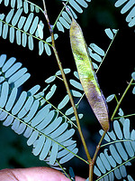

## Phylogeny 

-   « Ancestral Groups  
    -   [Fabaceae](../Fabaceae.md)
    -   [Fabales](../../Fabales.md)
    -   [Rosids](../../../Rosids.md)
    -   [Core Eudicots](Core_Eudicots)
    -   [Eudicots](../../../../../Eudicots.md)
    -   [Flowering_Plant](../../../../../../Flowering_Plant.md)
    -   [Seed_Plant](../../../../../../../Seed_Plant.md)
    -   [Land_Plant](../../../../../../../../Land_Plant.md)
    -   [Green plants](../../../../../../../../../Plants.md)
    -   [Eukaryotes](Eukaryotes)
    -   [Tree of Life](../../../../../../../../../../Tree_of_Life.md)

-   ◊ Sibling Groups of  Fabaceae
    -   [Cercideae](Cercideae.md)
    -   [Detarieae sensu lato](Detarieae.md)
    -   Cassieae sensu lato (pro parte)
    -   [Caesalpinieae s.l. & s.s., Cassieae sensu stricto,         Mimosoideae](Caesalpinieae_s.l._%26_s.s.%2C_Cassieae_sensu_stricto%2C_Mimosoideae)
    -   [Papilionoideae](Papilionoideae.md)

-   » Sub-Groups 

# Cassieae sensu lato (pro parte) 

[Martin F. Wojciechowski and Bruce Jones](http://www.tolweb.org/)

Containing group: [Fabaceae](../Fabaceae.md)

### Introduction

Tribe Cassieae has long been considered an artificial assemblage of
unrelated taxa in Caesalpinioideae (Polhill, 1994). In the last formal
treatment of this tribe, Irwin and Barneby (1981) divided Cassieae Bronn
into five subtribes, Ceratoniinae, Dialiinae, Duparquetiinae, Cassiinae,
and Labicheinae (Lewis, 2005). Three of these subtribes, Dialiinae,
Duparquetiinae, and Labicheinae, comprise the clade informally referred
to here as Cassieae sens. lat. pro parte (Lewis, 2005). The remaining
two subtribes are now considered more closely related to other
caesalpinioid groups.

Most of the genera in this group (18) are monotypic (with a single
species) or very small, with the exception of *Labichea* Gaudich. ex.
DC. (14 species) and *(Dialium* L. (28 species). They are trees, shrubs,
or herbs primarily distributed in forests and woodlands of subtropical
and tropical regions around the world (Lewis, 2005). *Koompassia
excelsa* (Becc.) Taub. - at heights of 84-88 m from Sarawak, Malaysia -
is regarded as the tallest angiosperm in tropical forests (Mabberley,
1993).

### Discussion of Phylogenetic Relationships

Tribe Cassieae, as treated by Irwin and Barneby (1981), is not
monophyletic based on analyses of molecular sequence data (e.g., Doyle
et al., 1997; Kajita et al., 2001; Herendeen et al., 2003; Wojciechowski
et al., 2004). Three of the five subtribes, Dialiinae, Duparquetiinae,
and Labicheinae, form a monophyletic group that branches early in the
family tree, whereas subtribes Cassiinae and Ceratoniinae are more
closely related to other caesalpinioid groups (Cassiinae, with *Cassia,
Chamaecrista*, and *Senna* as "Cassieae sens. strict.", in the clade
referred to as Caesalpinieae s.l. & s.s., Cassieae sensu stricto, and
Mimosoideae, and Ceratoniinae, with the single genus *Ceratonia*, in the
Umtiza clade). Within this group, Bruneau et al. (2001) found support
for the monophyly of the three subtribes, although Dialiinae is
monophyletic only if the Australian subtribe Labicheinae (with two
genera, *Labichea* and *Petalostylis* R. Br.) is included within it,
closely related to *Storckeilla* Seem. Sampling of species from the
genera shown here is still quite incomplete and so it is uncertain
whether any of them are monophyletic or not.

### References

Bruneau, A., F. Forest, P. S. Herendeen, B. B. Klitgaard, and G. P.
Lewis. 2001. Phylogenetic relationships in the Caesalpinioideae
(Leguminosae) as inferred from chloroplast *trnL* intron sequences.
Systematic Botany 26: 487-514.

Doyle, J. J., J. L. Doyle, J. A. Ballenger, E. E. Dickson, T. Kajita,
and H. Ohashi. 1997. A phylogeny of the chloroplast gene *rbcL* in the
Leguminosae: taxonomic correlations and insights into the evolution of
nodulation. American J. Botany 84: 541-554.

Herendeen, P. S., A. Bruneau, and G. P. Lewis. 2003. Phylogenetic
relationships in caesalpinioid legumes: a preliminary analysis based on
morphological and molecular data. Pages 37-62 in Advances in Legume
Systematics, part 10, higher level systematics (B. B. Klitgaard and A.
Bruneau, eds.). Royal Botanic Gardens, Kew, UK.

Irwin, H. S., and R. C. Barneby. 1981. Cassieae Bronn. Pages 97-106 in
Advances in legume systematics, part 1 (R. M. Polhill and P. H. Raven,
eds.). Royal Botanic Gardens, Kew, UK.

Kajita, T., H. Ohashi, Y. Tateishi, C. D. Bailey, and J. J. Doyle. 2001.
*rbcL* and legume phylogeny, with particular reference to Phaseoleae,
Millettieae, and allies. Syst. Bot. 26: 515-536.

Lewis, G. P. 2005. Cassieae. Pages 111-125 in Legumes of the World
(Lewis, G., B. Schrire, B. MacKinder, and M. Lock, eds.). Royal Botanic
Gardens, Kew.

Mabberley, D. J. 1993. The plant-book, a portable dictionary of the
higher plants. Cambridge University Press. UK.

Polhill, R. M. 1994. Classification of the Leguminosae. Pages xxxv -
xlviii in Phytochemical Dictionary of the Leguminosae (F.A. Bisby, J.
Buckingham, and J.B. Harborne, eds.). Chapman and Hall, New York, NY.

Wojciechowski, M. F., M. Lavin, and M. J. Sanderson. 2004. A phylogeny
of legumes (Leguminosae) based on analysis of the plastid *matK* gene
resolves many well-supported subclades within the family. American J.
Botany 91: 1846-1862.

##### Title Illustrations



  -----------------
  Scientific Name ::     Labichea lanceolata Benth.
  Location ::           West Australia
  Specimen Condition   Live Specimen
  Copyright ::            © [Bernd Krüger](http://www.bkaussi.de/)
  -----------------


  -----------------------
  Scientific Name ::     Poeppigia procera Presl
  Location ::           Bolivia
  Specimen Condition   Live Specimen
  Copyright ::            © [Robin Foster](http://fm2.fieldmuseum.org/plantguides/)
  -----------------------


  -----------------
  Scientific Name ::     Petalostylis labicheoides R.Br.
  Location ::           West Australia
  Specimen Condition   Live Specimen
  Copyright ::            © [Bernd Krüger](http://www.bkaussi.de/)
  -----------------
