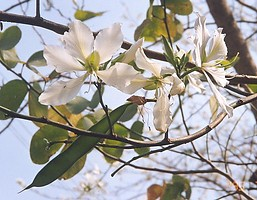

## Phylogeny 

-   « Ancestral Groups  
    -   [Fabaceae](../Fabaceae.md)
    -   [Fabales](../../Fabales.md)
    -   [Rosids](../../../Rosids.md)
    -   [Core Eudicots](Core_Eudicots)
    -   [Eudicots](../../../../../Eudicots.md)
    -   [Flowering_Plant](../../../../../../Flowering_Plant.md)
    -   [Seed_Plant](../../../../../../../Seed_Plant.md)
    -   [Land_Plant](../../../../../../../../Land_Plant.md)
    -   [Green plants](../../../../../../../../../Plants.md)
    -   [Eukaryotes](Eukaryotes)
    -   [Tree of Life](../../../../../../../../../../Tree_of_Life.md)

-   ◊ Sibling Groups of  Fabaceae
    -   Cercideae
    -   [Detarieae sensu lato](Detarieae.md)
    -   [Cassieae sensu lato (pro         parte)](Cassieae_%28pro_parte%29)
    -   [Caesalpinieae s.l. & s.s., Cassieae sensu stricto,         Mimosoideae](Caesalpinieae_s.l._%26_s.s.%2C_Cassieae_sensu_stricto%2C_Mimosoideae)
    -   [Papilionoideae](Papilionoideae.md)

-   » Sub-Groups 

# Cercideae 

[Martin F. Wojciechowski and Johanna Mahn](http://www.tolweb.org/)

\

Containing group: [Fabaceae](../Fabaceae.md)

### Introduction

Found across the globe from North America to East Asia, the tribe
Cercideae is the basally branching lineage in Fabaceae. The tribe is
divided into two subtribes, *Cercidinae*, the subtribe containing
*Cercis, Griffonia*, and *Adenolobus*, and *Bauhiniinae*, the subtribe
containing *Bauhinia* sens. lat. and *Brenierea*, based on seed, floral
and fruit characters (Wunderlin et al., 1981, 1987).

Within Cercideae, *Cercis* L. (\"redbud\"), which is the sister group to
the rest of the tribe, includes 10 species of shrubs and small trees
found in Mediterranean climates from western North America to central
Asia. Many of the species of *Cercis* have papilionoid-like flowers, but
the genus is not closely related evolutionarily to Papilionoideae (Lewis
and Forest, 2005). *Cercis canadensis,* found in the eastern United
States, produces red-purple flowers that are edible and used in salads.
*Griffonia* and *Adenolobus* are both African genera, with *Griffonia*
found in Western Africa and *Adenolobus* found in Southwestern Africa
(Mabberley, 1993). *Adenolobus* often have glandular fruits, the
characteristic they get their name from, and grow in tropical to
subtropical shrublands. *Griffonia* are shrubs and lianas found in
tropical humid forests, swamp forests, thickets, and grasslands and are
often used to make huts and baskets, and as medicines (Lewis and Forest,
2005).

According to Lewis and Forest (2005) *Bauhinia* sens. lat. is divided
into eight genera of trees and shrubs found in pantropical regions. The
number of genera in *Bauhinia sens. lat.* is still debated due to great
diversity among the group. The eight genera included in *Bauhinia sens.
lat.* are *Bauhinia, Gigasiphon, Tylosema, Barklya, Lysiphyllum,
Phanera, Lasiobema,* and *Piliostigma*. *Brenierea* is a monotypic genus
(one species) of tree or shrub found in Madagascar in subtropical
scrubland (Lewis and Forest, 2005). *Bauhinia* is a pantropical genus of
150 to 160 species of trees and shrubs, although most abundant in the
Neotropics (Lewis and Forest, 2005), and many species are lianas. The
flowers of *Bauhinia* are often pollinated by bats, birds, or insects
and some species produce explosive fruit, known to project seeds up to
15 m (Mabberley, 1993). Species of *Bauhinia* are used medicinally, for
tanning, and as food, dyes, and timber (Mabberley, 1993). The other
genera in *Bauhinia* sens. lat. include several species of lianas and
species that are important economically for their uses as timber,
medicinally, and sources of food.

### Discussion of Phylogenetic Relationships

Tribe Cercideae forms the basally branching lineage within Fabaceae
(i.e., the sister group to the rest of the family), a position supported
by numerous studies (e.g., Bruneau et al., 2001; Kajita et al., 2001;
Herendeen et al., 2003). In spite of considerable taxonomic work on the
tribe in the last 30 years, few species have been included in
phylogenetic analyses of either molecular or morphological data and thus
inter- and intrageneric relationships remain largely unresolved (Bruneau
et al., 2001; Herendeen et al., 2003). Within Cercideae, *Cercis* L. is
the most basally branching genus in the tribe, and recent studies have
provided some resolution of relationships in this genus (e.g., Davis et
al., 2002). *Cercis* plus *Adenolobus* and *Griffonia* appear to form
the sister group to *Brenierea* plus *Bauhinia* sens. lat., but this
relationship has not been well supported (here shown as a polytomy). In
addition, relationships among *Lysiphyllum, Phanera, Lasiobema,* and
*Piliostigma* are poorly resolved, largely due to sparse sampling from
these genera.

### References

Bruneau, A., F. Forest, P. S. Herendeen, B. B. Klitgaard, and G. P.
Lewis. 2001. Phylogenetic relationships in the Caesalpinioideae
(Leguminosae) as inferred from chloroplast *trnL* intron sequences.
Systematic Botany 26: 487-514.

Davis, C. C., P. W. Fritsch, J. Li, and M. J. Donoghue. 2002. Phylogeny
and biogeography of *Cercis* (Fabaceae): evidence from nuclear ribosomal
ITS and chloroplast *ndhF* sequence data. Systematic Botany 27: 289-302.

Herendeen, P. S., A. Bruneau, G.P. Lewis. 2003. Phylogenetic
relationships in caesalpinioid legumes: a preliminary analysis based on
morphological and molecular data. Pages 37-62 in Advances in Legume
Systematics, part 10, higher level systematics (B.B. Klitgaard and A.
Bruneau, eds.). Royal Botanic Gardens, Kew, UK.

Kajita, T., H. Ohashi, Y. Tateishi, C. D. Bailey, and J. J. Doyle. 2001.
*rbcL* and legume phylogeny, with particular reference to Phaseoleae,
Millettieae, and allies. Systematic Botany 26: 515-536.

Lewis, G. P. and F. Forest. 2005. Cercideae. Pages 57-67 in Legumes of
the World (G. Lewis, B. Schrire, B. MacKinder, and M. Lock, eds.). Royal
Botanical Gardens, Kew, UK.

Mabberley, D. J. 1993. The plant-book, a portable dictionary of the
higher plants. Cambridge University Press. UK.

Wunderlin, R., K. Larsen, and S. S. Larsen. 1981. Cercideae. Pages
107-116 in Advances in legume systematics, part 1 (R. M. Polhill and P.
H. Raven, eds.). Royal Botanic Gardens, Kew, UK.

Wunderlin, R., K. Larsen, and S. S. Larsen. 1987. Reorganizaztion of the
Cercideae (Fabaceae: Caesalpinioideae). Biol. Skr. 28: 1-40.

##### Title Illustrations



  ------------------------
  Scientific Name ::     Cercis chinensis Bunge
  Specimen Condition   Live Specimen
  Body Part            flower
  Copyright ::            © [Annette Hoeggemeier](http://www.boga.ruhr-uni-bochum.de/)
  ------------------------


  -------------------
  Scientific Name ::     Bauhinia variegata L. (var. candida)
  Specimen Condition   Live Specimen
  Copyright ::            © [L. Ramsden](http://web.hku.hk/%7Elramsden/)
  -------------------


  ---------------------------
  Scientific Name ::  Tylosema fassoglensis (Kotschy) Torre & Hillc.
  Location ::        Vumba rd near Altar Site, Mutare, Zimbabwe
  Copyright ::         © 06/2006 [Mark Hyde and Bart Wursten](http://www.zimbabweflora.co.zw/)
  ---------------------------
