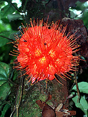
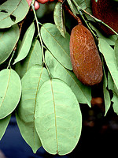
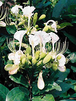

## Phylogeny 

-   « Ancestral Groups  
    -   [Fabaceae](../Fabaceae.md)
    -   [Fabales](../../Fabales.md)
    -   [Rosids](../../../Rosids.md)
    -   [Core Eudicots](Core_Eudicots)
    -   [Eudicots](../../../../../Eudicots.md)
    -   [Flowering_Plant](../../../../../../Flowering_Plant.md)
    -   [Seed_Plant](../../../../../../../Seed_Plant.md)
    -   [Land_Plant](../../../../../../../../Land_Plant.md)
    -   [Green plants](../../../../../../../../../Plants.md)
    -   [Eukaryotes](Eukaryotes)
    -   [Tree of Life](../../../../../../../../../../Tree_of_Life.md)

-   ◊ Sibling Groups of  Fabaceae
    -   [Cercideae](Cercideae.md)
    -   Detarieae sensu lato
    -   [Cassieae sensu lato (pro         parte)](Cassieae_%28pro_parte%29)
    -   [Caesalpinieae s.l. & s.s., Cassieae sensu stricto,         Mimosoideae](Caesalpinieae_s.l._%26_s.s.%2C_Cassieae_sensu_stricto%2C_Mimosoideae)
    -   [Papilionoideae](Papilionoideae.md)

-   » Sub-Groups 

# [[Detarieae]] sensu lato 

       

## #has_/text_of_/abstract 

> The subfamily Detarioideae is one of the subdivisions of the plant family Fabaceae (legumes). 
> This subfamily includes many tropical trees, some of which are used for timber or have ecological importance. 
> 
> The subfamily consists of 84 genera, most of which are native to Africa and Asia. 
> Pride of Burma (Amherstia nobilis) and tamarind (Tamarindus indica) 
> are two of the most notable species in Detarioideae. 
> 
> It has the following clade-based definition:
>
> The most inclusive crown clade containing Goniorrhachis marginata Taub. and Aphanocalyx cynometroides Oliv., but not Cercis canadensis L., Duparquetia orchidacea Baill., or Bobgunnia fistuloides (Harms) J. H. Kirkbr. & Wiersema.
>
> [Wikipedia](https://en.wikipedia.org/wiki/Detarioideae) 

## Introduction

[Martin F. Wojciechowski and Johanna Mahn]() 

The Detarieae sens. lat. is pantropical in distribution and consists of
82 genera and c. 750 species, with the majority of genera confined to
Africa and Madagascar (Mackinder, 2005). This group is known for its
remarkable range and complex patterns of floral modifications.

Of special interest, the [World Conservation Union](http://iucn.org/)
has assessed at least 132 extant species of Detarieae for red data
status, 13 of which are considered endangered, 11 are critically
endangered, and 73 are near endangered or vulnerable (Mackinder, 2005).

### Characteristics

Species in Detarieae demonstrate co-adaptation with animals for
defensive and reproductive purposes. They have adapted flower shape and
coloration to attract bees for pollination, and some have leaves that
attract ants. Other distinguishing characteristics include the
production of tannins and terpenoids (Cowan and Polhill, 1981).
Detarieae sens. lat. also includes a number of resin-producing genera
(Fougere-Danezan et al., 2003).

### Discussion of Phylogenetic Relationships

Detarieae sens. lat. (sensu Polhill, 1994) includes the tribes Detarieae
DC. and Amherstieae Bentham. The range and complexity of morphological
variation, especially floral modifications, exhibited in the tribe have
proven problematic to the establishment of clearly circumscribed and
accepted generic groupings (Mackinder, 2005). Phylogenies based on
morphological characteristics and molecular genetic studies exist, but
extreme diversity among species makes determining relationships between
them difficult. The African species are the primary focus of study
within the tribe, other species and their classification are less well
known.

The first \'comprehensive\' studies of phylogenetic relationships, based
on molecular sequence data, were those of Bruneau et al. (2000, 2001)
which suggested that none of the proposed generic groups (e.g., Cowan
and Polhill, 1981; Polhill, 1994) were strongly supported as
monophyletic. More recent analyses of molecular data alone and combined
molecular and morphological data (Herendeen et al., 2003; Wieringa and
Gervais, 2003) have provided additional resolution and support for some
groups. For example, the \'Prioria\' (sensu Bruneau et al., 2001),
Detarieae sens. strict., and \'Amherstieae\' subclades are
well-supported but unresolved with respect to each other. The
Amherstieae clade contains the \'Brownea\' and Macrolobieae subclades
(sensu Bruneau et al., 2001), with the latter containing a number of
familiar genera such as *Berlinia, Aphanocalyx, Bikinia*, and
*Tetraberlinia*. *Tamarindus*, the tamarind-producing plant, is also
included in Amherstieae.

## Title Illustrations

--------------------------

Scientific Name ::     Brownea macrophylla L.
Location ::           Ecuador
Specimen Condition   Live Specimen
Copyright ::            © [Robin Foster](http://fm2.fieldmuseum.org/plantguides/default.asp)

--------------------------

Scientific Name ::     Tamarindus indica L.
Specimen Condition   Live Specimen
Copyright ::            © 2006 [Mark Hyde and Bart Wursten](http://www.zimbabweflora.co.zw/)

-----------------------

Scientific Name ::     Crudia glaberrima Macbride
Location ::           Ecuador
Specimen Condition   Live Specimen
Copyright ::            © [Robin Foster](http://fm2.fieldmuseum.org/plantguides/)

--------------------------

Scientific Name ::     Berlinia bruneelii (De Wild.) Torr. & Hillc.
Specimen Condition   Live Specimen
Copyright ::            © 2005 [Paul Latham](http://home.tiscali.be/lpauwels/Latham2.htm)
