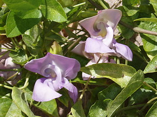
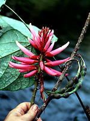
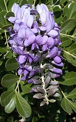
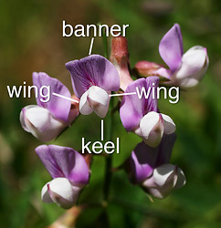

# [[Papilionoideae]]  

 
 
 

## #has_/text_of_/abstract 

> The Faboideae are a subfamily of the flowering plant family Fabaceae or Leguminosae. 
> An acceptable alternative name for the subfamily is **Papilionoideae**, 
> or Papilionaceae when this group of plants is treated as a family.
>
> This subfamily is widely distributed, and members are adapted to a wide variety of environments. 
> Faboideae may be trees, shrubs, or herbaceous plants. 
> 
> Members include the pea, the sweet pea, the laburnum, and other legumes. 
> The pea-shaped flowers are characteristic of the Faboideae subfamily and root nodulation is very common.
>
> [Wikipedia](https://en.wikipedia.org/wiki/Faboideae) 

## Phylogeny 

-   « Ancestral Groups  
    -   [Fabaceae](../Fabaceae.md)
    -   [Fabales](../../Fabales.md)
    -   [Rosids](../../../Rosids.md)
    -   [Core Eudicots](Core_Eudicots)
    -   [Eudicots](../../../../../Eudicots.md)
    -   [Flowering_Plant](../../../../../../Flowering_Plant.md)
    -   [Seed_Plant](../../../../../../../Seed_Plant.md)
    -   [Land_Plant](../../../../../../../../Land_Plant.md)
    -   [Green plants](../../../../../../../../../Plants.md)
    -   [Eukaryotes](Eukaryotes)
    -   [Tree of Life](../../../../../../../../../../Tree_of_Life.md)

-   ◊ Sibling Groups of  Fabaceae
    -   [Cercideae](Cercideae.md)
    -   [Detarieae sensu lato](Detarieae.md)
    -   [Cassieae sensu lato (pro         parte)](Cassieae_%28pro_parte%29)
    -   [Caesalpinieae s.l. & s.s., Cassieae sensu stricto,         Mimosoideae](Caesalpinieae_s.l._%26_s.s.%2C_Cassieae_sensu_stricto%2C_Mimosoideae)
    -   Papilionoideae

-   » Sub-Groups
    -   [Cladrastis clade](Cladrastis_clade)
    -   [Genistoid clade](Genistoid_clade)
    -   [Dalbergioid sensu lato clade](Dalbergioid_clade)
    -   [Millettioid sensu lato clade](Millettioid_clade)
    -   [Hologalegina](Papilionoideae/Hologalegina.md)

## Introduction

[Martin F. Wojciechowski]() 

Papilionoideae (the \"papilionoids\"), the largest of the three subfamilies of Fabaceae 
with 476 genera and 13,860 species, is also the most diverse and widely distributed, 
and includes most of the familiar domesticated food and forage crops 
and model genetic/genomic species

### Characteristics

Papilionoideae is characterized by pentamerous (floral parts in fives or
multiples thereof), zygomorphic papilionoid (pea-like) flowers that have
differentiated an adaxial petal (banner or standard) that is external to
the others in bud, and abaxial and lateral pairs of petals (keel and
wings, respectively), with the keel petals fused to enclose the stamens
and gynoecium (as shown in figure below). Although this floral
architecture is ubiquitous in the subfamily, exceptions do occur, with
nearly actinomorphic flowers (e.g., *Cadia* in tribe Sophoreae;
*Inocarpus* in tribe Dalbergieae) and flowers lacking 1 or more of the
five petals known from several groups (e.g., tribe Amorpheae).

Structure of typical zygomorphic (pea-like) papilionoid flower. The five
petals are labeled: banner (also known as the standard petal or
vexillum), top most petal, often reflexed; two lateral wing petals; and
two lower keel petals, often fused at least partially along one edge
into a single boat-shaped keel petal which surrounds the stamens
(androecium) and pistil (gynoecium). Photo: *Lathyrus vestitus*. © 2004
[Adam Paul](http://www.adampaul.com/home.shtml)

Unlike the other subfamilies, many papilionoids have the ability to
synthesize quinolizidine alkaloids, isoflavones, and non-protein amino
acids such as canavanine, while bipinnate leaves, complex leaf glands
and compound pollen grains are lacking (Polhill, 1994).

### Discussion of Phylogenetic Relationships

Although the majority of tribes are still defined in a more traditional
sense (e.g. Polhill, 1994) the results of phylogenetic studies from the
last 10 years necessitate quite radical shifts in inter- and
intra-tribal relationships within the subfamily, and these insights have
profound implications with regard to papilionoid evolution.

Papilionoideae has been consistently resolved (and strongly supported)
as monophyletic in analyses of molecular data (e.g., Doyle et al., 1997,
2000; Pennington et al., 2001; Wojciechowski et al., 2004), but on
morphological criteria the uncertainty regarding the position of
papilionoid tribes such as Swartzieae, long considered \'transitional\'
between Caesalpinioideae and Papilionoideae, has clouded this issue.
Rather than being resolved as the sister group to an isolated
caesalpinioid lineage(s), as are the mimosoids, papilionoids are sister
to the large clade comprised of Caesalpinieae sens. lat., Cassieae sens.
strict., and Mimosoideae in the legume phylogeny (Wojciechowski et al.,
2004). Although papilionoids have been considered to contain most of the
\"derived\" groups within the family (e.g., predominantly herbaceous
groups), fossil evidence and divergence time estimates clearly indicate
the oldest crown clades within papilionoids are comparable in age (39 to
59 Ma) to the oldest caesalpinioid diversifications (Lavin et al.,
2005).

Based on results from such studies papilionoids can be broadly divided
into the following main subclades and groups: Swartzieae sens. str., the
*Cladrastis* clade, the Genistoid clade, the Dalbergioid sens. lat.
clade, Mirbelioid sens. lat. clade, Millettioid sens. lat. clade,
Hologalegina, and several weakly supported and/or partially resolved
groups such as the \"basal papilionoid\" groups (including members of
tribes Swartzieae, Sophoreae, Dalbergieae and Dipterygeae), and the
Baphioid clade.

## Title Illustrations

------------------------------------------------------------------------

Scientific Name ::     Vigna speciosa (Kunth) Verdc.
Location ::           Mesa, Arizona
Comments             Commonly called Snail Vines.
Specimen Condition   Live Specimen
Copyright ::            © [Johanna Mahn](mailto:johannamahn@gmail.com) 

-----------------------

Scientific Name ::     Erythrina amazonica Krukoff
Location ::           Ecuador
Specimen Condition   Live Specimen
Copyright ::            © [Robin Foster](http://fm2.fieldmuseum.org/plantguides/)

------------------------------------------------------------------------------

Scientific Name ::     Calia secundiflora (Ortega) Yakovlev (= Sophora secundiflora)
Location ::           Arizona State University campus
Specimen Condition   Live Specimen
Identified By        M F Wojciechowski
Copyright ::            © [Martin F. Wojciechowski](http://www.public.asu.edu/%7Emfwojci/) 

## Confidential Links & Embeds: 

### [Papilionoideae](/_Standards/bio/bio~Domain/Eukaryotes/Plants/Land_Plant/Seed_Plant/Flowering_Plant/Eudicots/Core_Eudicots/Rosids/Fabales/Fabaceae/Papilionoideae.md) 

### [Papilionoideae.public](/_public/bio/bio~Domain/Eukaryotes/Plants/Land_Plant/Seed_Plant/Flowering_Plant/Eudicots/Core_Eudicots/Rosids/Fabales/Fabaceae/Papilionoideae.public.md) 

### [Papilionoideae.internal](/_internal/bio/bio~Domain/Eukaryotes/Plants/Land_Plant/Seed_Plant/Flowering_Plant/Eudicots/Core_Eudicots/Rosids/Fabales/Fabaceae/Papilionoideae.internal.md) 

### [Papilionoideae.protect](/_protect/bio/bio~Domain/Eukaryotes/Plants/Land_Plant/Seed_Plant/Flowering_Plant/Eudicots/Core_Eudicots/Rosids/Fabales/Fabaceae/Papilionoideae.protect.md) 

### [Papilionoideae.private](/_private/bio/bio~Domain/Eukaryotes/Plants/Land_Plant/Seed_Plant/Flowering_Plant/Eudicots/Core_Eudicots/Rosids/Fabales/Fabaceae/Papilionoideae.private.md) 

### [Papilionoideae.personal](/_personal/bio/bio~Domain/Eukaryotes/Plants/Land_Plant/Seed_Plant/Flowering_Plant/Eudicots/Core_Eudicots/Rosids/Fabales/Fabaceae/Papilionoideae.personal.md) 

### [Papilionoideae.secret](/_secret/bio/bio~Domain/Eukaryotes/Plants/Land_Plant/Seed_Plant/Flowering_Plant/Eudicots/Core_Eudicots/Rosids/Fabales/Fabaceae/Papilionoideae.secret.md)

