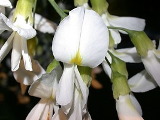
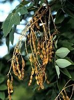
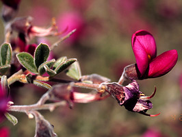

## Phylogeny 

-   « Ancestral Groups  
    -   [Papilionoideae](../Papilionoideae.md)
    -   [Fabaceae](../../Fabaceae.md)
    -   [Fabales](../../../Fabales.md)
    -   [Rosids](../../../../Rosids.md)
    -   [Core Eudicots](Core_Eudicots)
    -   [Eudicots](../../../../../../Eudicots.md)
    -   [Flowering_Plant](../../../../../../../Flowering_Plant.md)
    -   [Seed_Plant](../../../../../../../../Seed_Plant.md)
    -   [Land_Plant](../../../../../../../../../Land_Plant.md)
    -   [Green plants](../../../../../../../../../../Plants.md)
    -   [Eukaryotes](Eukaryotes)
    -   [Tree of Life](../../../../../../../../../../../Tree_of_Life.md)

-   ◊ Sibling Groups of  Papilionoideae
    -   Cladrastis clade
    -   [Genistoid clade](Genistoid_clade)
    -   [Dalbergioid sensu lato clade](Dalbergioid_clade)
    -   [Millettioid sensu lato clade](Millettioid_clade)
    -   [Hologalegina](Hologalegina.md)

-   » Sub-Groups 

# Cladrastis clade 

[Martin F. Wojciechowski](http://www.tolweb.org/)

Containing group: [Papilionoideae](../Papilionoideae.md)

### Introduction

Tribe Sophoreae has been considered a \"tribe of convenience\" to
include the heterogenous assemblage of genera within Papilionoideae that
have relatively simple flowers and unspecialized pinnate leaves
(Polhill, 1994). Since Polhill\'s last (1994) treatment of Sophoreae,
cladistic analyses of morphology (Chappill, 1995), pollen data (Ferguson
et al., 1994), and molecular sequences (e.g. Doyle et al., 1997; Kajita
et al., 2001; Pennington et al., 2001; Wojciechowski et al., 2004) have
clearly shown Sophoreae to be paraphyletic, its constituent genera
distributed as members of disparate, early-branching papilionoid
lineages.

One of the more interesting clades to emerge from these analyses is the
\"Cladrastis\" clade (Wojciechowski et al., 2004) containing the genera
*Cladrastis* Raf., *Pickeringia* Nutt. ex Torrey & A. Gray, and
*Styphnolobium* Schott. *Cladrastis* and *Styphnolobium* (segregate of
*Sophora* L.) have been traditionally classified in Sophoreae sens. str.
(Polhill, 1981, 1994), whereas *Pickeringia* has been classified in
tribe Thermopsideae (Turner, 1981). The close relationship of
*Cladrastis* and *Styphnolobium* is notable biogeographically because
both genera exhibit East Asian-North American disjunctions.

*Cladrastis*, with 6 to 7 species of trees found in warm temperate
montane evergreen, mixed-deciduous forests, is distributed in east Asia
(6 species; China to Japan) and eastern North America (1 sp.; southern
Illinois to North Carolina) (Duley and Vincent, 2003; Pennington et al.,
2005). *Styphnolobium*, with 9 species of trees inhabiting temperate to
seasonally-dry tropical woodlands to montane forests, is distributed
from North and Central America (8 species) to west-central China (1
species) (Pennington et al., 2005). *Pickeringia* is a monotypic genus
of spiny, xerophytic shrub restricted to the sclerophyllous chaparral
and mixed evergreen-woodland forest vegetation of California and
northern Baja California of Western North America (Raven and Axelrod,
1995).

Consistent with evidence of both *Cladrastis* (subgenus *Cladrastis* and
subgenus *Platycarpus*) and *Styphnolobium* represented in the fossil
record from the Middle Eocene (minimum 40 Ma) of Tennessee (Herendeen,
1992), age estimates based on rates analyses of molecular sequences
suggest this is one of the oldest clades of papilionoids (Lavin et al.,
2005).

### Discussion of Phylogenetic Relationships

The \"Cladrastis\" clade is one of the well-supported, early branching
clades of papilionoids to emerge from recent molecular analyses
(Wojciechowski et al., 2004). In this clade, the genera *Styphnolobium*
and *Pickeringia* are nested within a paraphyletic *Cladrastis*. The
close relationship between these three genera is supported by
similarities in floral morphology, chromosome number, and absence of
quinolizidine alkaloids.

The position of *Pickeringia* in the Cladrastis clade is consistent with
Polhill\'s (1981) and Sousa and Rudd\'s (1993) predictions of a close
relationship between these three genera based on floral morphology,
cytogenetic evidence, and the absence of quinolizidine alkaloids in
*Pickeringia* of the type that is characteristic of other members of
Thermopsideae (Turner, 1981). Recent analyses have failed to detect
similar alkaloids in *Cladrastis* and *Styphnolobium* (Kite and
Pennington, 2003), a finding consistent with the molecular data showing
a close phylogenetic relationship between these three genera.

### References

Chappill, J. A. 1995. Cladistic analysis of the Leguminosae: development
of an explicit hypothesis. Pages 1-9 in Advances in Legume Systematics,
part 7, phylogeny (W.D. Crisp and J.J. Doyle, eds.). Royal Botanic
Gardens, Kew, UK.

Doyle, J. J., J. L. Balinger, E. E. Dickson, T. Kajita, and H. Ohashi.
1997. A phylogeny of the chloroplast gene *rbcL* in the Leguminosae:
taxonomic correlations and insights into the evolution of nodulation.
American J. Botany 84: 541-554.

Duley, M. L., and M. A. Vincent. 2003. A synopsis of the genus
*Cladrastis* (Leguminosae). Rhodora 105: 205-239.

Ferguson, I. K., B. D. Schrire, and R. Shepperton. 1994. Pollen
morphology of the tribe Sophoreae and relationships between subfamilies
Caesalpinioideae and Papilionoideae. Pages 53-96 in Advances in Legume
Systematics, part 6, structural botany (I. K. Ferguson and S. C. Tucker,
eds.). Royal Botanic Gardens, Kew, UK.

Herendeen, P. S. 1992. The fossil history of Leguminosae from the Eocene
of southeastern North America. Pages 85-160 in Advances in Legume
Systematics, part 4, the fossil record (Herendeen, P.S., and D.L.
Dilcher, eds.). Royal Botanic Gardens, Kew, UK.

Kajita, T., H. Ohashi, Y. Tateishi, C. D. Bailey, and J. J. Doyle. 2001.
*rbcL* and legume phylogeny, with particular reference to Phaseoleae,
Millettieae, and Allies. Systematic Botany 26: 515-536.

Kite, G. C., and R. T. Pennington. 2003. Quinolizidine alkaloid status
of *Styphnolobium* and *Cladrastis* (Leguminosae). Biochemical
Systematics and Ecology 31: 1409-1416.

Lavin, M., P. S. Herendeen, and M. F. Wojciechowski. 2005. Evolutionary
rates analysis of Leguminosae implicates a rapid diversification of
lineages during the Tertiary. Syst. Biol. 54: 530-549.

Pennington, R. T., M. Lavin, H. Ireland, B. Klitgaard, J. Preston, and
J.-M. Hu. 2001. Phylogenetic relationships of basal papilionoid legumes
based upon sequence of the chloroplast *trnL* intron. Systematic Botany
26: 537-556.

Pennington, R. T., C. H. Stirton, and B. D. Schrire. 2005. Sophoreae.
Pages 227-249 in Legumes of the World (Lewis et al., eds.). Royal
Botanic Gardens, Kew, UK.

Polhill, R. M. 1981. Sophoreae. Pages 213-230 in Advances in legume
systematics, part 1 (R. M. Polhill and P. H. Raven, eds.). Royal Botanic
Gardens, Kew, UK.

Polhill, R. M. 1994. Classification of the Leguminosae. Pages xxxv --
xlviii in Phytochemical dictionary of the Leguminosae (F. A. Bisby, J.
Buckingham, and J. B. Harborne, eds.). Chapman and Hall, New York, NY.

Raven, R. H., and D. I. Axelrod. 1995. Origin and relationships of the
California flora. California Native Plant Society, Sacramento,
California, USA.

Sousa, M., and V. E. Rudd. 1993. Revision del genero *Styphnolobium*
(Leguminosae: Papilionoideae: Sophoreae). Annals of the Missouri
Botanical Garden 80: 270-283.

Turner, B. L. 1981. Thermopsideae. Pages 403-407 in Advances in Legume
Systematics, part 1 (R. M. Polhill and P. H. Raven, eds.). Royal Botanic
Gardens, Kew, UK.

Wojciechowski, M. F., M. Lavin, and M. J. Sanderson. 2004. A phylogeny
of legumes (Leguminosae) based on analysis of the plastid *matK* gene
resolves many well-supported subclades within the family. Am. J. Bot.
91: 1846-1862.

##### Title Illustrations



  -----------------------
  Scientific Name ::     Cladrastis kentukea (Dum.-Cours.) Rudd
  Location ::           Ithaca, NY, Cornell University Plantations
  Specimen Condition   Live Specimen
  Copyright ::            © 2006 [Kevin C. Nixon](http://www.plantsystematics.org/)
  -----------------------


  ------------------------
  Scientific Name ::     Styphnolobium japonicum (L.) Schott
  Comments             Commonly called Japanese Pagodatree or Scholar-tree.
  Specimen Condition   Live Specimen
  Copyright ::            © [Mark Brand](http://www.hort.uconn.edu/plants/index.html)
  ------------------------


  ------------------------
  Scientific Name ::     Pickeringia montana var. tomentosa
  Comments             Commonly called Chaparral Pea.
  Specimen Condition   Live Specimen
  Source Collection    [CalPhotos](http://calphotos.berkeley.edu/)
  Copyright ::            © 1996 [Christopher L. Christie](mailto:refugee2000@qwest.net)
  ------------------------
