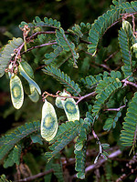
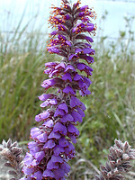

---
title: "Dalbergioid sensu lato clade"
---

# [[Dalbergioid]] sensu lato  

       

## Introduction

[Martin F. Wojciechowski]() 

The \"Dalbergioid sens. lat.\" clade includes the tribe Amorpheae and
the \"dalbergioid sens. str.\" clade (\"dalbergioids\" sensu Lavin et
al., 2001). First described by Lavin et al. (2001), the \"dalbergioid\"
legumes are a pantropical group of papilionoids originally recognized on
the basis of combined molecular and morphological phylogenetic evidence
and circumscribed to include all genera (44 genera, c. 1100 species)
previously referred to the tribes Aeschynomeneae, Adesmieae, subtribe
Bryinae of the Desmodieae, and tribe Dalbergieae except for *Andira*,
*Hymenolobium*, *Vatairea*, and *Vataireopsis* (Lavin et al., 2001). The
discovery of the dalbergioid clade prompted a re-examination of root
nodule structure within this group and the subsequent conclusion that
the \"aeschynomenoid\" type of root nodule (Sprent, 2001) is a
non-molecular synapomorphy for this clade (Lavin et al., 2001). The
tribe Amorpheae consists of eight genera (c. 240 species), all American,
of small trees and perennial and annual herbs distributed primarily in
warm temperate and desert regions of the northern hemisphere, but most
abundant and diverse in Mexico (Barneby, 1977).

### Discussion of Phylogenetic Relationships

The recognition of the dalbergioid legumes by Lavin et al. (2001)
brought together members of tribes Aeschynomeneae, Adesmieae,
Dalbergieae, and subtribe Bryinae of the Desmodieae, but the position of
this clade within Papilionoideae was not well clarified by their
analysis; preliminary evidence suggested that its sister group included
the tribe Amorpheae. More recent studies based on analyses of molecular
sequence data (McMahon and Hufford, 2004; Wojciechowski et al., 2004)
provide convincing support for the monophyly of Amorpheae, confirming
Barneby\'s (1977) hypothesis of Amorpheae as a \'natural group\', and
place Amorpheae as the sister group to the dalbergioids sensu Lavin et
al. (2001). Together these two clades comprise what has been referred to
as the \"dalbergioids sens. lat.\" clade (Wojciechowski et al., 2004).
Similarities in base chromosome number, the presence of glandular
punctuate leaves, and indehiscent single-seeded pods among many
dalbergioids also support this relationship with Amorpheae
(Wojciechowski et al., 2004). Furthermore, these studies suggest weak
support for a sister group relationship of the primarily tropical
American genera *Andira* and *Hymenolobium* of Dalbergieae to the
dalbergioids sens. lat. clade.

Within dalbergioids, three informal, well-supported subclades are
recognized (Lavin et al., 2001): the Adesmia clade (6 genera, c. 360
species mainly Neotropical), the Dalbergia clade (17 genera, c. 706
species pantropical, centered in Africa), and the Pterocarpus clade (22
genera, c. 200 species mainly Neotropical). In the analysis of Amorpheae
by McMahon and Hufford (2004), two well-supported subclades were
recognized: the \"Amorphoid\" clade (*Amorpha*, *Apoplanesia*,
*Errazurizia*, *Eysenhardtia*, and *Parryella*), characterized by
non-papilionaceous flowers, and the \"Daleoid\" clade (*Dalea*,
*Marina*, and *Psorothamnus*), characterized by generally papilionaceous
corollas.

## Phylogeny 

-   « Ancestral Groups  
    -   [Papilionoideae](../Papilionoideae.md)
    -   [Fabaceae](../../Fabaceae.md)
    -   [Fabales](../../../Fabales.md)
    -   [Rosids](../../../../Rosids.md)
    -   [Core Eudicots](Core_Eudicots)
    -   [Eudicots](../../../../../../Eudicots.md)
    -   [Flowering_Plant](../../../../../../../Flowering_Plant.md)
    -   [Seed_Plant](../../../../../../../../Seed_Plant.md)
    -   [Land_Plant](../../../../../../../../../Land_Plant.md)
    -   [Green plants](../../../../../../../../../../Plants.md)
    -   [Eukaryotes](Eukaryotes)
    -   [Tree of Life](../../../../../../../../../../../Tree_of_Life.md)

-   ◊ Sibling Groups of  Papilionoideae
    -   [Cladrastis clade](Cladrastis_clade)
    -   [Genistoid clade](Genistoid_clade)
    -   Dalbergioid sensu lato clade
    -   [Millettioid sensu lato clade](Millettioid_clade)
    -   [Hologalegina](Hologalegina.md)

-   » Sub-Groups 

## Title Illustrations

-----------------------

Scientific Name ::     Dalbergia gracilis Benth.
Location ::           Bolivia
Specimen Condition   Live Specimen
Copyright ::            © [Robin Foster](http://fm2.fieldmuseum.org/plantguides/)

---------------------

Scientific Name ::     Amorpha canescens Pursh
Location ::           Lincoln County, Kansas
Comments             Commonly called Lead Plant.
Specimen Condition   Live Specimen
Copyright ::            © [Mike Haddock](http://www.lib.ksu.edu/wildflower/)

---------------------

Scientific Name ::     Dalea aurea Nutt. ex Pursh
Location ::           Mitchell County, Kansas
Comments             Commonly called Silktop dalea.
Specimen Condition   Live Specimen
Copyright ::            © [Mike Haddock](http://www.lib.ksu.edu/wildflower/)

------------

Scientific Name ::     Inocarpus edulis Forst.
Specimen Condition   Live Specimen
Copyright ::            © G. D. Carr

## Confidential Links & Embeds: 

### #is_/same_as :: [Dalbergioid](/_Standards/bio/bio~Domain/Eukaryotes/Plants/Land_Plant/Seed_Plant/Flowering_Plant/Eudicots/Core_Eudicots/Rosids/Fabales/Fabaceae/Papilionoideae/Dalbergioid.md) 

### #is_/same_as :: [Dalbergioid.public](/_public/bio/bio~Domain/Eukaryotes/Plants/Land_Plant/Seed_Plant/Flowering_Plant/Eudicots/Core_Eudicots/Rosids/Fabales/Fabaceae/Papilionoideae/Dalbergioid.public.md) 

### #is_/same_as :: [Dalbergioid.internal](/_internal/bio/bio~Domain/Eukaryotes/Plants/Land_Plant/Seed_Plant/Flowering_Plant/Eudicots/Core_Eudicots/Rosids/Fabales/Fabaceae/Papilionoideae/Dalbergioid.internal.md) 

### #is_/same_as :: [Dalbergioid.protect](/_protect/bio/bio~Domain/Eukaryotes/Plants/Land_Plant/Seed_Plant/Flowering_Plant/Eudicots/Core_Eudicots/Rosids/Fabales/Fabaceae/Papilionoideae/Dalbergioid.protect.md) 

### #is_/same_as :: [Dalbergioid.private](/_private/bio/bio~Domain/Eukaryotes/Plants/Land_Plant/Seed_Plant/Flowering_Plant/Eudicots/Core_Eudicots/Rosids/Fabales/Fabaceae/Papilionoideae/Dalbergioid.private.md) 

### #is_/same_as :: [Dalbergioid.personal](/_personal/bio/bio~Domain/Eukaryotes/Plants/Land_Plant/Seed_Plant/Flowering_Plant/Eudicots/Core_Eudicots/Rosids/Fabales/Fabaceae/Papilionoideae/Dalbergioid.personal.md) 

### #is_/same_as :: [Dalbergioid.secret](/_secret/bio/bio~Domain/Eukaryotes/Plants/Land_Plant/Seed_Plant/Flowering_Plant/Eudicots/Core_Eudicots/Rosids/Fabales/Fabaceae/Papilionoideae/Dalbergioid.secret.md)

