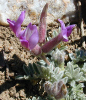

## Phylogeny 

-   « Ancestral Groups  
    -   [Hologalegina](../Hologalegina.md)
    -   [Papilionoideae](../../Papilionoideae.md)
    -   [Fabaceae](../../../Fabaceae.md)
    -   [Fabales](../../../../Fabales.md)
    -   [Rosids](../../../../../Rosids.md)
    -   [Core Eudicots](Core_Eudicots)
    -   [Eudicots](../../../../../../../Eudicots.md)
    -   [Flowering_Plant](../../../../../../../../Flowering_Plant.md)
    -   [Seed_Plant](../../../../../../../../../Seed_Plant.md)
    -   [Land_Plant](../../../../../../../../../../Land_Plant.md)
    -   [Green plants](../../../../../../../../../../../Plants.md)
    -   [Eukaryotes](Eukaryotes)
    -   [Tree of Life](../../../../../../../../../../../../Tree_of_Life.md)

-   ◊ Sibling Groups of  Hologalegina
    -   IRLC (Inverted Repeat-lacking clade)
    -   [Robinioid clade](Robinioid_clade)

-   » Sub-Groups 

# IRLC (Inverted Repeat-lacking clade) 

[Martin F. Wojciechowski](http://www.tolweb.org/)

Containing group: [Hologalegina](../Hologalegina.md)

### Introduction

The Inverted Repeat-lacking clade or IRLC (Wojciechowski et al., 2000),
so-called because it is uniquely marked by the loss of one copy of the
large inverted repeat (approx. 25 kilobase) in the chloroplast genome
(see below, under Characteristics), includes most members of Polhill\'s
(1981) \"temperate herbaceous group\" of papilionoids. This group
comprises all members of tribes Cicereae, Hedysareae, Trifolieae, and
Fabeae (also known as Vicieae), as well as at least three genera,
*Afgekia* Craib., *Callerya* Endl., and *Wisteria* Nutt., currently
treated in tribe Millettieae (Schrire, 2005), nested within the
paraphyletic tribe Galegeae (Polhill, 1994).

Polhill\'s \"temperate herbaceous group\" of tribes had been
distinguished from other predominantly temperate tribes such as
Thermopsideae (e.g., genera such as *Baptisia, Thermopsis*) by the
accumulation of the non-protein amino acid canavanine, rather than
alkaloids, in seeds. This group contains many of the familiar temperate
and [agriculturally important legumes](http://www.tolweb.org/notes/?note_id=3968) such as alfalfa,
clovers, lentils, chickpea, garden pea, vetches, as well as locoweeds,
and ornamental \"desert peas\" and wisterias. The IRLC also includes a
large number of model species such as *Medicago truncatula* (barrel
medic), *Medicago sativa* (alfalfa), *Pisum sativum* (garden pea),
*Vicia faba* (fava bean), and *Trifolium repens* (white clover), used
for studies of symbiotic nitrogen fixation, root nodule development,
legume development, genetics and genomics, and bacterial-plant
coevolution.

### Characteristics

The IRLC is dominated by often large, temperate genera such as
*Astragalus* L., *Hedysarum* L., *Medicago* L., *Oxytropis* DC.,
*Swainsona* Salisb., and *Trifolium* L., which share a number of
morphological characters including a predominantly herbaceous habit
(annual and perennial), epulvinate compound leaves, stipules adnate to
the petiole, base chromosome numbers of *n* = 7 or *n* = 8, and centers
of greatest species diversity in Eurasia and North America (Polhill and
Raven, 1981; Polhill, 1994), in addition to the loss of one copy of the
inverted repeat in the chloroplast genome. This structural mutation in
legumes (Palmer et al., 1987; Lavin et al., 1990) is particularly
remarkable since the inverted repeat, which encodes a duplicate set of
ribosomal RNA genes (structural RNA molecules used to make ribosomes
which are part of the cell machinery for protein synthesis), is an
evolutionary conserved feature of green algal and land plant
[chloroplast genomes](http://www.tolweb.org/notes/?note_id=4148) (Palmer
et al., 1988), and is known to be absent otherwise only from certain
conifers (Strauss et al., 1988) and a few, specific genera in the
angiosperm families Geraniaceae and Orobanchaceae (Downie and Palmer,
1992).

### Discussion of Phylogenetic Relationships

The IRLC was the first clade within legumes essentially distinguished on
the basis of a molecular synapomorphy, the loss of one copy of the 25-kb
IR in the chloroplast genome. The monophyly of the IRLC has been
consistently and strongly supported (e.g., 100% bootstrap proportions)
in essentially all studies based on cladistic analyses of molecular
data, including chloroplast DNA restriction fragment length
polymorphisms (Lavin et al., 1990; Liston, 1995), nuclear rDNA ITS
sequences (Sanderson and Wojciechowski, 1996) and chloroplast
gene/intron sequences (Doyle et al., 1997; Käss and Wink, 1997; Hu et
al., 2000; Kajita et al., 2001; Wojciechowski et al., 2004).

Within the IRLC, the so-called \"IRLC millettioids\", genera *Afgekia*,
*Callerya*, and *Wisteria* (and possibly *Endosamara*) along with
*Glycyrrhiza* of Galegeae form a paraphyletic grade at the base of the
IRLC. Relationships among these lineages are currently not well-resolved
or supported, a consequence most likely due to the lack of adequate
sampling. Three well-supported subclades, the \"Hedysaroid\" clade,
Galegeae sens. lat., and the \"Vicioid\" clade, comprise the remainder
of the IRLC. The tribe Hedysareae (Polhill, 1994), recently expanded by
Lock (2005) to include the genera *Calophaca*, *Caragana*,
*Halimodendron*, and *Alhagi* formerly treated in Galegeae (Polhill,
1994) in addition to the large genera *Hedysarum* and *Onobrychis*,
comprises the Hedysaroid clade. However, sampling within the Hedysaroid
clade has been limited and relationships both within and among the 12
genera (and 400-450 species) remain poorly understood.

The Galegeae sens. lat. subclade of the IRLC consists of the majority of
genera formerly treated in tribe Galegeae (sensu Polhill, 1994; Lock and
Schrire, 2005) and include *Astragalus*, *Chesneya*, *Oxytropis*,
*Sutherlandia*, *Swainsona*, *Colutea*, and *Carmichaelia*. With the
exception of *Astragalus* and *Oxytropis*, all of these genera are
distributed exclusively in Eurasia, Africa, or Australasia. Nested
within this group is the well-supported \"Astragalean\" clade which
includes the genus *Astragalus*, the largest genus of vascular plants
with an estimated 2,500 species (plus a number of segregates),
*Oxytropis*, and subtribe Colutinae (Wojciechowsk et al., 1999, 2000).

The Vicioid subclade of the IRLC includes many of the agriculturally
important genera and model species such as *Cicer, Medicago, Pisum,
Trifolium*, and *Vicia*. Within this subclade, the genus *Parochetus*
(Trifolieae) is consistently resolved as the sister group to all other
vicioid taxa; genus *Galega* forms the sister group to the monogeneric
tribe Cicereae (*Cicer*), and together these taxa form the sister group
to a clade that includes the tribes Trifolieae and Fabeae (formely known
as Vicieae) (Steele and Wojciechowski, 2003; Wojciechowski et al.,
2004). Results based on analyses of the *matK* gene (Steele and
Wojciechowski, 2003) suggest the genus *Trifolium* (\"clovers\") is the
sister group to the Fabeae rather than to remaining members of the tribe
Trifolieae, but this position is still weakly supported and the subject
of on-going investigation (e.g., see recent phylogeny of *Trifolium*;
Ellison et al., 2006).

### References

Downie, S. R., and J. D. Palmer. 1992. Use of chloroplast DNA
rearrangements in reconstructing plant phylogeny. Pages 14-35 in
Molecular Systematics of Plants (P. S. Soltis, D. E. Soltis, and J. J.
Doyle, eds.). Chapman and Hall, New York, NY.

Doyle, J.J., J.L. Doyle, J.A. Ballenger, E.E. Dickson, T. Kajita, and H.
Ohashi. 1997. A phylogeny of the chloroplast gene *rbcL* in the
Leguminosae: taxonomic correlations and insights into the evolution of
nodulation. American J. Botany 84: 541-554.

Ellison, N. W., A. Liston, J. J. Steiner, W. M. Williams, and N. L.
Taylor. 2006. Molecular phylogenetics of the clover genus *Trifolium*
(Leguminosae). Molecular Phylogenetics and Evolution 39: 688-705.

Hu, J.-M., M. Lavin, M. F. Wojciechowski, and M.J. Sanderson. 2000.
Phylogenetic systematics of the tribe Millettieae (Leguminosae) based on
*matK* sequences, and implications for evolutionary patterns in
Papilionoideae. American J. Botany 87: 418-430.

Kajita, T., H. Ohashi, Y. Tateishi, C. D. Bailey, and J. J. Doyle. 2001.
*rbcL* and legume phylogeny, with particular reference to Phaseoleae,
Millettieae, and allies. Systematic Botany 26: 515-536.

Käss, E., and M. Wink. 1997. Phylogenetic relationships in the
Papilionoideae (Family Leguminosae) based on nucleotide sequences of
cpDNA (*rbcL*) and ncDNA (ITS1 and 2). Molecular Phylogenetics and
Evolution 8:65-88.

Lavin, M., J. J. Doyle, and J. D. Palmer. 1990. Evolutionary
significance of the loss of the chloroplast\--DNA inverted repeat in the
Leguminosae subfamily Papilionoideae. Evolution 44: 390-402.

Liston, A. 1995. Use of the polymerase chain reaction to survey for the
loss of the inverted repeat in the legume chloroplast genome. Pages
31-40 in Advances in legume systematics, part 7, Phylogeny (M. D. Crisp
and J. J. Doyle, eds.). Royal Botanic Gardens, Kew, UK.

Lock, J. M. 2005. Hedysareae. Pages 489-495 in Legumes of the world
(Lewis et al., eds.). Royal Botanic Gardens, Kew, UK.

Lock, J. M., and B. D. Schrire. 2005. Galegeae. Pages 475-487 in Legumes
of the world (Lewis et al., eds.). Royal Botanic Gardens, Kew, UK.

Palmer, J. D., B. Osorio, J. Aldrich, and W. F. Thompson. 1987.
Chloroplast DNA evolution among legumes: loss of a large inverted repeat
occurred prior to other sequence rearrangements. Current Genetics 11:
275-286.

Palmer, J. D., R. K. Jansen, H. J. Michaels, M. W. Chase, and J. R.
Manhart. 1988. Chloroplast DNA variation and plant phylogeny. Annals of
the Missouri Botanical Garden 75: 1180-1206.

Polhill, R. M. 1981. Papilionoideae. Pages 191-208 in Advances in Legume
Systematics, part 1 (R. M. Polhill and P. Raven, eds.). Royal Botanic
Gardens, Kew, UK.

Polhill, R. M. 1994. Classification of the Leguminosae. Pages
xxxv--xlviii in Phytochemical Dictionary of the Leguminosae (F. A.
Bisby, J. Buckingham, and J. B. Harborne, eds.). Chapman and Hall, New
York, NY.

Polhill, R. M., and P. H. Raven (eds.). 1981. Advances in legume
systematics, parts 1 and 2. Royal Botanic Gardens, Kew, UK.

Schrire, B. D. 2005. Millettieae. Pages 367-387 in Legumes of the world
(Lewis et al., eds.). Royal Botanic Gardens, Kew, UK.

Sanderson, M. J., and M. F. Wojciechowski. 1996. Diversification rates
in a temperate legume clade: are there \"so many species\" of
*Astragalus* (Fabaceae)? American J. Botany 83: 1488-1502.

Steele, K. P., and M. F. Wojciechowski. 2003. Phylogenetic analyses of
tribes Trifolieae and Vicieae based on sequences of the plastid gene
matK (Papilionoideae: Leguminosae). Pages 355-370 in Advances in Legume
Systematics, part 10, higher level systematics (B. B. Klitgaard and A.
Bruneau, eds.). Royal Botanic Gardens, Kew, UK.

Strauss, S. H., J. D. Palmer, G. T. Howe and A. H. Doerksen. 1988.
Chloroplast genomes of two conifers lack a large inverted repeat and are
extensively rearranged. Proceedings of the National Academy of Sciences
USA 85: 3898-3902.

Wojciechowski, M. F., M. Lavin, and M. J. Sanderson. 2004. A phylogeny
of legumes (Leguminosae) based on analysis of the plastid *matK* gene
resolves many well-supported subclades within the family. American J.
Botany 91: 1846-1862.

Wojciechowski, M. F., M. J. Sanderson, and J.-M. Hu. 1999. Evidence on
the monophyly of *Astragalus* (Fabaceae) and its major subgroups based
on nuclear ribosomal DNA ITS and chloroplast DNA *trnL* intron data.
Systematic Botany 24: 409--437.

Wojciechowski, M. F., M. J. Sanderson, K. P. Steele, and A. Liston.
2000. Molecular phylogeny of the "temperate herbaceous tribes" of
papilionoid legumes: a supertree approach. Pages 277-298 in Advances in
Legume Systematics, part 9 (P. S. Herendeen and A. Bruneau, eds.). Royal
Botanic Gardens, Kew, UK.

##### Title Illustrations



  ------------------------------
  Scientific Name ::     Medicago sativa L.
  Specimen Condition   Live Specimen
  Copyright ::            © 2006 [International Legume Research Institute](http://www.tropicalforages.info/)
  ------------------------------


  ---------------------
  Scientific Name ::     Astragalus purshii Dougl. ex G.Don
  Location ::           California, USA
  Specimen Condition   Live Specimen
  Copyright ::            © 2006 [Jay Sullivan](http://www.timetotrack.com/jay/)
  ---------------------


  ---------------------
  Scientific Name ::     Pisum sativum L.
  Location ::           Island of Mallorca, Spain
  Specimen Condition   Live Specimen
  Copyright ::            © 2006 [Jardin Mundani](http://jardin-mundani.info/)
  ---------------------


  -------------------------
  Scientific Name ::     Wisteria sinensis (Sims) Sweet
  Specimen Condition   Live Specimen
  Copyright ::            © 2006 [Annette Höggemeier](http://www.boga.ruhr-uni-bochum.de/)
  -------------------------
