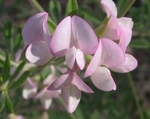

## Phylogeny 

-   « Ancestral Groups  
    -   [Hologalegina](../Hologalegina.md)
    -   [Papilionoideae](../../Papilionoideae.md)
    -   [Fabaceae](../../../Fabaceae.md)
    -   [Fabales](../../../../Fabales.md)
    -   [Rosids](../../../../../Rosids.md)
    -   [Core Eudicots](Core_Eudicots)
    -   [Eudicots](../../../../../../../Eudicots.md)
    -   [Flowering_Plant](../../../../../../../../Flowering_Plant.md)
    -   [Seed_Plant](../../../../../../../../../Seed_Plant.md)
    -   [Land_Plant](../../../../../../../../../../Land_Plant.md)
    -   [Green plants](../../../../../../../../../../../Plants.md)
    -   [Eukaryotes](Eukaryotes)
    -   [Tree of Life](../../../../../../../../../../../../Tree_of_Life.md)

-   ◊ Sibling Groups of  Hologalegina
    -   [IRLC (Inverted Repeat-lacking         clade)](IRLC_%28Inverted_Repeat-lacking_clade%29)
    -   Robinioid clade

-   » Sub-Groups 

# Robinioid clade 

[Martin F. Wojciechowski and Bruce Jones](http://www.tolweb.org/)

Containing group: [Hologalegina](../Hologalegina.md)

### Introduction

Traditional tribes Loteae (including Coronilleae; sensu Polhill, 1994)
and Robinieae (sensu Lavin and Sousa, 1995) comprise the \"Robinioid
clade\". Loteae, consisting almost entirely of herbaceous
annual/perennials or small shrubs distributed in the Mediterranean
region and to a lesser extent in North and South America, has been
traditionally considered closely related to other temperate, largely
herbaceous Old World tribes, especially Galegeae as part of Dormer\'s
(1945) \'epulvinate series\' (Polhill, 1981). Robinieae, which is
primarily a group of tropical and arid temperate trees and shrubs
restricted to the New World (except for the pantropical *Sesbania*), has
been considered related to Dalbergieae, Aeschynomeneae, and Millettieae.

The circumscription of Loteae was expanded by Polhill (1994) to include
all genera formerly placed in tribe Coronilleae (Polhill 1981), which
had been distinguished by the presence of lomented fruits and branched
root nodules, features not observed in Loteae sens. strict. The merging
of Loteae and Coronilleae is supported by both molecular and
morphological data (e.g., Diez and Ferguson, 1990, 1994, 1996; Allan and
Porter, 2000; Allan et al., 2003).

*Sesbania* is a pantropical genus of c. 60 species of herbs, shrubs, or
trees (Lavin and Sousa, 1995) and of interest because of its unusual
preference for seasonally wet, or flooded habitats, and the occurrence
of \"stem\"-nodulation in some species (nodules are formed at
adventitious root primordia on the lower stems) (Goormachtig et al.,
2004). The treatment of Lavin and Schrire (2005b) now recognizes the
separate tribe Sesbanieae, comprising one genus, *Sesbania*, and a more
restricted tribe Robinieae with 11 genera and 72 species (Lavin and
Schrire, 2005a).

### Discussion of Phylogenetic Relationships

The robinioid clade includes tribes Loteae sens. lat. (incl.
Coronilleae, sensu Polhill, 1994), Robinieae (Lavin and Schrire, 2005a),
which are distributed primarily in the New World, northern Africa, and
Europe, and the recently resurrected tribe Sesbanieae (Lavin and
Schrire, 2005b). Within this clade, the pantropical *Sesbania* L.
(Sesbanieae) is monophyletic and weakly resolved as the sister group to
Loteae sens. lat., a finding first suggested by a preliminary analysis
of *matK* gene sequences (Wojciechowski et al., 2000) and later
supported by an exhaustive sampling of additional *matK* sequences
(Lavin et al., 2003; Wojciechowski et al., 2004). Evidence (nuclear rDNA
ITS sequences) for *Sesbania* as the sister group to the remaining
Robinieae, rather than to Loteae sens. lat., has also been reported by
Lavin et al. (2003). Based on these molecular phylogenetic studies of
robinioids (Lavin et al., 2003; Wojciechowski et al., 2004), *Sesbania*
is either sister to remaining members of Robinieae, or to Loteae sens.
lat. and together they form a weak-supported sister group to the
remaining Robinieae. Resolution of this uncertainty in relationships
among the major lineages of the robinioid legumes is a subject of active
investigation.

The most recent phylogeny of Loteae sens. lat. provides molecular
evidence for its monophyly but suggests the large genus *Lotus*, which
includes the genetic/genomic model *Lotus corniculatus* L. subsp.
*japonicus* (Regel) H. Ohashi, is paraphyletic (Allan et al., 2003). In
that analysis, Old World *Lotus* is a moderately supported monophyletic
group (if the genera *Tetragonolobus* and *Dorycnium* are included),
while New World *Lotus* is paraphyletic. Relationships within a
recircumscribed Robinieae, which includes genera such as *Robinia* L.
(black locust), *Olneya* A. Gray (ironwood), and *Coursetia* DC., have
been resolved by recent, comprehensive molecular phylogenetic analyses
(Lavin et al., 2003).

### References

Allan, G. J., and J. M. Porter. 2000. Tribal delimitation and
phylogenetic relationships of Loteae and Coronilleae (Faboideae:
Fabaceae) with special reference to *Lotus*: evidence from nuclear
ribosomal ITS sequences. American J. Botany 87: 1871-1881.

Allan, G. J., E. A. Zimmer, W. L. Wagner, and D. D. Sokoloff. 2003.
Molecular phylogenetic analyses of tribe Loteae (Leguminosae):
implications for classification and biogeography. Pages 371-393 in
Advances in legume systematics, part 10, higher level systematics (B.B.
Klitgaard and A. Bruneau, eds.). Royal Botanic Gardens, Kew, UK.

Diez, M. J., and I. K. Ferguson. 1990-1996. Studies of the pollen
morphology and taxonomy of the tribes Loteae and Coronilleae
(Leguminosae: Papilionoideae). Part 1. (1990) Lagascalia 16: 77-94; Part
2. (1994). Review of Palaeobotany and Palynology 81: 233-255; Part 3.
(1996). Review of Palaeobotany and Palynology 94: 239-257.

Goormachtig, S., W. Capoen, and M. Holsters. 2004. Rhizobium infection:
lessons from the versatile nodulation behaviour of water-tolerant
legumes. Trends in Plant Science 9: 518-522.

Lavin, M., and B. D. Schrire. 2005a. Robinieae. Pages 467-473 in Legumes
of the world (Lewis et al., eds.). Royal Botanic Gardens, Kew, UK.

Lavin, M., and B. D. Schrire. 2005b. Sesbanieae. Pages 452-453 in
Legumes of the world (Lewis et al., eds.). Royal Botanic Gardens, Kew,
UK.

Lavin, M., and M. Sousa. 1995. Phylogenetic systematics and biogeography
of the tribe Robineae (Leguminosae). Systematic Botany Monographs 45:
1-165.

Lavin, M., M. F. Wojciechowski, P. Gasson, C. E. Hughes, and E. Wheeler.
2003. Phylogeny of robinioid legumes (Fabaceae) revisited: *Coursetia*
and *Gliricidia* recircumscribed, and a biogeographical appraisal of the
Caribbean endemics. Systematic Botany 28: 387--409.

Polhill, R. M. 1981. Papilionoideae. Pages 191-208 in Advances in legume
systematics, part 1 (R. M. Polhill and P. H. Raven, eds.). Royal Botanic
Gardens, Kew, UK.

Polhill, R. M. 1994. Classification of the Leguminosae. Pages
xxxv-xlviii in Phytochemical Dictionary of the Leguminosae (F.A. Bisby,
J. Buckingham, and J.B. Harborne, eds.). Chapman and Hall, New York, NY.

Wojciechowski, M. F., M. Lavin, and M. J. Sanderson. 2004. A phylogeny
of legumes (Leguminosae) based on analysis of the plastid *matK* gene
resolves many well-supported subclades within the family. American J.
Botany 91: 1846-1862.

Wojciechowski, M. F., M. J. Sanderson, K. P. Steele, and A. Liston.
2000. Molecular phylogeny of the "temperate herbaceous tribes" of
papilionoid legumes: a supertree approach. Pages 277-298 in Advances in
Legume Systematics, part 9 (P. S. Herendeen and A. Bruneau, eds.). Royal
Botanic Gardens, Kew, UK.

##### Title Illustrations



  -------------------------------------------------------------------------
  Scientific Name ::     Robinia pseudoacacia L.
  Specimen Condition   Live Specimen
  Copyright ::            © 2006 [Nick Kurzenko](mailto:kurzenko@ibss.dvo.ru) 
  -------------------------------------------------------------------------


  ---------------------------
  Scientific Name ::     Lotus australis Andrews
  Location ::           Land\'s End restoration area, Australia
  Specimen Condition   Live Specimen
  Copyright ::            © 2006 [Jeff Reid](http://homepages.picknowl.com.au/jreid)
  ---------------------------


  ----------------------
  Scientific Name ::     Sesbania punicea Benth.
  Location ::           Florida, USA
  Specimen Condition   Live Specimen
  Copyright ::            © 2006 [Frank Farrugia](mailto:Frank.Farruggia@asu.edu)
  ----------------------
