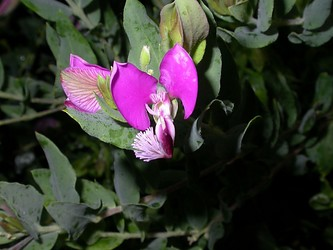

# [[Polygalaceae]] 

 

## #has_/text_of_/abstract 

> The **Polygalaceae** or the milkwort family are made up of flowering plants in the order Fabales. 
> They have a near-cosmopolitan range, with about 27 genera 
> and ca. 900 known species of herbs, shrubs and trees. 
> Over half of the species are in one genus, Polygala, the milkworts.
>
> The family was first described in 1809 by Johann Hoffmansegg and Johann Link. In 1896, Robert Chodat split it into 3 tribes. A fourth tribe was split off from the tribe Polygaleae in 1992.  Under the Cronquist classification system, Polygalaceae were treated in a separate order of their own, Polygalales. Currently, according to the Angiosperm Phylogeny Group, the family belongs in Fabales.
>
> [Wikipedia](https://en.wikipedia.org/wiki/Polygalaceae) 

## Phylogeny 

-   « Ancestral Groups  
    -   [Fabales](../Fabales.md)
    -   [Rosids](../../Rosids.md)
    -   [Core Eudicots](Core_Eudicots)
    -   [Eudicots](../../../../Eudicots.md)
    -   [Flowering_Plant](../../../../../Flowering_Plant.md)
    -   [Seed_Plant](../../../../../../Seed_Plant.md)
    -   [Land_Plant](../../../../../../../Land_Plant.md)
    -   [Green plants](../../../../../../../../Plants.md)
    -   [Eukaryotes](Eukaryotes)
    -   [Tree of Life](../../../../../../../../../Tree_of_Life.md)

-   ◊ Sibling Groups of  Fabales
    -   [Fabaceae](Fabaceae.md)
    -   [Surianaceae](Surianaceae.md)
    -   Polygalaceae
    -   [Quillaja](Quillaja)

-   » Sub-Groups 

## Introduction

[Martin F. Wojciechowski and Johanna Mahn]() 

Polygalaceae R. Br., a widespread family of ca. 18 genera and perhaps
1050 species, is considered to be monophyletic on the basis of
morphological and molecular data (*trnL-F*; Persson, 2001). This family
of trees, lianas and herbs is distributed worldwide except for the
western Pacific (e.g., New Zealand). Polygalaceae were traditionally
considered to be related to Malpighiaceae or Krameriaceae, all three of
which have bilaterally symmetrical flowers that superficially resemble
those of Fabaceae, however, analyses of molecular data (*rbcL*, 18S rDNA
and *atpB*; Soltis et al. 2000; Doyle et al. 2000) place the family as
the sister group of Fabaceae.

## Title Illustrations

-----------------------

Scientific Name ::     Polygala dalmaisiana
Location ::           Sea World, San Diego, CA
Specimen Condition   Live Specimen
Copyright ::            © 2005 [Kevin C. Nixon](http://www.plantsystematics.org/)

## Confidential Links & Embeds: 

### #is_/same_as :: [Polygalaceae](/_Standards/bio/bio~Domain/Eukaryotes/Plants/Land_Plant/Seed_Plant/Flowering_Plant/Eudicots/Core_Eudicots/Rosids/Fabales/Polygalaceae.md) 

### #is_/same_as :: [Polygalaceae.public](/_public/bio/bio~Domain/Eukaryotes/Plants/Land_Plant/Seed_Plant/Flowering_Plant/Eudicots/Core_Eudicots/Rosids/Fabales/Polygalaceae.public.md) 

### #is_/same_as :: [Polygalaceae.internal](/_internal/bio/bio~Domain/Eukaryotes/Plants/Land_Plant/Seed_Plant/Flowering_Plant/Eudicots/Core_Eudicots/Rosids/Fabales/Polygalaceae.internal.md) 

### #is_/same_as :: [Polygalaceae.protect](/_protect/bio/bio~Domain/Eukaryotes/Plants/Land_Plant/Seed_Plant/Flowering_Plant/Eudicots/Core_Eudicots/Rosids/Fabales/Polygalaceae.protect.md) 

### #is_/same_as :: [Polygalaceae.private](/_private/bio/bio~Domain/Eukaryotes/Plants/Land_Plant/Seed_Plant/Flowering_Plant/Eudicots/Core_Eudicots/Rosids/Fabales/Polygalaceae.private.md) 

### #is_/same_as :: [Polygalaceae.personal](/_personal/bio/bio~Domain/Eukaryotes/Plants/Land_Plant/Seed_Plant/Flowering_Plant/Eudicots/Core_Eudicots/Rosids/Fabales/Polygalaceae.personal.md) 

### #is_/same_as :: [Polygalaceae.secret](/_secret/bio/bio~Domain/Eukaryotes/Plants/Land_Plant/Seed_Plant/Flowering_Plant/Eudicots/Core_Eudicots/Rosids/Fabales/Polygalaceae.secret.md)

