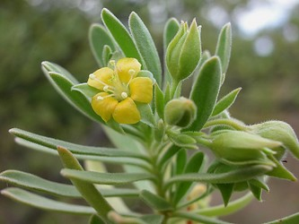

## Phylogeny 

-   « Ancestral Groups  
    -   [Fabales](../Fabales.md)
    -   [Rosids](../../Rosids.md)
    -   [Core Eudicots](Core_Eudicots)
    -   [Eudicots](../../../../Eudicots.md)
    -   [Flowering_Plant](../../../../../Flowering_Plant.md)
    -   [Seed_Plant](../../../../../../Seed_Plant.md)
    -   [Land_Plant](../../../../../../../Land_Plant.md)
    -   [Green plants](../../../../../../../../Plants.md)
    -   [Eukaryotes](Eukaryotes)
    -   [Tree of Life](../../../../../../../../../Tree_of_Life.md)

-   ◊ Sibling Groups of  Fabales
    -   [Fabaceae](Fabaceae.md)
    -   Surianaceae
    -   [Polygalaceae](Polygalaceae.md)
    -   [Quillaja](Quillaja)

-   » Sub-Groups 

# Surianaceae 

[Martin F. Wojciechowski and Johanna Mahn](http://www.tolweb.org/)

-   *Cadellia*
-   *Guilfoylia*
-   *Recchia*
-   *Stylobasium*
-   *Suriana*

Containing group: [Fabales](../Fabales.md)

### Introduction

Surianaceae consists of five genera, *Cadellia* F. Muell., *Guilfoylia*
F. Muell., *Recchia* Moc. & Sesse ex DC., *Stylobasium* Desf., and
*Suriana* L., each having one or two species. Members of this family are
primarily trees and shrubs found mostly in Australia but also Mexico
(*Recchia*), and pantropical (*Suriana maritima*). They inhabit a range
of environments from beaches and deserts to tropical rainforests
(Fernando et al. 1993). Molecular data supports a sister group
relationship of Surianaceae to Polygalaceae and Fabaceae (Crayn et al.,
1995; Persson, 2001; Soltis et al., 2000).

### References

Crayn, D. M., E. S. Fernando, P.A. Gadek, and C.J. Quinn. 1995. A
reassessment of the familial affinity of the Mexican genus Recchia
Moçiño & Sessé ex DC. Brittonia 47: 397-402.

Fernando, E.S., P. A. Gadek, D. M. Crayn, and C. J. Quinn. 1993. Rosid
affinities of Surianacae: molecular evidence. Molecular Phylogenetics
and Evolution 2: 344 -- 350.

Persson, C. 2001. Phylogenetic relationships in Polygalaceae based on
plastid DNA sequences from the trnL-F region. Taxon 50: 763-779.

Soltis, D. E., P. S. Soltis, M. W. Chase, M. E. Mort, D. C. Albach, M.
Zanis, V. Savolainen, W. H. Hahn, S. B. Hoot, M. F. Fay, M. Axtell, S.
M. Swensen, L. M. Prince, W. J. Kress, K. C. Nixon, and J. S. Farris.
2000. Angiosperm phylogeny inferred from 18S rDNA, rbcL, and atpB
sequences. Botanical Journal of the Linnean Society 133:381-461.

##### Title Illustrations



  ------------------------
  Scientific Name ::     Suriana maritima L.
  Location ::           Dade Co. Coral Gables, Fairchild Tropical Garden, Florida
  Specimen Condition   Live Specimen
  Copyright ::            © 2005 [Dennis Stevenson](http://www.plantsystematics.org/)
  ------------------------
