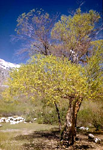
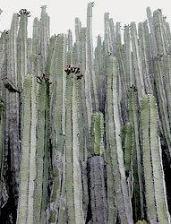
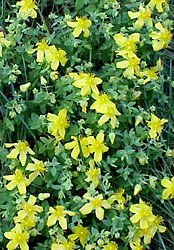

# [[Malpighiales]] 

     

## #has_/text_of_/abstract 

> The **Malpighiales** comprise one of the largest orders of flowering plants. 
> The order is very diverse, with well-known members including 
> willows, violets, aspens and poplars, poinsettia, corpse flower, coca plant, cassava, 
> flaxseed, castor bean, Saint John's wort, passionfruit, mangosteen, and manchineel tree.
>
> The order is not part of any of the classification systems based only on plant morphology 
> and the relationships of its diverse members can be hard to recognize 
> except with molecular phylogenetic evidence. 
> 
> Molecular clock calculations estimate the origin of stem group Malpighiales 
> at around 100 million years ago (Mya) and the origin of crown group Malpighiales at about 90 Mya.
>
> The Malpighiales contain about 36 families and more than 16,000 species, about 7.8% of the eudicots.
>
> [Wikipedia](https://en.wikipedia.org/wiki/Malpighiales) 

## Phylogeny 

-   « Ancestral Groups  
    -   [Rosids](../Rosids.md)
    -   [Core Eudicots](Core_Eudicots)
    -   [Eudicots](../../../Eudicots.md)
    -   [Flowering_Plant](../../../../Flowering_Plant.md)
    -   [Seed_Plant](../../../../../Seed_Plant.md)
    -   [Land_Plant](../../../../../../Land_Plant.md)
    -   [Green plants](../../../../../../../Plants.md)
    -   [Eukaryotes](Eukaryotes)
    -   [Tree of Life](../../../../../../../../Tree_of_Life.md)

-   ◊ Sibling Groups of  Rosids
    -   [Gerrardina](Gerrardina)
    -   [Fagales](Fagales.md)
    -   [Cucurbitales](Cucurbitales.md)
    -   [Rosales](Rosales.md)
    -   [Fabales](Fabales.md)
    -   [Zygophyllales](Zygophyllales.md)
    -   [Oxalidales](Oxalidales.md)
    -   Malpighiales
    -   [Celastrales](Celastrales.md)
    -   [Geraniales](Geraniales.md)
    -   [Crossosomatales](Crossosomatales.md)
    -   [Myrtales](Myrtales.md)
    -   [Brassicales](Brassicales.md)
    -   [Malvales](Malvales.md)
    -   [Sapindales](Sapindales.md)

-   » Sub-Groups
    -   [Salicaceae](Salicaceae)
    -   [Scyphostegia borneensis](Malpighiales/Scyphostegia_borneensis.md)
    -   [Lacistemataceae](Malpighiales/Lacistemataceae.md)
    -   [Samydaceae](Malpighiales/Samydaceae.md)

## Title Illustrations

------------------------------------------------------------------------------

Scientific Name ::     Salix laevigata
Location ::           Kearsarge Pass (Fresno County, California, USA)
Comments             Red willow (Salicaceae)
Creator              Photograph by Charles Webber
Specimen Condition   Live Specimen
Source Collection    [CalPhotos](http://calphotos.berkeley.edu/)
Copyright ::            © 1998 [California Academy of Sciences](http://www.calacademy.org/) 

------------------------------------------------------------------------

Scientific Name ::   Euphorbia canariensis
Location ::         Buenavista del Norte, Teneriffa, Canary Islands
Comments           Euphorbiaceae
Acknowledgements   courtesy [Botanical Image Database](http://www.unibas.ch/botimage/)
Copyright ::          © 2001 University of Basel, Basel, Switzerland 

---------------------------------------------------------------------

Scientific Name ::  Hypericum cerastoides
Comments          Hypericaceae
Copyright ::         © [Kurt Stüber](http://www.biolib.de/) 

## Confidential Links & Embeds: 

### #is_/same_as :: [Malpighiales](/_Standards/bio/bio~Domain/Eukaryotes/Plants/Land_Plant/Seed_Plant/Flowering_Plant/Eudicots/Core_Eudicots/Rosids/Malpighiales.md) 

### #is_/same_as :: [Malpighiales.public](/_public/bio/bio~Domain/Eukaryotes/Plants/Land_Plant/Seed_Plant/Flowering_Plant/Eudicots/Core_Eudicots/Rosids/Malpighiales.public.md) 

### #is_/same_as :: [Malpighiales.internal](/_internal/bio/bio~Domain/Eukaryotes/Plants/Land_Plant/Seed_Plant/Flowering_Plant/Eudicots/Core_Eudicots/Rosids/Malpighiales.internal.md) 

### #is_/same_as :: [Malpighiales.protect](/_protect/bio/bio~Domain/Eukaryotes/Plants/Land_Plant/Seed_Plant/Flowering_Plant/Eudicots/Core_Eudicots/Rosids/Malpighiales.protect.md) 

### #is_/same_as :: [Malpighiales.private](/_private/bio/bio~Domain/Eukaryotes/Plants/Land_Plant/Seed_Plant/Flowering_Plant/Eudicots/Core_Eudicots/Rosids/Malpighiales.private.md) 

### #is_/same_as :: [Malpighiales.personal](/_personal/bio/bio~Domain/Eukaryotes/Plants/Land_Plant/Seed_Plant/Flowering_Plant/Eudicots/Core_Eudicots/Rosids/Malpighiales.personal.md) 

### #is_/same_as :: [Malpighiales.secret](/_secret/bio/bio~Domain/Eukaryotes/Plants/Land_Plant/Seed_Plant/Flowering_Plant/Eudicots/Core_Eudicots/Rosids/Malpighiales.secret.md)

