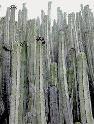
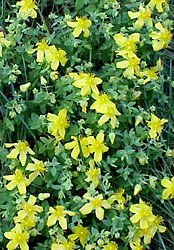

## Phylogeny 

-   « Ancestral Groups  
    -   [Rosids](../Rosids.md)
    -   [Core Eudicots](Core_Eudicots)
    -   [Eudicots](../../../Eudicots.md)
    -   [Flowering_Plant](../../../../Flowering_Plant.md)
    -   [Seed_Plant](../../../../../Seed_Plant.md)
    -   [Land_Plant](../../../../../../Land_Plant.md)
    -   [Green plants](../../../../../../../Plants.md)
    -   [Eukaryotes](Eukaryotes)
    -   [Tree of Life](../../../../../../../../Tree_of_Life.md)

-   ◊ Sibling Groups of  Rosids
    -   [Gerrardina](Gerrardina)
    -   [Fagales](Fagales.md)
    -   [Cucurbitales](Cucurbitales.md)
    -   [Rosales](Rosales.md)
    -   [Fabales](Fabales.md)
    -   [Zygophyllales](Zygophyllales.md)
    -   [Oxalidales](Oxalidales.md)
    -   Malpighiales
    -   [Celastrales](Celastrales.md)
    -   [Geraniales](Geraniales.md)
    -   [Crossosomatales](Crossosomatales.md)
    -   [Myrtales](Myrtales.md)
    -   [Brassicales](Brassicales.md)
    -   [Malvales](Malvales.md)
    -   [Sapindales](Sapindales.md)

-   » Sub-Groups
    -   [Salicaceae](Salicaceae)
    -   [Scyphostegia borneensis](Malpighiales/Scyphostegia_borneensis.md)
    -   [Lacistemataceae](Malpighiales/Lacistemataceae.md)
    -   [Samydaceae](Malpighiales/Samydaceae.md)

# Malpighiales 

Relationships after Savolainen et al. (2000), Soltis et al. (2000), and
Chase et al. (2002)

Containing group: [Rosids](../Rosids.md)

### References

Chase, M. W., S. Zmarzty, M. D. Lledó, K. J. Wurdack, S. M. Swensen, and
M. F. Fay. 2002. When in doubt, put it in Flacourtiaceae: A molecular
phylogenetic analysis based on plastid rbcL DNA sequences. Kew Bulletin
57:141-181.

Davis, C. C. and M. W. Chase. 2004. Elatinaceae are sister to
Malpighiaceae; Peridiscaceae belong to Saxifragales. American Journal of
Botany 91(2): 262-273.

Davis, C. C., M. Latvis, D. L. Nickrent 2, K. J. Wurdack, and D. A.
Baum. 2007. Floral gigantism in Rafflesiaceae. Science: DOI:
10.1126/science.1135260

Davis, C. C. and K. J. Wurdack. 2004. Host-to-parasite gene transfer in
flowering plants: Phylogenetic evidence from malpighiales. Science
305(5684):676-678.

Litt, A. J. and M. W. Chase. 1999. The systematic position of Euphronia,
with comments on the position of Balanops: An analysis based on rbcL
sequence data. Systematic Botany 23:401-409.

Merino Sutter, D. and P. K. Endress. 2003. Female flower and cupule
structure in Balanopaceae, an enigmatic rosid family. Annals of Botany
92: 459-469.

Qiu, Y. L., J. H. Lee, F. Bernasconi-Quadroni, D. E. Soltis, P. S.
Soltis, M. Zanis, E. A. Zimmer, Z. D. Chen, V. Savolainen, and M. W.
Chase. 2000. Phylogeny of basal angiosperms: Analyses of five genes from
three genomes. International Journal of Plant Sciences 161:S3-S27.

Savolainen, V., M. W. Chase, S. B. Hoot, C. M. Morton, D. E. Soltis, C.
Bayer, M. F. Fay, A. Y. De Bruijn, S. Sullivan, and Y. L. Qiu. 2000a.
Phylogenetics of flowering plants based on combined analysis of plastid
atpB and rbcL gene sequences. Systematic Biology 49:306-362.

Savolainen, V., M. F. Fay, D. C. Albach, A. Backlund, M. van der Bank,
K. M. Cameron, S. A. Johnson, M. D. Lledó, J.-C. Pintaud, M. Powell, M.
C. Sheahan, D. E. Soltis, P. S. Soltis, P. Weston, W. M. Whitten, K. J.
Wurdack, and M. W. Chase. 2000b. Phylogeny of the eudicots: a nearly
complete familial analysis based on rbcl gene sequences. Kew Bulletin
55:257-309.

Soltis, D. E., P. S. Soltis, M. W. Chase, M. E. Mort, D. C. Albach, M.
Zanis, V. Savolainen, W. H. Hahn, S. B. Hoot, M. F. Fay, M. Axtell, S.
M. Swensen, L. M. Prince, W. J. Kress, K. C. Nixon, and J. S. Farris.
2000. Angiosperm phylogeny inferred from 18S rDNA, rbcL, and atpB
sequences. Botanical Journal of the Linnean Society 133:381-461.

##### Title Illustrations



  ------------------------------------------------------------------------------
  Scientific Name ::     Salix laevigata
  Location ::           Kearsarge Pass (Fresno County, California, USA)
  Comments             Red willow (Salicaceae)
  Creator              Photograph by Charles Webber
  Specimen Condition   Live Specimen
  Source Collection    [CalPhotos](http://calphotos.berkeley.edu/)
  Copyright ::            © 1998 [California Academy of Sciences](http://www.calacademy.org/) 
  ------------------------------------------------------------------------------


  ------------------------------------------------------------------------
  Scientific Name ::   Euphorbia canariensis
  Location ::         Buenavista del Norte, Teneriffa, Canary Islands
  Comments           Euphorbiaceae
  Acknowledgements   courtesy [Botanical Image Database](http://www.unibas.ch/botimage/)
  Copyright ::          © 2001 University of Basel, Basel, Switzerland 
  ------------------------------------------------------------------------


  ---------------------------------------------------------------------
  Scientific Name ::  Hypericum cerastoides
  Comments          Hypericaceae
  Copyright ::         © [Kurt Stüber](http://www.biolib.de/) 
  ---------------------------------------------------------------------
