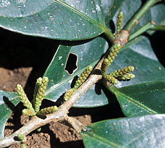

# [[Lacistemataceae]] 

 
 

## #has_/text_of_/abstract 

> **Lacistemataceae** is a small flowering plant family.  There are two genera:
> - Lacistema (12 species)
> - Lozania (5 species)
>
> They are small trees (to 15 metres tall) and shrubs (to 5 metres tall) that are native to the 
> subtropical and tropical regions of the Americas (also known as the Neotropics).
>
> The leaves are on alternate sides of the stem and maybe surrounded by a pair of stipules.
>
> The Inflorescence located between the leaf and the stem (axil) 
> are either catkins (in Lacistema) or racemes (in Lozania).
>
> Each flower (mostly bisexual) approximately one millimetre in length 
> consist of a disc with attached bract (in Lacistema) and sepals (in Lozania). 
> 
> Attached to the disc is a single stamen divided into two anthers, 
> the single superior ovary has a single style with three stigmas.
>
> The fruit is a capsule that splits on drying into three parts 
> and contains one seed surrounded by an aril.
>
> [Wikipedia](https://en.wikipedia.org/wiki/Lacistemataceae) 

## Phylogeny 

-   « Ancestral Groups  
    -   [Malpighiales](../Malpighiales.md)
    -   [Rosids](../../Rosids.md)
    -   [Core Eudicots](Core_Eudicots)
    -   [Eudicots](../../../../Eudicots.md)
    -   [Flowering_Plant](../../../../../Flowering_Plant.md)
    -   [Seed_Plant](../../../../../../Seed_Plant.md)
    -   [Land_Plant](../../../../../../../Land_Plant.md)
    -   [Green plants](../../../../../../../../Plants.md)
    -   [Eukaryotes](Eukaryotes)
    -   [Tree of Life](../../../../../../../../../Tree_of_Life.md)

-   ◊ Sibling Groups of  Malpighiales
    -   [Salicaceae](Salicaceae)
    -   [Scyphostegia borneensis](Scyphostegia_borneensis.md)
    -   Lacistemataceae
    -   [Samydaceae](Samydaceae.md)

-   » Sub-Groups 

## Introduction

[Mac H. Alford](http://www.tolweb.org/)

Lacistemataceae are a small neotropical family consisting of two genera
and 14 species. The family is characterized by catkin-like cylindrical
spikes or spiciform racemes, minute apetalous flowers with a single
stamen (usually with an expanded connective), and parietal placentation.

Traditionally, the family has been allied with Salicaceae or
Flacourtiaceae. Lacistemataceae were treated as tribe Lacistemeae in
Sleumer\'s (1980) monograph of all neotropical Flacourtiaceae, a family
now split mostly among Achariaceae, Salicaceae, and Samydaceae.\

### Characteristics

*Shrubs* or *small trees*. *Leaves* alternate, stipulate, blades
pinnately veined, margins entire to denticulate or serrate.
*Inflorescences* axillary spiciform racemes or catkin-like cylindrical
spikes. *Flowers* minute, bisexual (or polygamous), each flower
subtended by a bract. *Sepals* one to six. *Petals* lacking. *Disk*
present. *Stamen* one, attached to the inner surface of disk, anther
dehiscence introrse. *Gynoecium* of one pistil, ovary superior,
unilocular, placentation parietal, ovules anatropous, style short or
long, stigmas (two or) three. *Fruit* berry-like, but eventually
dehiscent by three loculicidal valves. *Seeds* one or few, arillate,
embryo straight, cotyledons foliaceous.

## Title Illustrations

-------------------------------------------------------------------------

Scientific Name ::     Lacistema aggregatum
Location ::           Costa Rica: Guanacaste: 25 km NE of Liberia
Specimen Condition   Live Specimen
Identified By        Mac H. Alford
Collection           BH
Collector            Mac H. Alford
Copyright ::            © 2002 [Mac H. Alford](http://www.usm.edu/biology/) 

--------------------------

Scientific Name ::  Lacistema aggregatum
Location ::        Panama: Barro Colorado Island
Creator           Steven Paton
Copyright ::         © 2006 [Smithsonian Tropical Research Institute](mailto:patons@si.edu)

