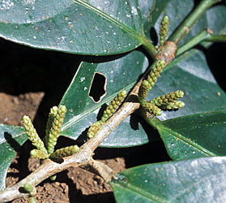
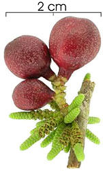

## Phylogeny 

-   « Ancestral Groups  
    -   [Malpighiales](../Malpighiales.md)
    -   [Rosids](../../Rosids.md)
    -   [Core Eudicots](Core_Eudicots)
    -   [Eudicots](../../../../Eudicots.md)
    -   [Flowering_Plant](../../../../../Flowering_Plant.md)
    -   [Seed_Plant](../../../../../../Seed_Plant.md)
    -   [Land_Plant](../../../../../../../Land_Plant.md)
    -   [Green plants](../../../../../../../../Plants.md)
    -   [Eukaryotes](Eukaryotes)
    -   [Tree of Life](../../../../../../../../../Tree_of_Life.md)

-   ◊ Sibling Groups of  Malpighiales
    -   [Salicaceae](Salicaceae)
    -   [Scyphostegia borneensis](Scyphostegia_borneensis.md)
    -   Lacistemataceae
    -   [Samydaceae](Samydaceae.md)

-   » Sub-Groups 

# Lacistemataceae 

[Mac H. Alford](http://www.tolweb.org/)

Containing group: [Malpighiales](../Malpighiales.md)

### Introduction

Lacistemataceae are a small neotropical family consisting of two genera
and 14 species. The family is characterized by catkin-like cylindrical
spikes or spiciform racemes, minute apetalous flowers with a single
stamen (usually with an expanded connective), and parietal placentation.

Traditionally, the family has been allied with Salicaceae or
Flacourtiaceae. Lacistemataceae were treated as tribe Lacistemeae in
Sleumer\'s (1980) monograph of all neotropical Flacourtiaceae, a family
now split mostly among Achariaceae, Salicaceae, and Samydaceae.\

### Characteristics

*Shrubs* or *small trees*. *Leaves* alternate, stipulate, blades
pinnately veined, margins entire to denticulate or serrate.
*Inflorescences* axillary spiciform racemes or catkin-like cylindrical
spikes. *Flowers* minute, bisexual (or polygamous), each flower
subtended by a bract. *Sepals* one to six. *Petals* lacking. *Disk*
present. *Stamen* one, attached to the inner surface of disk, anther
dehiscence introrse. *Gynoecium* of one pistil, ovary superior,
unilocular, placentation parietal, ovules anatropous, style short or
long, stigmas (two or) three. *Fruit* berry-like, but eventually
dehiscent by three loculicidal valves. *Seeds* one or few, arillate,
embryo straight, cotyledons foliaceous.

### References

Chase, M. W., S. Zmarzty, M. D. Lledó, K. J. Wurdack, S. M. Swensen, and
M. F. Fay. 2002. When in doubt, put it in Flacourtiaceae: a molecular
phylogenetic analysis based on plastid rbcL DNA sequences. Kew Bulletin
57: 141-181.

Chirtoiü, M. 1918. Observations sur les Lacistema et la situation
systématique de ce genre. Bull. Soc. Bot. Genève, sér. 2, 10: 317-349.

Sleumer, H. O. 1980. Flacourtiaceae. Flora Neotropica No. 22. Bronx: New
York Botanical Garden.

##### Title Illustrations



  -------------------------------------------------------------------------
  Scientific Name ::     Lacistema aggregatum
  Location ::           Costa Rica: Guanacaste: 25 km NE of Liberia
  Specimen Condition   Live Specimen
  Identified By        Mac H. Alford
  Collection           BH
  Collector            Mac H. Alford
  Copyright ::            © 2002 [Mac H. Alford](http://www.usm.edu/biology/) 
  -------------------------------------------------------------------------


  --------------------------
  Scientific Name ::  Lacistema aggregatum
  Location ::        Panama: Barro Colorado Island
  Creator           Steven Paton
  Copyright ::         © 2006 [Smithsonian Tropical Research Institute](mailto:patons@si.edu)
  --------------------------
