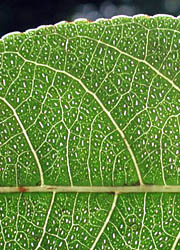

## Phylogeny 

-   « Ancestral Groups  
    -   [Malpighiales](../Malpighiales.md)
    -   [Rosids](../../Rosids.md)
    -   [Core Eudicots](Core_Eudicots)
    -   [Eudicots](../../../../Eudicots.md)
    -   [Flowering_Plant](../../../../../Flowering_Plant.md)
    -   [Seed_Plant](../../../../../../Seed_Plant.md)
    -   [Land_Plant](../../../../../../../Land_Plant.md)
    -   [Green plants](../../../../../../../../Plants.md)
    -   [Eukaryotes](Eukaryotes)
    -   [Tree of Life](../../../../../../../../../Tree_of_Life.md)

-   ◊ Sibling Groups of  Malpighiales
    -   [Salicaceae](Salicaceae)
    -   [Scyphostegia borneensis](Scyphostegia_borneensis.md)
    -   [Lacistemataceae](Lacistemataceae.md)
    -   Samydaceae

-   » Sub-Groups 

# Samydaceae 

[Mac H. Alford](http://www.tolweb.org/)

Containing group: [Malpighiales](../Malpighiales.md)

### Information on the Internet

-   [PlantSystematics.Org](http://www.plantsystematics.org/). Electronic
    key to all taxa formerly placed in Flacourtiaceae, including all
    Samydaceae treated here.
-   [Royal Botanic Gardens,     Kew.](http://www.rbgkew.org.uk/herbarium/keys/flacs/index.html)
    Electronic keys to most taxa formerly placed in Flacourtiaceae,
    including all Samydaceae treated here.

### Introduction

Samydaceae are a family of flowering plants formerly placed in the
polyphyletic Flacourtiaceae. Samydaceae have sometimes been segregated
from Flacourtiaceae (e.g., by Bentham and Hooker) as the group with
well-developed hypanthia, and this tradition has been maintained in many
African floras. Recent analyses based on both morphological and
molecular data indicate that Samydaceae are a monophyletic and
monothetic group related to Salicaceae, which now also include many
former Flacourtiaceae. Some authors (e.g., Chase et al., 2002) even
place Samydaceae in a broader Salicaceae. However, Samydaceae share many
symplesiomorphies with other Malpighialean families, such as
Passifloraceae, and show few obvious morphological connections to
Salicaceae.\

Like many other closely-related taxa in the Malpighiales, Samydaceae
have introrse anther dehiscence, parietal placentation, and arillate
seeds. They also have synapomorphies which are useful for field
identification: pellucid-punctations and/or -lines (usually in the
leaves) and deciduous leaf teeth (theoid type). Almost all members of
the family have minute flowers. The largest genus in the family is
*Casearia*, which has more than 180 species, and the number of species
coupled with the size of the flowers has left the family largely
unstudied.

The genus *Casearia* is pantropical, *Osmelia* and *Pseudosmelia* are
from Indo-Malesia, *Ophiobotrys* and *Trichostephanus* are from tropical
Africa, and all of the other genera are neotropical.

### Characteristics

*Shrubs* or *trees*. *Leaves* alternate, pinnately veined, rarely
acrodromous (*Lunania*), infrequently entire but more commonly with
deciduous conical teeth (theoid teeth), rarely with spinose margins
(*Casearia* sect. *Casearia* unranked group *Ilicifoliae*), rarely with
stellate pubescence (*Ryania*), lamina often with pellucid-punctations
or -lines, stipulate or exstipulate. Mostly hermaphroditic, infrequently
dioecious (*Euceraea*, *Neoptychocarpus*, *Osmelia*, *Pseudosmelia*?),
rarely monoecious (*Trichostephanus*) or polygamous (*Ophiobotrys*).
*Inflorescences* usually axillary fascicles/glomerules or reduced to
single axillary flowers, less commonly corymbs, racemes of spikes, or
panicles of spikes. *Flowers* often minute, wider than 2 cm only in
*Ryania* and *Samyda*. *Hypanthium* generally present, sometimes reduced
or lacking. *Sepals* 4-7, possible less in *Lunania* but hard to tell
due to early splitting, imbricate. *Petals* absent. *Disk* usually
present, adnate to the calyx, and alternating with or inside the whorl
of stamens, in some genera (e.g., *Casearia*) appearing like staminodes
or a fleshy corona. *Stamens* 4 to numerous, typically inserted in 1-3
whorls, sometimes connate to various degrees, anther dehiscence introrse
or rarely latrorse (*Lunania*). *Gynoecium* of one pistil, ovary
superior, unilocular, placentation parietal, ovules few to numerous,
styles usually 1 or distally 3(-5)-branched, 3 in *Osmelia* and
*Pseudosmelia*, stigma usually capitate, rarely sessile. *Fruits* fleshy
or dry 3-valved capsules, occasionally indehiscent. *Seeds* arillate
(except *Tetrathylacium*) or with long, cottony hairs (*Casearia* sect.
*Gossypiospermum*).

### References

Alford, M. H. 2005. Systematic studies in Flacourtiaceae. Dissertation.
Cornell University, Ithaca, New York, USA. 290 pp.

Bernhard, A., and P. K. Endress. 1999. Androecial development and
systematics in Flacourtiaceae s.l. Plant Systematics and Evolution 215:
141---155.

Chase, M. W., S. Zmarzty, M. D. Lledó, K. J. Wurdack, S. M. Swensen, and
M. F. Fay. 2002. When in doubt, put it in Flacourtiaceae: a molecular
phylogenetic analysis based on plastid rbcL DNA sequences. Kew Bulletin
57: 141---181.

de Wilde, W. J. J. O. 1971. The systematic position of tribe Paropsieae,
in particular the genus Ancistrothyrsus, and a key to the genera of
Passifloraceae. Blumea 19: 99---104.

Gilg, E. 1925. Flacourtiaceae. Pages 377---457 in Vol. 21, Die
natürlichen Pflanzenfamilien, 2nd ed. (A. Engler, and K. Prantl, eds.),
Berlin.

Grill, I. 1990. Beiträge zur Karyosystematik der Flacourtiaceae.
Dissertation. Universität Wien, Vienna, Austria. 55 pp.

Hallé, N., and J. J. F. E. de Wilde. 1978. Trichostephanus acuminatus
Gilg (Flacourtiacées), une approche biosystématique. Adansonia, ser. 2,
18: 167---182.

Judd, W. S. 1997. The Flacourtiaceae in the southeastern United States.
Harvard Papers in Botany 10:65-79.

Keating, R. C. 1973. Pollen morphology and relationships of the
Flacourtiaceae. Annals of the Missouri Botanical Garden 60: 273---305.

Keating, R. C. 1975. Trends of specialization in pollen of
Flacourtiaceae with comparative observations of Cochlospermaceae and
Bixaceae. Grana 15: 29---49.

Kiger, R. W. 1972. The genus Samyda (Flacourtiaceae). Dissertation.
University of Maryland, College Park, Maryland. 266 pp.

Kiger, R. W. 1984. Exclusions from Samyda Jacq. (Flacourtiaceae). Taxon
33: 445---468.

Lemke, D. E. 1988. A synopsis of Flacourtiaceae. Aliso 12: 29---43.

Miller, R. B. 1968. Systematic wood anatomy of the American Casearia
Jacq. (Flacourtiaceae). M.S. Thesis. University of Wisconsin, Madison.
56 pp.

Miller, R. B. 1975. Systematic anatomy of the xylem and comments on the
relationships of Flacourticeae. Journal of the Arnold Arboretum 56:
20---102.

Sleumer, H. O. 1954. Flacourtiaceae. Pages 1---106 in Flora Malesiana,
Series 1 (C. G. G. J. van Steenis, ed.) Noordhoff-Kilff N.V., Djakarta.

Sleumer, H. O. 1980. Flacourtiaceae. Flora Neotropica 22: 1---499.

Spencer, K. C., and D. S. Seigler. 1985. Cyanogenic glycosides and the
systematics of the Flacourtiaceae. Biochemical Systematics and Ecology
13: 421---431.

van Heel, W. A. 1979. Flowers and fruits in Flacourtiaceae. IV.
Hydnocarpus spp., Kiggelaria africana L., Casearia spp., Berberidopsis
corallina Hook.f. Blumea 25: 513---529.

Warburg, O. 1894. Flacourtiaceae. Pages 1---56 in Vol. 3(6a), Die
natürlichen Pflanzenfamilien, 1st ed. (A. Engler, and K. Prantl, eds.).
Wilhelm Englemann, Leipzig.

##### Title Illustrations



  --------------------
  Scientific Name ::  Casearia arborea
  Location ::        Costa Rica: Heredia: Estacion Biologica La Selva
  Copyright ::         © 2004 [Lawrence M. Kelly](mailto:lkelly@nybg.org)
  --------------------


  --------------------
  Scientific Name ::  Casearia corymbosa
  Location ::        Costa Rica: Guanacaste: Palo Verde
  Copyright ::         © 2003 [Lawrence M. Kelly](mailto:lkelly@nybg.org)
  --------------------


  ---------------------
  Scientific Name ::  Casearia corymbosa
  Location ::        Costa Rica: Guanacaste: Palo Verde
  Body Part         Fruit with arillate seed
  Copyright ::         © 2003 [Fabián Michelangeli](mailto:fabian@nybg.org)
  ---------------------
