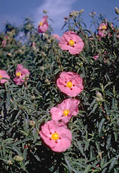
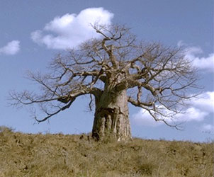
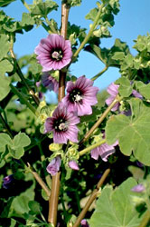

## Phylogeny 

-   « Ancestral Groups  
    -   [Rosids](../Rosids.md)
    -   [Core Eudicots](Core_Eudicots)
    -   [Eudicots](../../../Eudicots.md)
    -   [Flowering_Plant](../../../../Flowering_Plant.md)
    -   [Seed_Plant](../../../../../Seed_Plant.md)
    -   [Land_Plant](../../../../../../Land_Plant.md)
    -   [Green plants](../../../../../../../Plants.md)
    -   [Eukaryotes](Eukaryotes)
    -   [Tree of Life](../../../../../../../../Tree_of_Life.md)

-   ◊ Sibling Groups of  Rosids
    -   [Gerrardina](Gerrardina)
    -   [Fagales](Fagales.md)
    -   [Cucurbitales](Cucurbitales.md)
    -   [Rosales](Rosales.md)
    -   [Fabales](Fabales.md)
    -   [Zygophyllales](Zygophyllales.md)
    -   [Oxalidales](Oxalidales.md)
    -   [Malpighiales](Malpighiales.md)
    -   [Celastrales](Celastrales.md)
    -   [Geraniales](Geraniales.md)
    -   [Crossosomatales](Crossosomatales.md)
    -   [Myrtales](Myrtales.md)
    -   [Brassicales](Brassicales.md)
    -   Malvales
    -   [Sapindales](Sapindales.md)

-   » Sub-Groups
    -   [Core Malvales](Core_Malvales)

# Malvales 

     

## #has_/text_of_/abstract 

> The **Malvales** are an order of flowering plants. As circumscribed by APG II-system, 
> the order includes about 6000 species within nine families. 
> The order is placed in the eurosids II, which are part of the eudicots.
>
> The plants are mostly shrubs and trees; 
> most of its families have a cosmopolitan distribution in the tropics and subtropics, 
> with limited expansion into temperate regions. 
> 
> An interesting distribution occurs in Madagascar, 
> where three endemic families of Malvales (Sphaerosepalaceae, Sarcolaenaceae and Diegodendraceae) occur.
>
> Many species of Malvaceae, sensu lato (in the broad sense), are valued for their wood, 
> with that of Ochroma (balsa) being known for its lightness, 
> and that of Tilia (lime, linden, or basswood) as a popular wood for carving. 
> 
> Fruit of the cacao tree (Theobroma cacao) are used as an ingredient for chocolate. 
> Kola nuts (genus Cola) are notable for their high caffeine content 
> and were commonly used in the past in preparation of various cola drinks. 
> They are still in use as a stimulant, particularly in West Africa where they are chewed for this effect. 
> 
> Other well-known members of Malvales in the APG II sense are 
> daphnes, hibiscus, hollyhocks, okra, jute, baobab trees, cotton, 
> kapok (which mostly comes from Ceiba pentandra, 
> but also from other "Kapok trees" also of Malvales, such as Bombax ceiba), 
> and durian.
>
> [Wikipedia](https://en.wikipedia.org/wiki/Malvales) 

## Introduction

[Stacey D. Smith and David A. Baum]()

The order Malvales has traditionally included four core families,
Bombacaceae, Malvaceae, Sterculiaceae and Tiliaceae, although various
authors have included other families such as Cistaceae and
Cochlospermaceae. Recent phylogenetic studies (e.g., Alverson et al.
1998, Bayer et al. 1999) have revealed that the four core families form
a monophyletic group, termed here the core Malvales, and have identified
ten allied families which are included in the expanded Malvales shown in
the tree above. Together, these families contain approximately 4,000
species and range from small Mediterranean shrubs like *Cistus* to
towering tropical trees like *Shorea*. The order also contains many
economically important plants, such as *Cola* (the source of cola
flavor), *Bixa orellana* (annatto, a natural red coloring), *Theobroma
cacao* (the source of cocoa) and *Gossypium* (cotton) and *Ochroma
pyramidale* (balsa wood).

### Characteristics

Many members of Malvales can be identified by the following combination
of characters: leaves with palmate venation (often three principal veins
arising from the base of the leaf blade), mucilage canals within the
tissues (think of the slime in Okra), stellate (star-shaped) hairs on
the vegetative parts of the plant and stipules (leaf-like structures at
the base of the leaf stalk).

### Discussion of Phylogenetic Relationships

The core Malvales clade has been consistently well-supported in
molecular phylogenetic analyses as have the clades comprising
Bixaceae+Diegodendraceae+Cochlospermaceae and
Dipterocarpaceae+Sarcolaenaceae+Cistaceae. However, placement of the
remaining families (Muntingiaceae, Sphaerosepalaceae, Thymelaceae and
Neuradaceae) is still unclear. Muntingiaceae falls either in the
Dipterocarpaceae+Sarcolaenaceae+Cistaceae clade (Alverson et al. 1998,
Fay et al. 1998) or at the base of the Malvales (Bayer et al. 1999).
Analyses by Alverson et al. (1998) place Sphaerosepalaceae basal in the
Bixaceae+Cochlospermaceae clade (Diegodendraceae was not sampled in
their analysis). In contrast, Bayer et al. (1999) found that
Sphaerosepalaceae falls sister to Thymelaeaceae, but with weak support.
Thymelaeaceae (+Sphaerosepalaceae) has been weakly supported as sister
to the Dipterocarpaceae+Sarcolaenaceae+Cistaceace+Muntingiaceae
(Alverson et al. 1998, Bayer et al. 1999). Finally, Neuradaceae seems
most likely to belong at the base of the Malvales, although no studies
have been able to place it with certainty.

## Title Illustrations

------------------------------------------------------------------------------

Scientific Name ::     Cistus
Location ::           Golden Gate Park, Strybing Arboretum (San Francisco County, California, USA)
Comments             Rock rose (Cistaceae)
Creator              Photograph by G. Dallas and Margaret Hanna
Specimen Condition   Live Specimen
Source Collection    [CalPhotos](http://calphotos.berkeley.edu/)
Copyright ::            © 1999 [California Academy of Sciences](http://www.calacademy.org/) 

------------------------------------------------------------------------------

Scientific Name ::     Adansonia digitata
Location ::           East Africa
Comments             Baobab tree (Core Malvales).
Creator              Photograph by Robert Thomas and Margaret Orr
Specimen Condition   Live Specimen
Source Collection    [CalPhotos](http://calphotos.berkeley.edu/)
Copyright ::            © 1999 [California Academy of Sciences](http://www.calacademy.org/) 

---------------------------------------------------------------------------------

Scientific Name ::     Malva sylvestris (Core Malvales)
Location ::           Bodega Bay (Sonoma County, California, USA)
Comments             High mallow
Creator              Photograph by Brother Alfred Brousseau
Specimen Condition   Live Specimen
Source Collection    [CalPhotos](http://calphotos.berkeley.edu/)
Copyright ::            © 1995 [Saint Mary\'s College of California](mailto:rpolowin@stmarys-ca.edu) 

## Confidential Links & Embeds: 

### [Malvales](/_Standards/bio/bio~Domain/Eukaryotes/Plants/Land_Plant/Seed_Plant/Flowering_Plant/Eudicots/Core_Eudicots/Rosids/Malvales.md) 

### [Malvales.public](/_public/bio/bio~Domain/Eukaryotes/Plants/Land_Plant/Seed_Plant/Flowering_Plant/Eudicots/Core_Eudicots/Rosids/Malvales.public.md) 

### [Malvales.internal](/_internal/bio/bio~Domain/Eukaryotes/Plants/Land_Plant/Seed_Plant/Flowering_Plant/Eudicots/Core_Eudicots/Rosids/Malvales.internal.md) 

### [Malvales.protect](/_protect/bio/bio~Domain/Eukaryotes/Plants/Land_Plant/Seed_Plant/Flowering_Plant/Eudicots/Core_Eudicots/Rosids/Malvales.protect.md) 

### [Malvales.private](/_private/bio/bio~Domain/Eukaryotes/Plants/Land_Plant/Seed_Plant/Flowering_Plant/Eudicots/Core_Eudicots/Rosids/Malvales.private.md) 

### [Malvales.personal](/_personal/bio/bio~Domain/Eukaryotes/Plants/Land_Plant/Seed_Plant/Flowering_Plant/Eudicots/Core_Eudicots/Rosids/Malvales.personal.md) 

### [Malvales.secret](/_secret/bio/bio~Domain/Eukaryotes/Plants/Land_Plant/Seed_Plant/Flowering_Plant/Eudicots/Core_Eudicots/Rosids/Malvales.secret.md)

