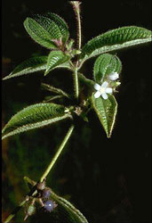

## Phylogeny 

-   « Ancestral Groups  
    -   [Rosids](../Rosids.md)
    -   [Core Eudicots](Core_Eudicots)
    -   [Eudicots](../../../Eudicots.md)
    -   [Flowering_Plant](../../../../Flowering_Plant.md)
    -   [Seed_Plant](../../../../../Seed_Plant.md)
    -   [Land_Plant](../../../../../../Land_Plant.md)
    -   [Green plants](../../../../../../../Plants.md)
    -   [Eukaryotes](Eukaryotes)
    -   [Tree of Life](../../../../../../../../Tree_of_Life.md)

-   ◊ Sibling Groups of  Rosids
    -   [Gerrardina](Gerrardina)
    -   [Fagales](Fagales.md)
    -   [Cucurbitales](Cucurbitales.md)
    -   [Rosales](Rosales.md)
    -   [Fabales](Fabales.md)
    -   [Zygophyllales](Zygophyllales.md)
    -   [Oxalidales](Oxalidales.md)
    -   [Malpighiales](Malpighiales.md)
    -   [Celastrales](Celastrales.md)
    -   [Geraniales](Geraniales.md)
    -   [Crossosomatales](Crossosomatales.md)
    -   Myrtales
    -   [Brassicales](Brassicales.md)
    -   [Malvales](Malvales.md)
    -   [Sapindales](Sapindales.md)

-   » Sub-Groups
    -   [Onagraceae](Myrtales/Onagraceae.md)

# Myrtales 

[Kenneth J. Sytsma and Jeffrey R. Hapeman](http://www.tolweb.org/)

Containing group: [Rosids](../Rosids.md)

### References

Conti, E., A. Litt, and K.J. Sytsma. 1996. Circumscription of Myrtales
and their relationships to other rosids: evidence from rbcL sequence
data. American Journal of Botany 83:221-233.

Conti, E., A. Litt, P. G. Wilson, S. A. Graham, B. G. Briggs, L. A. S.
Johnson, and K. J. Sytsma. 1997. Interfamilial relationships in
Myrtales: molecular phylogeny and patterns of morphological evolution.
Systematic Botany 22:629-647.

Dahlgren, R. and R. F. Thorne. 1984. The order Myrtales:
Circumscription, variation, and relationships. Annals of the Missouri
Botanical Garden 71:633-699.

Johnson, L. A. S. and B. G. Briggs. 1984. Myrtales and Myrtaceae-a
phylogenetic analysis. Annals of the Missouri Botanical Garden
71:700-756.

Savolainen, V., M. F. Fay, D. C. Albach, A. Backlund, M. van der Bank,
K. M. Cameron, S. A. Johnson, M. D. Lledó, J.-C. Pintaud, M. Powell, M.
C. Sheahan, D. E. Soltis, P. S. Soltis, P. Weston, W. M. Whitten, K. J.
Wurdack, and M. W. Chase. 2000. Phylogeny of the eudicots: a nearly
complete familial analysis based on rbcl gene sequences. Kew Bulletin
55:257-309.

##### Title Illustrations



  ------------------------------------------------------------------------------
  Scientific Name ::    Clidemia hirta
  Location ::          Native to tropical America, specimen photographed at Ranomafana National Park (Madagascar).
  Comments            Koster\'s curse (Melastomataceae)
  Creator             Photograph by Gerald and Buff Corsi
  Source Collection   [CalPhotos](http://calphotos.berkeley.edu/)
  Copyright ::           © 2000 [California Academy of Sciences](http://www.calacademy.org/) 
  ------------------------------------------------------------------------------


  ------------------------------------------------------------------------------
  Scientific Name ::     Oenothera californica
  Location ::           Mojave Desert (San Bernardino County, California, USA)
  Comments             California evening-primrose (Onagraceae)
  Creator              Photograph by Jo-Ann Ordano
  Specimen Condition   Live Specimen
  Source Collection    [CalPhotos](http://calphotos.berkeley.edu/)
  Copyright ::            © 2000 [California Academy of Sciences](http://www.calacademy.org/) 
  ------------------------------------------------------------------------------


  ------------------------------------------------------------------------------
  Scientific Name ::    Eucalyptus viminalis (Myrtaceae)
  Location ::          Native to Australia, specimen photographed in Sunol (Alameda County, California, USA)
  Comments            Manna gum
  Creator             Photograph by Charles Webber
  Source Collection   [CalPhotos](http://calphotos.berkeley.edu/)
  Copyright ::           © 1998 [California Academy of Sciences](http://www.calacademy.org/) 
  ------------------------------------------------------------------------------
