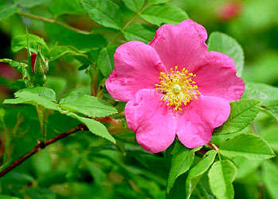
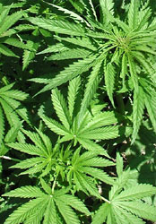

# [[Rosales]] 

     

## #has_/text_of_/abstract 

> **Rosales** (, roh-ZAY-leez) are an order of flowering plants. Well-known members of Rosales include: 
> roses, strawberries, blackberries and raspberries, apples and pears, plums, peaches and apricots, 
> almonds, rowan and hawthorn, jujube, elms, banyans, figs, mulberries, breadfruit, nettles, hops, and cannabis.
>
> Rosales contain about 7,700 species, distributed into nine families and about 260 genera. 
> Their type family is the rose family, Rosaceae. 
> The largest families are Rosaceae (91/4828) and Urticaceae (53/2625).
>
> [Wikipedia](https://en.wikipedia.org/wiki/Rosales) 
## Phylogeny 

-   « Ancestral Groups  
    -   [Rosids](../Rosids.md)
    -   [Core Eudicots](Core_Eudicots)
    -   [Eudicots](../../../Eudicots.md)
    -   [Flowering_Plant](../../../../Flowering_Plant.md)
    -   [Seed_Plant](../../../../../Seed_Plant.md)
    -   [Land_Plant](../../../../../../Land_Plant.md)
    -   [Green plants](../../../../../../../Plants.md)
    -   [Eukaryotes](Eukaryotes)
    -   [Tree of Life](../../../../../../../../Tree_of_Life.md)

-   ◊ Sibling Groups of  Rosids
    -   [Gerrardina](Gerrardina)
    -   [Fagales](Fagales.md)
    -   [Cucurbitales](Cucurbitales.md)
    -   Rosales
    -   [Fabales](Fabales.md)
    -   [Zygophyllales](Zygophyllales.md)
    -   [Oxalidales](Oxalidales.md)
    -   [Malpighiales](Malpighiales.md)
    -   [Celastrales](Celastrales.md)
    -   [Geraniales](Geraniales.md)
    -   [Crossosomatales](Crossosomatales.md)
    -   [Myrtales](Myrtales.md)
    -   [Brassicales](Brassicales.md)
    -   [Malvales](Malvales.md)
    -   [Sapindales](Sapindales.md)

-   » Sub-Groups 

## Title Illustrations

------------------------------------------------------------------------
 
Scientific Name ::   Urtica dioica
Location ::         Allschwil, Basel, Switzerland
Comments           Stinging nettle (Urticaceae). Flowering.
Acknowledgements   courtesy [Botanical Image Database](http://www.unibas.ch/botimage/)
Sex ::              Female
Copyright ::          © 2001 University of Basel, Basel, Switzerland 

-------------------------------------------------------------------------

Scientific Name ::    Rosa davurica
Location ::          Near Barabash-Levada village, Pogranichny distr., Primorsky Territory (Russian Federation)
Comments            Daurian rose (Rosaceae)
Source Collection   [CalPhotos](http://calphotos.berkeley.edu/)
Copyright ::           © 1999 [Nick Kurzenko](mailto:kurzenko@ibss.dvo.ru) 

------------------------------------------------------------------------
 
Scientific Name ::   Cannabis sativa
Comments           Marijuana plant (Cannabaceae), cultivated at the Botanical Garden Basel, Switzerland.
Acknowledgements   courtesy [Botanical Image Database](http://www.unibas.ch/botimage/)
Copyright ::          © 2001 University of Basel, Basel, Switzerland 

## Confidential Links & Embeds: 

### #is_/same_as :: [Rosales](/_Standards/bio/bio~Domain/Eukaryotes/Plants/Land_Plant/Seed_Plant/Flowering_Plant/Eudicots/Core_Eudicots/Rosids/Rosales.md) 

### #is_/same_as :: [Rosales.public](/_public/bio/bio~Domain/Eukaryotes/Plants/Land_Plant/Seed_Plant/Flowering_Plant/Eudicots/Core_Eudicots/Rosids/Rosales.public.md) 

### #is_/same_as :: [Rosales.internal](/_internal/bio/bio~Domain/Eukaryotes/Plants/Land_Plant/Seed_Plant/Flowering_Plant/Eudicots/Core_Eudicots/Rosids/Rosales.internal.md) 

### #is_/same_as :: [Rosales.protect](/_protect/bio/bio~Domain/Eukaryotes/Plants/Land_Plant/Seed_Plant/Flowering_Plant/Eudicots/Core_Eudicots/Rosids/Rosales.protect.md) 

### #is_/same_as :: [Rosales.private](/_private/bio/bio~Domain/Eukaryotes/Plants/Land_Plant/Seed_Plant/Flowering_Plant/Eudicots/Core_Eudicots/Rosids/Rosales.private.md) 

### #is_/same_as :: [Rosales.personal](/_personal/bio/bio~Domain/Eukaryotes/Plants/Land_Plant/Seed_Plant/Flowering_Plant/Eudicots/Core_Eudicots/Rosids/Rosales.personal.md) 

### #is_/same_as :: [Rosales.secret](/_secret/bio/bio~Domain/Eukaryotes/Plants/Land_Plant/Seed_Plant/Flowering_Plant/Eudicots/Core_Eudicots/Rosids/Rosales.secret.md)

