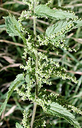

## Phylogeny 

-   « Ancestral Groups  
    -   [Rosids](../Rosids.md)
    -   [Core Eudicots](Core_Eudicots)
    -   [Eudicots](../../../Eudicots.md)
    -   [Flowering_Plant](../../../../Flowering_Plant.md)
    -   [Seed_Plant](../../../../../Seed_Plant.md)
    -   [Land_Plant](../../../../../../Land_Plant.md)
    -   [Green plants](../../../../../../../Plants.md)
    -   [Eukaryotes](Eukaryotes)
    -   [Tree of Life](../../../../../../../../Tree_of_Life.md)

-   ◊ Sibling Groups of  Rosids
    -   [Gerrardina](Gerrardina)
    -   [Fagales](Fagales.md)
    -   [Cucurbitales](Cucurbitales.md)
    -   Rosales
    -   [Fabales](Fabales.md)
    -   [Zygophyllales](Zygophyllales.md)
    -   [Oxalidales](Oxalidales.md)
    -   [Malpighiales](Malpighiales.md)
    -   [Celastrales](Celastrales.md)
    -   [Geraniales](Geraniales.md)
    -   [Crossosomatales](Crossosomatales.md)
    -   [Myrtales](Myrtales.md)
    -   [Brassicales](Brassicales.md)
    -   [Malvales](Malvales.md)
    -   [Sapindales](Sapindales.md)

-   » Sub-Groups 

# Rosales 

Relationships after Savolainen et al. (2000a), Soltis et al. (2000),
Sytsma et al. (2002), and Hilu et al. (2003).

Containing group: [Rosids](../Rosids.md)

### References

Hilu, K. W., T. Borsch, K. Müller, D. E. Soltis, P. S. Soltis, V.
Savolainen, M. W. Chase, M. P. Powell, L. A. Alice, R. Evans, H.
Sauquet, C. Neinhuis, T. A. B. Slotta, J. G. Rohwer, C. S. Campbell, and
L. W. Chatrou. 2003. Angiosperm phylogeny based on matK sequence
information. American Journal of Botany 90(12):1758-1776.

Savolainen, V., M. W. Chase, S. B. Hoot, C. M. Morton, D. E. Soltis, C.
Bayer, M. F. Fay, A. Y. De Bruijn, S. Sullivan, and Y. L. Qiu. 2000a.
Phylogenetics of flowering plants based on combined analysis of plastid
atpB and rbcL gene sequences. Systematic Biology 49:306-362.

Savolainen, V., M. F. Fay, D. C. Albach, A. Backlund, M. van der Bank,
K. M. Cameron, S. A. Johnson, M. D. Lledó, J.-C. Pintaud, M. Powell, M.
C. Sheahan, D. E. Soltis, P. S. Soltis, P. Weston, W. M. Whitten, K. J.
Wurdack, and M. W. Chase. 2000b. Phylogeny of the eudicots: a nearly
complete familial analysis based on rbcl gene sequences. Kew Bulletin
55:257-309.

Soltis, D. E., P. S. Soltis, M. W. Chase, M. E. Mort, D. C. Albach, M.
Zanis, V. Savolainen, W. H. Hahn, S. B. Hoot, M. F. Fay, M. Axtell, S.
M. Swensen, L. M. Prince, W. J. Kress, K. C. Nixon, and J. S. Farris.
2000. Angiosperm phylogeny inferred from 18S rDNA, rbcL, and atpB
sequences. Botanical Journal of the Linnean Society 133:381-461.

Sytsma K., J. J. Morawetz, J. C. Pires, M. Nepokroeff, E. Conti, M.
Zjhra, J. C. Hall, and M. W. Chase. 2002. Urticalean rosids:
circumscription, rosid ancestry, and phylogenetics based on rbcL, trnLF,
and ndhF sequences. American Journal of Botany 89:1531-1531.

##### Title Illustrations



  ------------------------------------------------------------------------
  Scientific Name ::   Urtica dioica
  Location ::         Allschwil, Basel, Switzerland
  Comments           Stinging nettle (Urticaceae). Flowering.
  Acknowledgements   courtesy [Botanical Image Database](http://www.unibas.ch/botimage/)
  Sex ::              Female
  Copyright ::          © 2001 University of Basel, Basel, Switzerland 
  ------------------------------------------------------------------------


  -------------------------------------------------------------------------
  Scientific Name ::    Rosa davurica
  Location ::          Near Barabash-Levada village, Pogranichny distr., Primorsky Territory (Russian Federation)
  Comments            Daurian rose (Rosaceae)
  Source Collection   [CalPhotos](http://calphotos.berkeley.edu/)
  Copyright ::           © 1999 [Nick Kurzenko](mailto:kurzenko@ibss.dvo.ru) 
  -------------------------------------------------------------------------


  ------------------------------------------------------------------------
  Scientific Name ::   Cannabis sativa
  Comments           Marijuana plant (Cannabaceae), cultivated at the Botanical Garden Basel, Switzerland.
  Acknowledgements   courtesy [Botanical Image Database](http://www.unibas.ch/botimage/)
  Copyright ::          © 2001 University of Basel, Basel, Switzerland 
  ------------------------------------------------------------------------
