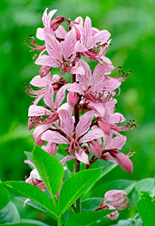

## Phylogeny 

-   « Ancestral Groups  
    -   [Rosids](../Rosids.md)
    -   [Core Eudicots](Core_Eudicots)
    -   [Eudicots](../../../Eudicots.md)
    -   [Flowering_Plant](../../../../Flowering_Plant.md)
    -   [Seed_Plant](../../../../../Seed_Plant.md)
    -   [Land_Plant](../../../../../../Land_Plant.md)
    -   [Green plants](../../../../../../../Plants.md)
    -   [Eukaryotes](Eukaryotes)
    -   [Tree of Life](../../../../../../../../Tree_of_Life.md)

-   ◊ Sibling Groups of  Rosids
    -   [Gerrardina](Gerrardina)
    -   [Fagales](Fagales.md)
    -   [Cucurbitales](Cucurbitales.md)
    -   [Rosales](Rosales.md)
    -   [Fabales](Fabales.md)
    -   [Zygophyllales](Zygophyllales.md)
    -   [Oxalidales](Oxalidales.md)
    -   [Malpighiales](Malpighiales.md)
    -   [Celastrales](Celastrales.md)
    -   [Geraniales](Geraniales.md)
    -   [Crossosomatales](Crossosomatales.md)
    -   [Myrtales](Myrtales.md)
    -   [Brassicales](Brassicales.md)
    -   [Malvales](Malvales.md)
    -   Sapindales

-   » Sub-Groups
    -   [Anacardiaceae](Anacardiaceae)
    -   [Burseraceae](Burseraceae)

# Sapindales 

Tree after Savolainen et al. (2000b) and Soltis et al. (2000)

Containing group: [Rosids](../Rosids.md)

### References

Gadek, P. A., E. S. Fernando, C. J. Quinn, S. B. Hoot, T. Terrazas, M.
C. Sheahan, and M. W. Chase. 1996. Sapindales: Molecular delimitation
and infraordinal groups. American Journal of Botany 83:802-811.

Savolainen, V., M. W. Chase, S. B. Hoot, C. M. Morton, D. E. Soltis, C.
Bayer, M. F. Fay, A. Y. De Bruijn, S. Sullivan, and Y. L. Qiu. 2000a.
Phylogenetics of flowering plants based on combined analysis of plastid
atpB and rbcL gene sequences. Systematic Biology 49:306-362.

Savolainen, V., M. F. Fay, D. C. Albach, A. Backlund, M. van der Bank,
K. M. Cameron, S. A. Johnson, M. D. Lledó, J.-C. Pintaud, M. Powell, M.
C. Sheahan, D. E. Soltis, P. S. Soltis, P. Weston, W. M. Whitten, K. J.
Wurdack, and M. W. Chase. 2000b. Phylogeny of the eudicots: a nearly
complete familial analysis based on rbcl gene sequences. Kew Bulletin
55:257-309.

Soltis, D. E., P. S. Soltis, M. W. Chase, M. E. Mort, D. C. Albach, M.
Zanis, V. Savolainen, W. H. Hahn, S. B. Hoot, M. F. Fay, M. Axtell, S.
M. Swensen, L. M. Prince, W. J. Kress, K. C. Nixon, and J. S. Farris.
2000. Angiosperm phylogeny inferred from 18S rDNA, rbcL, and atpB
sequences. Botanical Journal of the Linnean Society 133:381-461.

##### Title Illustrations



  ------------------------------------------------------------------------------
  Scientific Name ::     Aesculus californica
  Comments             California buckeye (Sapindaceae)
  Creator              Photograph by G. Dallas and Margaret Hanna
  Specimen Condition   Live Specimen
  Source Collection    [CalPhotos](http://calphotos.berkeley.edu/)
  Copyright ::            © 1999 [California Academy of Sciences](http://www.calacademy.org/) 
  ------------------------------------------------------------------------------


  -------------------------------------------------------------------------
  Scientific Name ::     Dictamnus dasycarpus
  Location ::           Near Barabash-Levada village, Pogranichny distr., Primorsky Territory (Russian Federation)
  Comments             Rutaceae
  Specimen Condition   Live Specimen
  Source Collection    [CalPhotos](http://calphotos.berkeley.edu/)
  Copyright ::            © 1999 [Nick Kurzenko](mailto:kurzenko@ibss.dvo.ru) 
  -------------------------------------------------------------------------


  ------------------------------------------------------------------------------
  Scientific Name ::     Bursera microphylla
  Location ::           Baja California, La Gringa, near (Mexico)
  Comments             Elephant tree (Burseraceae)
  Creator              Photograph by Glenn Vargas
  Specimen Condition   Live Specimen
  Source Collection    [CalPhotos](http://calphotos.berkeley.edu/)
  Copyright ::            © 1999 [California Academy of Sciences](http://www.calacademy.org/) 
  ------------------------------------------------------------------------------
