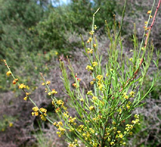
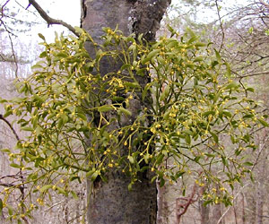

## Phylogeny 

-   « Ancestral Groups  
    -   [Core Eudicots](Core_Eudicots)
    -   [Core_Eudicots](../Core_Eudicots.md)
    -   [Flowering_Plant](../../../Flowering_Plant.md)
    -   [Seed_Plant](../../../../Seed_Plant.md)
    -   [Land_Plant](../../../../../Land_Plant.md)
    -   [Green plants](../../../../../../Plants.md)
    -   [Eukaryotes](Eukaryotes)
    -   [Tree of Life](../../../../../../../Tree_of_Life.md)

-   ◊ Sibling Groups of  Core Eudicots
    -   Santalales
    -   [Saxifragales](Saxifragales.md)
    -   [Berberidopsidales](Berberidopsidales.md)
    -   [Rosids](Rosids.md)
    -   [Caryophyllales](Caryophyllales.md)
    -   [Asterids](Asterids.md)

-   » Sub-Groups 

# [[Santalales]]  

## #has_/text_of_/abstract 

> The **Santalales** are an order of flowering plants in the dicotyledons. 
> 
> Well-known members of the Santalales include sandalwoods and the many species of mistletoes. 
> The order has a cosmopolitan distribution, but is heavily concentrated in tropical and subtropical regions. 
> 
> It derives its name from its type genus, Santalum (sandalwood).
>
> [Wikipedia](https://en.wikipedia.org/wiki/Santalales) 

## Title Illustrations

  ------------------------------------------------------------------------
  Scientific Name ::   Osyris alba
  Location ::         Samos, Greece
  Comments           Santalaceae
  Acknowledgements   courtesy [Botanical Image Database](http://www.unibas.ch/botimage/)
  Copyright ::          © 2001 University of Basel, Basel, Switzerland 
  ------------------------------------------------------------------------

  ------------------------------------------------------------------------
  Scientific Name ::   Viscum album, Sorbus aria
  Location ::         Arlesheim, Switzerland
  Comments           Mistletoe, Viscum album (Loranthaceae), growing on the trunk of a whitebeam, Sorbus aria (Rosaceae)
  Acknowledgements   courtesy [Botanical Image Database](http://www.unibas.ch/botimage/)
  Copyright ::          © 2001 University of Basel, Basel, Switzerland 
  ------------------------------------------------------------------------

## Confidential Links & Embeds: 

### #is_/same_as :: [Santalales](/_Standards/bio/bio~Domain/Eukaryotes/Plants/Land_Plant/Seed_Plant/Flowering_Plant/Eudicots/Core_Eudicots/Santalales.md) 

### #is_/same_as :: [Santalales.public](/_public/bio/bio~Domain/Eukaryotes/Plants/Land_Plant/Seed_Plant/Flowering_Plant/Eudicots/Core_Eudicots/Santalales.public.md) 

### #is_/same_as :: [Santalales.internal](/_internal/bio/bio~Domain/Eukaryotes/Plants/Land_Plant/Seed_Plant/Flowering_Plant/Eudicots/Core_Eudicots/Santalales.internal.md) 

### #is_/same_as :: [Santalales.protect](/_protect/bio/bio~Domain/Eukaryotes/Plants/Land_Plant/Seed_Plant/Flowering_Plant/Eudicots/Core_Eudicots/Santalales.protect.md) 

### #is_/same_as :: [Santalales.private](/_private/bio/bio~Domain/Eukaryotes/Plants/Land_Plant/Seed_Plant/Flowering_Plant/Eudicots/Core_Eudicots/Santalales.private.md) 

### #is_/same_as :: [Santalales.personal](/_personal/bio/bio~Domain/Eukaryotes/Plants/Land_Plant/Seed_Plant/Flowering_Plant/Eudicots/Core_Eudicots/Santalales.personal.md) 

### #is_/same_as :: [Santalales.secret](/_secret/bio/bio~Domain/Eukaryotes/Plants/Land_Plant/Seed_Plant/Flowering_Plant/Eudicots/Core_Eudicots/Santalales.secret.md)

