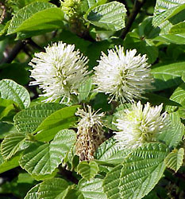
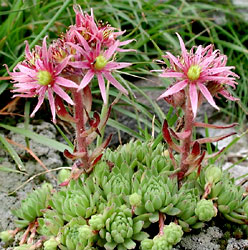
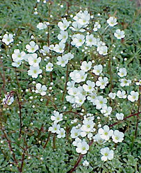

# [[Saxifragales]]  

     

## #has_/text_of_/abstract 

> **Saxifragales** is an order of flowering plants in the superrosid clade of the eudicots. 
> It contains 15 families and around 100 genera, with nearly 2,500 species. 
> 
> Well-known and economically important members of this order include 
> saxifrages (after whom the order is named), blackcurrants, redcurrants, gooseberries, peonies, 
> liquidambars, witch-hazel, Persian ironwood, katsura, jade plant, houseleeks, and water milfoil.
>
> Of the 15 families, many are small, with eight of them being monotypic (only a single genus). 
> 
> The largest family is the Crassulaceae (stonecrops), 
> a diverse group of mostly succulent plants, with about 35 genera. 
> 
> Saxifragales are found worldwide,  primarily in temperate to subtropical  zones, 
> rarely being encountered growing wild in the tropics; 
> however, many species are now cultivated throughout the world 
> as knowledge of plant husbandry has improved. 
> 
> They can be found in a wide variety of environments, from deserts to fully aquatic habitats, 
> with species adapted to alpine, forested or fully-aquatic habitats. 
> 
> Many are epiphytic or lithophytic, growing on exposed cliff faces, on trees or on rocks, 
> and not requiring a highly organic or nutrient-dense substrate to thrive. 
>
> Globally, the saxifrages have a wide variety of uses by humans, 
> ranging from textiles and timber to foodstuffs. 
> 
> Several families—such as the aforementioned Crassulaceae—and genera 
> are of significant commercial importance in some countries and economies, 
> being cultivated on a large scale for sale as ornamental plants. 
> 
> Apart from ornamentals, another highly-prized group are the Grossulariaceae 
> (currants and gooseberries), particularly blackcurrants, redcurrants and white currants. 
>
> Overall, the order is extremely diverse, encompassing numerous trees, shrubs, 
> perennial herbs and succulent plants, as well as aquatic and semi-aquatic species. 
> 
> The order's high degree of diversity, in terms of vegetative and reproductive traits 
> (and sheer amount of species), can make it challenging 
> to find any common or unifying features amongst the respective genera.
>
> In the Angiosperm Phylogeny Group classification system, the Saxifragales are placed within the major division of flowering plants referred to as eudicots, specifically the core eudicots. This subgroup consists of the Dilleniaceae, superasterids and superrosids. The superrosids, in turn, have two components, rosids and Saxifragales. The Saxifragales order has undergone considerable revision since its original classification, which had been based purely on plant characteristics. The modern classification is based on genetic studies, using molecular phylogenetics. There is an extensive fossil record from the Turonian-Campanian phase of the late Cretaceous, dating to about 90 million years ago (Myr). However, molecular studies may suggest an older origin, from the early Cretaceous (102–108 Myr), with rapid and early diversification to more modern forms.
>
> [Wikipedia](https://en.wikipedia.org/wiki/Saxifragales) 

## Introduction

[Doug Soltis, Pam Soltis, and Monica Arakaki](http://www.tolweb.org/) 

Saxifragales are a morphologically diverse group, including annual and
perennial herbs, succulents, aquatics, shrubs, vines, and large trees.
Saxifragales include the well-known families Saxifragaceae,
Crassulaceae, Cercidiphyllaceae, Grossulariaceae, Paeoniaceaea, and
Hamamelidaceae. Other members include Altingiaceae, Daphniphyllaceae,
Haloragaceae, Iteaceae, and Pterostemonaceae. Prior to molecular
phylogenetics (Morgan and Soltis, 1993; Fishbein *et al.*, 2001),
members of this clade were classified based on morphology, in three
subclasses from the six recognized in recent classifications (Cronquist,
1981; Takhtajan, 1997, reviewed in Morgan and Soltis, 1993; Qiu *et
al*., 1998; Soltis *et al*., 2005).

Analysis of *rbcL* sequences first revealed the Saxifragales clade
(Chase *et al*., 1993; Morgan and Soltis, 1993). Investigation of *atpB*
alone, as well as *atpB* + *rbcL,* also indicated a monophyletic
Saxifragales, but none of these studies provided support
[\>] 50% (Chase and Albert, 1998; Savolainen *et al.*,
2000). 18S rDNA alone and 18S rDNA + *rbcL* revealed a Saxifragales
clade with moderate jackknife support (e.g., D. Soltis *et al*., 1997,
1998; D. Soltis and Soltis, 1997). Most recently, in analyses of three
or four-gene data sets (*rbcL*, 18S rDNA,
*atp[B]{style="font-family: Symbol;"}*) (Hoot *et al*., 1999; D. P.
Soltis *et al*. 1999, D. Soltis *et al*., 2000), the monophyly of
Saxifragales received strong support.\

### Characteristics

Saxifragales include trees, shrubs, lianas, annual and perennial herbs,
succulents, and aquatics. Flowers vary considerably in arrangement,
merosity, and degree of fusion of perianth parts, stamen and carpel
number, ovary position, and degree of syncarpy (Cronquist 1981;
Takhtajan 1997). Due to the great morphological diversity found in this
clade, synapomorphies for the group are not clear.

Possible synapomorphies include a partially fused bicarpellate
gynoecium, a hypanthium, and glandular leaf teeth (Judd *et al.*, 2002).
Aspects of leaf venation and wood anatomy are similar in the woody
members of the clade: solitary vessels, scalariform perforations,
opposite to scalariform intervessel pits, nonseptate fibers with
distinctly bordered pits, and apotracheal parenchyma (Baas *et al.*,
2000). Exceptions to this suite of features occur, however, in
Crassulaceae and Saxifragaceae, but in these primarily herbaceous
families, woodiness probably arose secondarily (Carlquist, 1988; Mort
*et al.,* 2001). A seed character represents a possible synapomorphy for
the core members of the Saxifragales clade. An exotestal palisade with
thickened outer walls (Nandi *et al.*, 1998) is found in Saxifragaceae,
*Ribes* (Grossulariaceae), Crassulaceae, and Paeoniaceae. However,
Hamamelidaceae are characterized by mesotestal seeds (see Corner, 1976
for a review of angiosperm seeds).

### Relationships to other clades of Eudicots

Whereas the composition of Saxifragales is now clear, the position of
the clade among the core eudicots remains uncertain. Initial analyses of
*rbcL* sequences (Chase *et al*., 1993) placed the order as sister to
all rosids, while analyses of *atpB* sequences placed Saxifragales as
sister to a large clade of most core eudicots (Savolainen *et al.*,
2000a). None of these placements received support \> 50%. The three-gene
analysis (P. Soltis *et al*., 1999; D. Soltis *et al*., 2000) placed
Saxifragales as sister to rosids, but with only weak jackknife support
(60%). However, in spite of the weak support (e.g., D. Soltis *et al*.,
2000), the simple, pentamerous flowers have long been thought to
indicate a relationship with Rosaceae and other rosids, but whether
these floral features are synapomorphies for Saxifragales + rosids or
symplesiomorphies (i.e., shared ancestral features) is unclear.
Additional research is needed to resolve the relationship of
Saxifragales within the core eudicots.

The analyses of a four-gene data set for eudicots revealed a placement
of Saxifragales as sister to all other core eudicots except Gunnerales
and Berberidopsidales (D. Soltis *et al*., 2003), but without support \>
50%. Analysis of *matK* placed Gunnerales sister to other core eudicots,
followed by a trichotomy of Saxifragales, rosids, remaining core
eudicots (Santalales, asterids, Caryophyllales, Berberidopsidales) (Hilu
*et al*., submitted). Thus, it appears likely that Saxifragales occupies
a pivotal position near the base of the core eudicot radiation.
Molecular data also demonstrated that the initial diversification of
Saxifragales was rapid (Fishbein *et al.*, 2001). These data further
suggested that the early diversification of Saxifragales was
contemporaneous with the initial radiation of the major lineages of
eudicots and that of non-eudicot (magnoliid and monocot) angiosperms.
Molecular data suggesting an early diversification also agree with the
fossil record in that fossils attributed to Saxifragales are present in
Turonian-Campanian strata (89.5 mya), which is comparable in age to the
oldest fossils of core eudicots (Magallón *et al*., 1999; Soltis *et
al*., 2005).

### Discussion of Phylogenetic Relationships

Several members of Saxifragales were considered closely related in some
classifications. Saxifragaceae, Grossulariaceae, Iteaceae,
Pterostemonaceae, Penthoraceae, and Tetracarpaeaceae were previously
considered part of a much more broadly defined Saxifragaceae *sensu
lato* (Engler, 1928; reviewed in Morgan and Soltis, 1993). A close
relationship of these core families of Saxifragaceae *s. l*. to
Crassulaceae was also proposed (e.g., Cronquist, 1981; Takhtajan, 1987,
1997). Hamamelidaceae, Altingiaceae, Cercidiphyllaceae, and
Daphniphyllaceae were also considered closely related in modern
classifications (e.g., the "lower hamamelids" *sensu* Walker and Doyle,
1975). However, Saxifragales also include Haloragaceae and Paeoniaceae,
families that have never been placed with any members of Saxifragales in
previous classifications. Haloragaceae have been placed in or near the
rosid order Myrtales (Cronquist, 1981), whereas Paeoniaceae have been
considered closely related to Magnoliaceae (e.g. Worsdell 1908),
Ranunculaceae (e.g., Takhtajan 1997), or Dilleniaceae (e.g. Cronquist,
1981). The inclusion of *Aphanopetalum* (previously placed in the rosid
family Cunoniaceae) in Saxifragales initially seemed surprising, but was
suggested previously based on anatomical data (Dickison *et al*., 1994).

Phylogenetic analyses of a five gene-data set identified two
well-supported clades of families in Saxifragales (Fishbein *et al*.,
2001). Strong support was found for a Saxifragaceae alliance of
Saxifragaceae and several woody members of the former Saxifragaceae *s.
l.* (i.e., Grossulariaceae, Iteaceae, and Pterostemonaceae). Within this
clade *Ribes* (Grossulariaceae) was found to be the immediate sister to
Saxifragaceae, followed subsequently by a clade of Iteaceae ,
Pterostemonaceae. A second strongly supported clade within Saxifragales
consists of a well-supported Crassulaceae (see Mort *et al.*, 2001) as
sister to a clade of *Tetracarpaea* (Tetracarpaeaceae)*, Penthorum*
(Penthoraceae), Haloragaceae, and *Aphanopetalum* (Cunoniaceae).
*Tetracarpaea, Penthorum*, and *Aphanopetalum* are all small genera that
should be included within an expanded family Haloragaceae (APGII, 2003).
The Saxifragaceae alliance and Crassulaceae , Haloragaceae form a clade
in the strict consensus of shortest trees, but this clade does not
receive support \> 50% in parsimony analyses. However, this sister group
relationship is weakly supported (68% bootstrap) in maximum likelihood
analyses (Fishbein *et al.*, 2001) and strongly supported using Bayesian
inference (1.00 posterior probability; Fishbein, unpubl.).

A considerable amount of sequence data (i. e. Fishbein *et al.*, 2001;
D. Soltis *et al.*, 2000; Hoot *et al.*, 1999) has been unable to
resolve some of the critical deep relationships among clades within
Saxifragales. A large core clade consisting of Saxifragaceae and
Crassulaceae , Haloragaceae is evident in all shortest trees, but does
not receive support greater than 50%. Furthermore, relationships among
this core group, and the remaining families (Paeoniaceae,
Cercidiphyllaceae, Daphniphyllaceae, Hamamelidaceae, and Altingiaceae)
also remain unclear (Feng *et al.*, 1998; Qiu *et al*., 1998; Hoot *et
al.*, 1999; Savolainen *et al*., 2000; Fishbein et al., 2001; D. Soltis
et al., 2000). In maximum likelihood analyses of a five-gene data set,
Fishbein *et al.* (2001) recovered an optimal topology with
Daphniphyllaceae and Hamamelidaceae sister to the remaining members of
the clade; however, the precise branching order of these two
early-diverging members of Saxifragales was unclear. Following
Daphniphyllaceae and Hamamelidaceae, Altingiaceae, Cercidiphyllaceae,
and Paeoniaceae appeared as successive sisters to a core clade of
Saxifragaceae and Haloragaceae , Crassulaceae. Fishbein *et al*. (2001)
also showed that the poor resolution obtained in Saxifragales is not due
to violations of assumptions or to combining data partitions having
conflicting histories or processes. Rather, their analyses suggest
instead that the initial diversification of Saxifragales was indeed
rapid.

## Phylogeny 

-   « Ancestral Groups  
    -   [Core Eudicots](Core_Eudicots)
    -   [Core_Eudicots](../Core_Eudicots.md)
    -   [Flowering_Plant](../../../Flowering_Plant.md)
    -   [Seed_Plant](../../../../Seed_Plant.md)
    -   [Land_Plant](../../../../../Land_Plant.md)
    -   [Green plants](../../../../../../Plants.md)
    -   [Eukaryotes](Eukaryotes)
    -   [Tree of Life](../../../../../../../Tree_of_Life.md)

-   ◊ Sibling Groups of  Core Eudicots
    -   [Santalales](Santalales.md)
    -   Saxifragales
    -   [Berberidopsidales](Berberidopsidales.md)
    -   [Rosids](Rosids.md)
    -   [Caryophyllales](Caryophyllales.md)
    -   [Asterids](Asterids.md)

-   » Sub-Groups 

## Title Illustrations

---------------------------------------------------------------------
  
Scientific Name ::  Fothergilla major
Comments          Hamamelidaceae
Copyright ::         © [Kurt Stüber](http://www.biolib.de/) 

------------------------------------------------------------------------
  
Scientific Name ::   Sempervivum montanum
Location ::         San Bernardino, Mesocco, Ticino, Switzerland, 2100 m
Comments           Crassulaceae
Acknowledgements   courtesy [Botanical Image Database](http://www.unibas.ch/botimage/)
Copyright ::          © 2001 University of Basel, Basel, Switzerland 

---------------------------------------------------------------------
 
Scientific Name ::  Saxifraga cochlearis
Comments          Saxifragaceae
Copyright ::         © [Kurt Stüber](http://www.biolib.de/) 
