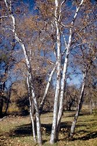

## Phylogeny 

-   « Ancestral Groups  
    -   [Eudicots](../Eudicots.md)
    -   [Flowering_Plant](../../Flowering_Plant.md)
    -   [Seed_Plant](../../../Seed_Plant.md)
    -   [Land_Plant](../../../../Land_Plant.md)
    -   [Green plants](../../../../../Plants.md)
    -   [Eukaryotes](Eukaryotes)
    -   [Tree of Life](../../../../../../Tree_of_Life.md)

-   ◊ Sibling Groups of  eudicots
    -   [Buxaceae](Buxaceae.md)
    -   [Ranunculales](Ranunculales.md)
    -   Proteales
    -   [Core Eudicots](Core_Eudicots)

-   » Sub-Groups 

# [[Proteales]]  

     

## #has_/text_of_/abstract 

> **Proteales** is an order of flowering plants consisting of three (or four) families. 
> The Proteales have been recognized by almost all taxonomists.
>
> The representatives of the Proteales can be very different from each other 
> due to their very early divergence. 
> 
> They possess seeds with little or no endosperm. The ovules are often atropic.
>
> The oldest fossils of Proteales are of the nelumbonaceous genus Notocyamus 
> from the Barremian stage of the Early Cretaceous of Brazil, 126–121 Ma (million years ago). 
> 
> According to molecular clock calculations, 
> the lineage that led to Proteales split from other plants about 128 Ma or 125 Ma.
>
> [Wikipedia](https://en.wikipedia.org/wiki/Proteales) 
## Title Illustrations

---------------------------------------------------------------------
 
Scientific Name ::  Petrophila pedunculata
Comments          Proteaceae
Copyright ::         © [Kurt Stüber](http://www.biolib.de/) 

-------------------------------------------------------------------------
 
Scientific Name ::     Nelumbo nucifera
Location ::           Vladivostok suburb, Primorsky Territory, Russian Federation
Comments             Sacred lotus
Specimen Condition   Live Specimen
Source Collection    [CalPhotos](http://calphotos.berkeley.edu/)
Copyright ::            © 1999 [Nick Kurzenko](mailto:kurzenko@ibss.dvo.ru) 

------------------------------------------------------------------------------

Scientific Name ::     Platanus racemosa
Location ::           Alameda County, California, US
Comments             Western Sycamore
Creator              Photograph by Charles Webber
Specimen Condition   Live Specimen
Source Collection    [CalPhotos](http://calphotos.berkeley.edu/)
Copyright ::            © 1998 [California Academy of Sciences](http://www.calacademy.org/) 
------------------------------------------------------------------------------

