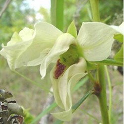
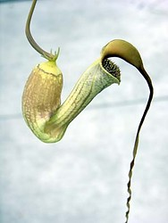
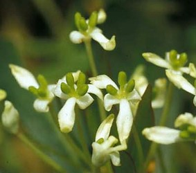
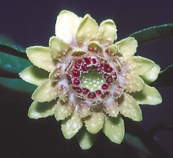
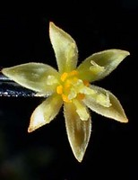
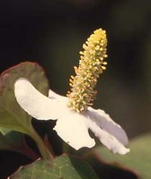
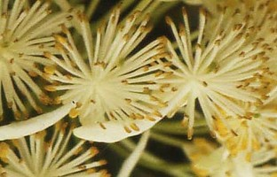

# [[Magnoliids]] 

     

## #has_/text_of_/abstract 

> **Magnoliids**, Magnoliidae or Magnolianae are a clade of flowering plants. 
> 
> With more than 10,000 species, including 
> magnolias, nutmeg, bay laurel, cinnamon, avocado, black pepper, tulip tree and many others, 
> it is the third-largest group of angiosperms after the eudicots and monocots. 
> 
> The group is characterized by trimerous flowers, pollen with one pore, 
> and usually branching-veined leaves.
>
> Some members of the subclass are among the earliest angiosperms 
> and share anatomical similarities with gymnosperms like stamens 
> that resemble the male cone scales of conifers and carpels found on the long flowering axis. 
> 
> According to molecular clock calculations, the lineage that led to magnoliids 
> split from other plants about 135 million years ago or 160-165 million years ago.
>
> [Wikipedia](https://en.wikipedia.org/wiki/Magnoliids) 

## Phylogeny 

-   « Ancestral Groups  
    -   [Flowering_Plant](../Flowering_Plant.md)
    -   [Seed_Plant](../../Seed_Plant.md)
    -   [Land_Plant](../../../Land_Plant.md)
    -   [Green plants](../../../../Plants.md)
    -   [Eukaryotes](Eukaryotes)
    -   [Tree of Life](../../../../../Tree_of_Life.md)

-   ◊ Sibling Groups of  Angiosperms
    -   [Amborella trichopoda](Amborella.md)
    -   magnoliids
    -   [Chloranthaceae](Chloranthaceae.md)
    -   [Ceratophyllaceae](Ceratophyllaceae.md)
    -   [Monocot](Monocot.md)
    -   [Eudicots](Eudicots.md)
    -   [Austrobaileyales](Austrobaileyales.md)
    -   [Nymphaeaceae](Nymphaeaceae.md)

-   » Sub-Groups
    -   [Piperales](Magnoliids/Piperales.md)
    -   [Canellales](Magnoliids/Canellales.md)
    -   [Magnoliales](Magnoliids/Magnoliales.md)
    -   [Laurales](Magnoliids/Laurales.md)

## Introduction

[Pam Soltis, Doug Soltis, and Christine Edwards]()

The magnoliid clade contains several thousand (\~8500) species divided
into 20 families, including several large, economically important
families such as Magnoliaceae, Lauraceae, Piperaceae, and Annonaceae.
Members of the magnoliid clade are widespread throughout tropical and
temperate areas of the world and can be large trees, shrubs, vines,
lianas, and occasionally herbs (Judd et al., 2002; D. Soltis et al.,
2005). Economically important products derived from magnoliids include
edible fruits, such as avocados (*Persea americana*) and guanabana, sour
sop, cherimoya, and sweet sop (*Annona* spp.). Magnoliid species are
also the source of spices (Judd et al., 2002; D. Soltis et al., 2005)
such as black and white pepper (*Piper nigrum*), bay leaves (*Laurus
nigrus*), nutmeg (*Myristica fragrans*), cinnamon (*Cinnamomum verum*),
and camphor (*Cinnamomum camphora*). Other members are used as
ornamentals or timber (e.g., *Magnolia* and *Liriodendron*; Judd et al.,
2002; D. Soltis et al., 2005).

### Characteristics

The magnoliid clade contains most of those lineages that were typically
referred to as \"primitive angiosperms\" in earlier classification
schemes (e.g., Cronquist, 1981, 1988; Stebbins, 1974; Takhtajan, 1997);
most of these \"primitive\" species have long, broad, net-veined leaves
and large flowers with numerous, spirally arranged tepals (perianth
parts that are not differentiated into petals and sepals), stamens, and
carpels. Some also have leaf-like, or \"laminar,\" stamens. However,
while these classification systems (for example Cronquist\'s subclass
Magnoliidae) united some of the families that are currently
circumscribed as magnoliids, phylogenetic analyses have shown that these
previous classifications also included groups that are unrelated to the
magnoliid clade, such as *Amborella* and Austrobaileyales. Moreover,
these classifications also excluded members, such as *Lactoris*, that
were difficult to place in the magnoliids because the group is very old
(some hypothesized members, such as *Archaeanthus* (Dilcher and Crane
1984) date to the early Cretaceous) and extinction has likely obscured
many of the evolutionary relationships (see Soltis et al 2005).

The major lineages of magnoliids were first identified in studies using
DNA evidence (e.g., P. Soltis et al., 1999); however the composition of
the magnoliid clade and relationships among the members did not become
clear until data sets of at least five genes for a broad sample of taxa
were assembled to address these problems (e.g., Qiu et al., 1999, 2000;
Zanis et al., 2002). Several possible morphological characteristics have
now been identified that may unite magnoliids. Some (although obscure)
possible synapomorphies (shared, derived characteristics) include entire
leaf margins, extrorse anthers, ephemeral antipodal cells, the presence
of hypostase, the presence of a nucellar cap, and raphal bundle branches
at the chalaza ([Angiosperm Phylogeny Website](http://www.mobot.org/MOBOT/research/APweb/welcome.html), 2005).

### Discussion of Phylogenetic Relationships

Within the magnoliids, researchers have identified four evolutionary
lineages and clarified their evolutionary relationships: Magnoliales and
Laurales are sisters, and Piperales and Canellales are sisters. The
circumscription of these orders and their interrelationships had not
been proposed previously based on morphology alone.

***Magnoliales.*** Based on molecular analyses, this group includes six
families (Myristicaceae, Degeneriaceae, Himantandraceae, Magnoliaceae,
Eupomatiaceae, and Annonaceae), relationships among which are now clear
(e.g., Sauquet et al., 2003). This same clade also emerged in the
nonmolecular analysis of Doyle and Endress (2000). Apparent
synapomorphies for the clade include reduced fiber pit borders,
stratified phloem, an adaxial plate of vascular tissue in the petiole,
palisade parenchyma, asterosclereids in the leaf mesophyll, continuous
tectum in the pollen, and multiplicative testa in the seed (Doyle and
Endress, 2000). Furthermore, all members of this clade examined to date
have a characteristic deletion in their *Apetala3* gene (Kim et al.,
2004a).

*Magnolia tripetala*, a member of Magnoliaceae (photo © Kurt Stuber),
and *Eupomatia benettii*, a representative of Epomatiaceae (photo ©
Peter Endress).

***Laurales.*** Laurales, as currently circumscribed (APG II, 2003; see
Renner, 1999), include seven families: Calycanthaceae (including
Idiospermaceae), Monimiaceae, Gomortegaceae, Atherospermataceae,
Lauraceae, Siparunaceae, and Hernandiaceae. In previous classifications
(e.g., Cronquist, 1981, 1988), Amborellaceae and Trimeniaceae were
occasionally placed in Laurales; and in fact, both *Amborella* and
*Trimenia* have even been considered part of Monimiaceae (Perkins, 1925;
see [Angiosperms](tree?group=Angiosperms) for a
discussion of the placement of these families). Chloranthaceae have also
occasionally been placed in Laurales (e.g., Takhtajan, 1987, 1997;
Thorne, 1974; see
[Angiosperms](tree?group=Angiosperms) for a
discussion of its placement). Laurales are united by a perigynous flower
in which the gynoecium is frequently deeply embedded in a fleshy
receptacle (Endress and Igersheim, 1997; Renner, 1999). Other apparent
non-DNA synapomorphies include the presence of inner staminodia,
ascendant ovules, and tracheidal endotesta (Doyle and Endress, 2000).

Photo of *Persea americana*, a representative of Lauraceae (photo ©
Matyas Buzgo).

***Piperales.*** Previous circumscriptions of Piperales have varied
(e.g., Dahlgren, 1980; Cronquist, 1981, 1988; Takhtajan, 1987, 1997;
Thorne, 1992; Heywood, 1993), but molecular studies clearly united
Aristolochiaceae, Lactoridaceae, Piperaceae, and Saururaceae (e.g., Qiu
et al., 1999; P. Soltis et al., 1999; Barkman et al., 2000; D. Soltis et
al., 2000; Zanis et al., 2002). In addition, recent studies have placed
Hydnoraceae, a family of parasitic plants often placed in Rosidae (e.g.,
Cronquist, 1981; Heywood, 1993), within Piperales, although the exact
position is not certain (Nickrent et al., 2002). Although not recognized
as a group prior to molecular analyses, a number of morphological
synapomorphies have been identified: distichous phyllotaxis, a single
prophyll, and oil cells (Doyle and Endress, 2000).

The flower of *Aristolochia sprucei*, a representative of
Aristolochiaceae (photo © Mario Blanco), the inflorescence of *Piper
capense*, in the Piperaceae (photo © Matyas Buzgo), and the
inflorescence of *Houttuynia cordata*, a representative of Saururaceae
(photo © Matyas Buzgo).

***Canellales.*** The relationship of Canellaceae and Winteraceae has
been strongly supported in all multigene analyses (e.g., Qiu et al.,
1999; P. Soltis et al., 1999; D. Soltis et al., 2000; Zanis et al.,
2002, 2003), and the clade was also obtained in Doyle and Endress\'s
(2000) nonmolecular analysis. However, these two families have not
typically been considered closely related to each other, and neither was
suspected of being related to any members of Piperales. For example,
Winteraceae have often been considered a close relative of Magnoliaceae
(e.g., Cronquist, 1981, 1988; Heywood, 1993), with Canellaceae close to
Myristicaceae (e.g., Wilson, 1966; Cronquist, 1981, 1988). Furthermore,
intuitive classification systems regarded Winteraceae as perhaps the
\"most primitive\" extant family of angiosperms (Cronquist, 1981;
Endress, 1986). The phylogenetic position of Winteraceae clearly
indicates that the vesselless xylem and plicate carpels found in members
of the family are secondarily derived (see also Young, 1981). Possible
synapomorphies for Canellales are a well-differentiated pollen tube
transmitting tissue, an outer integument with only two to four cell
layers, and seeds with a palisade exotesta (Doyle and Endress, 2000).
Additional synapomorphies may include an irregular \"first-rank\" leaf
venation (Hickey and Wolf, 1975; Doyle and Endress, 2000), features of
stelar and nodal structure (Keating, 2000), and vascularization of the
seeds (Deroin, 2000).

The male inflorescence of *Tasmannia stipitata* (photo © Matyas Buzgo),
a representative of Winteraceae.

## Title Illustrations

---------------------

Scientific Name ::     Asimina
Specimen Condition   Live Specimen
Identified By        Sangtae Kim
Copyright ::            © 2005 [Sangtae Kim](mailto:sangtae@botany.ufl.edu)

---------------------
[Aristolochia trilobata](Magnoliids/Aristolochia_trilobata_Blanco.jpg) 
Scientific Name ::     Aristolochia trilobata
Specimen Condition   Live Specimen
Identified By        Mario Blanco
Body Part            Flower
View                 profile
Copyright ::            © 2005 [Mario Blanco](mailto:mblanco@fllmnh.ufl.edu)

-----------------------------
 
Scientific Name ::     Tasmannia stipitata
Specimen Condition   Live Specimen
Identified By        Matyas Buzgo
Sex ::                Female
Body Part            Flowers
Copyright ::            © 2005 [Matyas Buzgo](ftp://ftp.flmnh.ufl.edu/Public/mbuzgo/MyPage/mbuzgo.htm)

