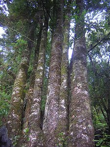

# [[Gomortega_nitida]] 

 

## #has_/text_of_/abstract 

> Gomortega keule (syn. G. nitida; Spanish names keule, queule, and hualhual) 
> is a species of tree endemic to Chile. 
> 
> It is the sole species of the genus Gomortega and, according to the APG IV system of 2016 (unchanged from the APG systems of 2009, 2003 and 1998), 
> of the monotypic family Gomortegaceae, assigned to the order Laurales in the clade magnoliids.
>
> [Wikipedia](https://en.wikipedia.org/wiki/Gomortega) 

## Phylogeny 

-   « Ancestral Groups  
    -   [Laurales](../Laurales.md)
    -   [Magnoliids](../../Magnoliids.md)
    -   [Flowering_Plant](../../../Flowering_Plant.md)
    -   [Seed_Plant](../../../../Seed_Plant.md)
    -   [Land_Plant](../../../../../Land_Plant.md)
    -   [Green plants](../../../../../../Plants.md)
    -   [Eukaryotes](Eukaryotes)
    -   [Tree of Life](../../../../../../../Tree_of_Life.md)

-   ◊ Sibling Groups of  Laurales
    -   Gomortega nitida

-   » Sub-Groups 

## Title Illustrations

------------------------------------------------------------------------
 
Scientific Name ::     Gomortega keule (syn. Gomortega nitida)
Location ::           Quebrada de Caramávida, Bio-Bio, Chile
Acknowledgements     Proyecto Chilebosque http://www.chilebosque.cl
Specimen Condition   Live Specimen
Identified By        Diego Alarcon
Body Part            trunks
Size                 20 m tall
Copyright ::            © [Diego Alarcon](http://www.chilebosque.cl/) 
