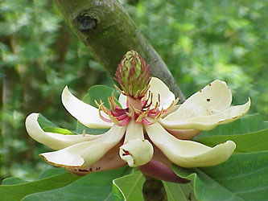

# [[Magnoliales]] 

   
 

## #has_/text_of_/abstract 

> The **Magnoliales** are an order of flowering plants. Well-known members of Magnoliales include: magnolias, tulip trees, custard apples, American pawpaw, cherimoyas, ylang-ylang, soursop fruit, and nutmeg.
>
> [Wikipedia](https://en.wikipedia.org/wiki/Magnoliales) 

## Phylogeny 

-   « Ancestral Groups  
    -   [Magnoliids](../Magnoliids.md)
    -   [Flowering_Plant](../../Flowering_Plant.md)
    -   [Seed_Plant](../../../Seed_Plant.md)
    -   [Land_Plant](../../../../Land_Plant.md)
    -   [Green plants](../../../../../Plants.md)
    -   [Eukaryotes](Eukaryotes)
    -   [Tree of Life](../../../../../../Tree_of_Life.md)

-   ◊ Sibling Groups of  magnoliids
    -   [Piperales](Piperales.md)
    -   [Canellales](Canellales.md)
    -   Magnoliales
    -   [Laurales](Laurales.md)

-   » Sub-Groups 

## Title Illustrations  

---------------------------------------------------------------------
 
Scientific Name ::  Magnolia tripetala
Comments          Magnoliaceae
Copyright ::         © [Kurt Stüber](http://www.biolib.de/) 

----------------------------------------------------------------------------------------------
 
Scientific Name ::  Asimina triloba
Comments          Pawpaw tree, Annonaceae
Creator           Photo by Scott Bauer
Copyright ::         © [USDA Agricultural Research Service USDA Agricultural Research Service](http://www.ars.usda.gov/is/graphics/photos/) 
