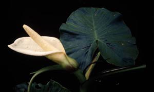
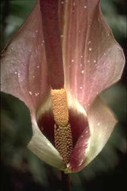

## Phylogeny 

-   « Ancestral Groups  
    -   [Monocot](../Monocot.md)
    -   [Flowering_Plant](../../Flowering_Plant.md)
    -   [Seed_Plant](../../../Seed_Plant.md)
    -   [Land_Plant](../../../../Land_Plant.md)
    -   [Green plants](../../../../../Plants.md)
    -   [Eukaryotes](Eukaryotes)
    -   [Tree of Life](../../../../../../Tree_of_Life.md)

-   ◊ Sibling Groups of  Monocotyledons
    -   [Alismatanae](Alismatanae.md)
    -   Aranae
    -   [Liliales](Liliales.md)
    -   [Asparagales](Asparagales.md)
    -   [Pandanales](Pandanales.md)
    -   [Dioscoreales](Dioscoreales.md)
    -   [Palms](Palms.md)
    -   [Zingiberanae](Zingiberanae.md)
    -   [Commelinanae](Commelinanae.md)

-   » Sub-Groups 

# [[Aranae]]

The aroids 

 
 
Images © 1997 [William J. Hahn](mailto:wjh22@georgetown.edu)  

## #has_/text_of_/abstract 

> Arales is an order of flowering plants. 
> The name was used in the Cronquist system for an order placed in subclass Arecidae, 
> circumscribed as (1981):
> - order Arales
> - family Acoraceae
> - family Araceae
> - family Lemnaceae
>
> In the classification system of Dahlgren the Arales were in the superorder Ariflorae 
> (also called **Aranae**), but did not include Acoraceae as a separate family. 
> Instead, Acorus, its only genus, was included in the Araceae. 
> Arales was the only order included in the Ariflorae.
>
> The APG II system elevates the first of these three families 
> to become an order Acorales of its own (consisting of the single genus, Acorus) 
> and unites the last two of these families into the one family Araceae 
> assigning this to the order Alismatales.
>
> [Wikipedia](https://en.wikipedia.org/wiki/Arales) 

## Introduction

[William J. Hahn](http://www.tolweb.org/)

The aroids are a predominantly tropical group of herbaceous terrestrial or epiphytic plants. 
Edible plants, poisonous species, ornamentals. 
The superorder contains 2 families, 110 genera, and approximately 2500 species.

### Characteristics

The aroids are distinguished by distichous leaves, paracytic stomata,
carpels with multiple ovules, and albuminous seeds (Grayum, 1990). A
close relationships to the alismatids is supported in most analyses.
