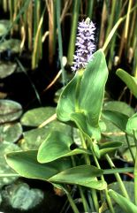
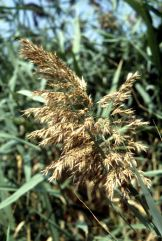

# [[Commelinanae]] 

     
Images © 1997 [William J. Hahn](mailto:wjh22@georgetown.edu) 

## #has_/text_of_/abstract 

> Commelinales is an order of flowering plants. It comprises five families: 
> - Commelinaceae, 
> - Haemodoraceae, 
> - Hanguanaceae, 
> - Philydraceae, and 
> - Pontederiaceae. 
> 
> All the families combined contain over 885 species in about 70 genera; 
> the majority of species are in the Commelinaceae. 
> 
> Plants in the order share a number of synapomorphies that tie them together, 
> such as a lack of mycorrhizal associations and tapetal raphides. 
> 
> Estimates differ as to when the Commelinales evolved, 
> but most suggest an origin and diversification sometime during the mid- to late Cretaceous. 
> 
> Studies suggest a range of origin between 123 and 73 million years, 
> with diversification occurring within the group 110 to 66 million years ago. 
> The order's closest relatives are in the Zingiberales, 
> which includes ginger, bananas, cardamom, and others.
>
> [Wikipedia](https://en.wikipedia.org/wiki/Commelinales) 

## Phylogeny 

-   « Ancestral Groups  
    -   [Monocot](../Monocot.md)
    -   [Flowering_Plant](../../Flowering_Plant.md)
    -   [Seed_Plant](../../../Seed_Plant.md)
    -   [Land_Plant](../../../../Land_Plant.md)
    -   [Green plants](../../../../../Plants.md)
    -   [Eukaryotes](Eukaryotes)
    -   [Tree of Life](../../../../../../Tree_of_Life.md)

-   ◊ Sibling Groups of  Monocotyledons
    -   [Alismatanae](Alismatanae.md)
    -   [Aranae](Aranae.md)
    -   [Liliales](Liliales.md)
    -   [Asparagales](Asparagales.md)
    -   [Pandanales](Pandanales.md)
    -   [Dioscoreales](Dioscoreales.md)
    -   [Palms](Palms.md)
    -   [Zingiberanae](Zingiberanae.md)
    -   Commelinanae

-   » Sub-Groups 
	- Commelinaceae, 
	- Haemodoraceae, 
	- Hanguanaceae, 
	- Philydraceae, and 
	- Pontederiaceae. 

## Introduction

[William J. Hahn](http://www.tolweb.org/)

The Commelinanae includes the grasses, sedges, bromeliads, and relatives. 
This superorder includes approximately 25 families, 1075 genera, and 24000 species.

### Characteristics

The Commelinanae are characterized by scrobiculate pollen 
with operculate apertures and orthotropous ovules, 
girdle-like endothecial thickenings of the anthers, 
annulate pollen apertures, and apical placentation (Linder and Kellogg, 1993).
