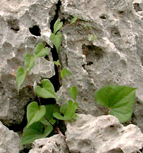

# [[Dioscoreales]] 

   

## #has_/text_of_/abstract 

> The **Dioscoreales** are an order of monocotyledonous flowering plants, organized under modern classification systems, such as the Angiosperm Phylogeny Group or the Angiosperm Phylogeny Web.  Among monocot plants, Dioscoreales are grouped with the lilioid monocots, wherein they are a sister group to the Pandanales. In total, the order Dioscoreales comprises three families, 22 genera and about 850 species.
>
> Dioscoreales contains the family Dioscoreaceae, which notably includes the yams (Dioscorea) and several other bulbous and tuberous plants, some of which are heavily cultivated as staple food sources in certain countries. 
>
> Certain species are found solely in arid climates (incl. parts of Southern Africa), and have adapted to this harsh environment as caudex-forming, perennial caudiciformes, including Dioscorea elephantipes, the "elephant's foot" or "elephant-foot yam".
>
> Older systems tended to place all lilioid monocots with reticulate veined leaves (such as Smilacaceae and Stemonaceae together with Dioscoraceae) in Dioscoreales; as currently circumscribed by phylogenetic analysis, using combined morphology and molecular methods, Dioscreales now contains many reticulate-veined vines within the Dioscoraceae, as well as the myco-heterotrophic Burmanniaceae and the autotrophic Nartheciaceae.
>
> [Wikipedia](https://en.wikipedia.org/wiki/Dioscoreales) 

## Phylogeny 

-   « Ancestral Groups  
    -   [Monocot](../Monocot.md)
    -   [Flowering_Plant](../../Flowering_Plant.md)
    -   [Seed_Plant](../../../Seed_Plant.md)
    -   [Land_Plant](../../../../Land_Plant.md)
    -   [Green plants](../../../../../Plants.md)
    -   [Eukaryotes](Eukaryotes)
    -   [Tree of Life](../../../../../../Tree_of_Life.md)

-   ◊ Sibling Groups of  Monocotyledons
    -   [Alismatanae](Alismatanae.md)
    -   [Aranae](Aranae.md)
    -   [Liliales](Liliales.md)
    -   [Asparagales](Asparagales.md)
    -   [Pandanales](Pandanales.md)
    -   Dioscoreales
    -   [Palms](Palms.md)
    -   [Zingiberanae](Zingiberanae.md)
    -   [Commelinanae](Commelinanae.md)

-   » Sub-Groups 
	-   *Burmanniaceae*
	-   *Dioscoreaceae*
	-   *Nartheciaceae*
	-   *Taccaceae*
	-   *Thismiaceae*
	-   *Trichopodaceae*

## Title Illustrations

------------------------------------------------------------------------

Scientific Name ::   Tamus communis
Location ::         Samos, Greece
Comments           Dioscoreaceae
Acknowledgements   courtesy [Botanical Image Database](http://www.unibas.ch/botimage/)
Copyright ::          © 2001 University of Basel, Basel, Switzerland 

-----------------------------------------

Scientific Name ::     Narthecium californicum
Location ::           Gumboot Creek, headwaters of South Fork Sacramento River, south side of Mt. Eddy (Siskiyou County, California, USA)
Comments             California bog asphodel (Nartheciaceae).
Specimen Condition   Live Specimen
Source Collection    [CalPhotos](http://calphotos.berkeley.edu/)
Copyright ::            © 1991 [Julie Kierstead Nelson](mailto:jknelson@fs.fed.us)

